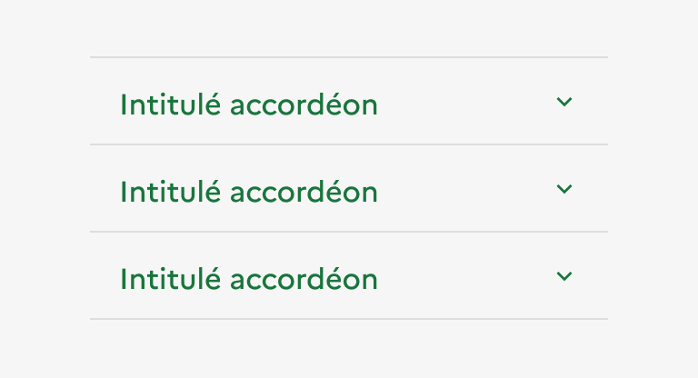

## Accordéon

:::dsfr-doc-tab-navigation

- [Présentation](../index.md)
- [Démo](../demo/index.md)
- Design
- [Code](../code/index.md)
- [Accessibilité](../accessibility/index.md)

:::

### Design

:::dsfr-doc-anatomy{col=12}

::dsfr-doc-pin[Un en-tête, correspondant au titre de la section]{required=true}

::dsfr-doc-pin[Un chevron orienté vers le bas, indiquant que le panneau peut s'ouvrir. Il est orienté vers le haut quand le panneau peut se refermer]{required=true}

::dsfr-doc-pin[Une zone de contenu libre, masquée par défaut]{required=true}

::dsfr-doc-pin[Un séparateur]{required=true}

:::

#### **Variations**

**Groupe d’accordéons**

- Par défaut, les accordéons compris dans un groupe d’accordéons sont fermés. Seuls l’en-tête et le chevron sont visibles.
- La totalité de la barre d’en-tête est cliquable. Au clic, le contenu est révélé, ou caché, et le chevron change d'orientation en conséquence.
- Par défaut, le groupe d’accordéons ne permet l’ouverture que d’un accordéon à la fois. Le clic sur un accordéon du groupe entraîne la fermeture de l’accordéon précédemment ouvert.

> [!NOTE]
> L'utilisation d'accordéons non liés entre eux (seuls et non au sein d’un groupe) reste toutefois possible, permettant l'ouverture de chaque accordéon indépendamment des autres.

::::dsfr-doc-guidelines

:::dsfr-doc-guideline[✅ À faire]{col=6 valid=true}

Proposer plusieurs accordéons seuls dans une même page permet leur ouverture simultanée.

:::

:::dsfr-doc-guideline[❌ À ne pas faire]{col=6 valid=false}

Ne pas permettre l’ouverture simultanée de deux accordéons au sein d’un groupe d’accordéons.

:::

::::

#### **Tailles**

La largeur de l’accordéon s’adapte à la taille de son conteneur. Toutefois, il est recommandé de ne pas excéder une largeur de 8 colonnes, s’agissant d’un composant de mise en forme de contenu.

#### **États**

**État au clic**

L’état au clic correspond au comportement constaté par l’usager une fois le panneau ouvert, après avoir cliqué sur l’accordéon.

**État au survol**

L’état au survol correspond au comportement constaté par l’utilisateur lorsqu’il survol le bouton d'ouverture de l’accordéon avec sa souris. Il existe 2 états au survol :

- Lorsque l’accordéon est non cliqué
- Lorsque l’accordéon est cliqué

#### **Personnalisation**

Les accordéons ne sont pas personnalisables.

::::dsfr-doc-guidelines

:::dsfr-doc-guideline[✅ À faire]{col=6 valid=true}

Utiliser uniquement la couleur bleu pour les accordéons.

:::

:::dsfr-doc-guideline[❌ À ne pas faire]{col=6 valid=false}

Ne pas personnaliser la couleur des accordéons.

:::

::::

::::dsfr-doc-guidelines

:::dsfr-doc-guideline[✅ À faire]{col=6 valid=true}

Utiliser uniquement le chevron comme icône.

:::

:::dsfr-doc-guideline[❌ À ne pas faire]{col=6 valid=false}

Ne pas personnaliser l’icône des accordéons.

:::

::::

::::dsfr-doc-guidelines

:::dsfr-doc-guideline[✅ À faire]{col=6 valid=true}

Utiliser uniquement la taille de typographie prévue pour l’en-tête des accordéons.

:::

:::dsfr-doc-guideline[❌ À ne pas faire]{col=6 valid=false}

Ne pas augmenter la taille de typographie de l’en-tête des accordéons.

:::

::::

#### Maillage

- [Onglet](../../../../tab/_part/doc/design/index.md)
- [Modale](../../../../modal/_part/doc/design/index.md)
