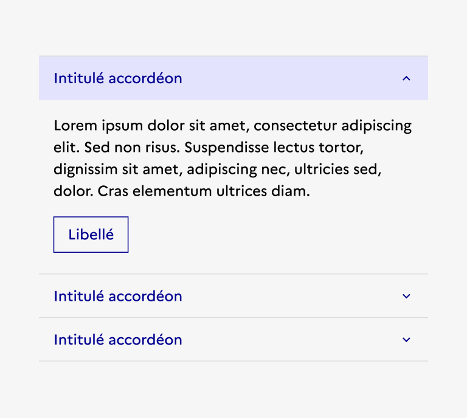
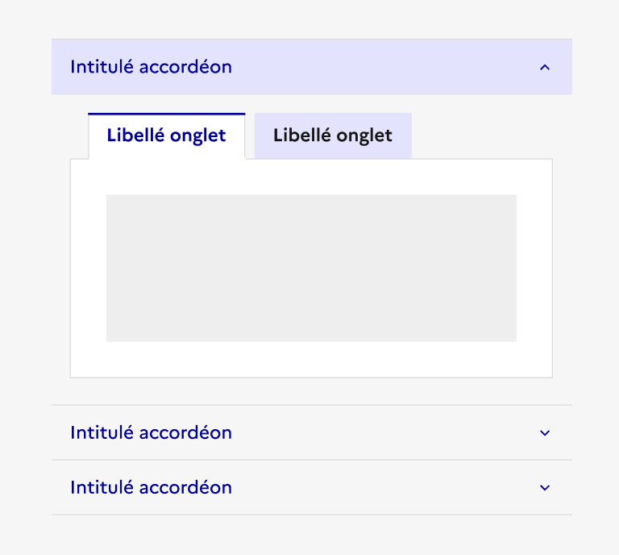
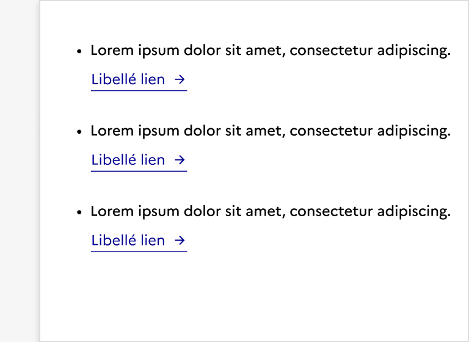
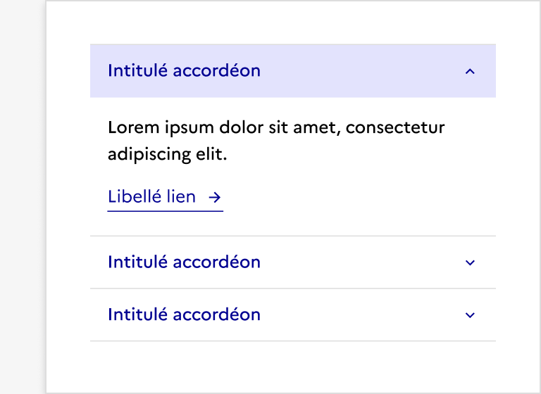

## Accordéon

:::dsfr-doc-tab-navigation

- Présentation
- [Démo](./demo/index.md)
- [Design](./design/index.md)
- [Code](./code/index.md)
- [Accessibilité](./accessibility/index.md)

:::

### Présentation

L’accordéon est un élément d’interaction avec l’interface permettant à l’utilisateur d'afficher ou de masquer une section de contenu présentée dans une page.

#### Quand utiliser ce composant ?

L’accordéon est utilisé pour mettre en forme du contenu dans une page.

> [!WARNING]
> Son objectif principal étant d’économiser de l’espace, il doit principalement être utilisé au sein de longues pages de contenu.

#### Comment utiliser ce composant ?

- **Alléger des pages de contenus denses** en permettant à l’utilisateur de consulter uniquement ce dont il a besoin.

::::dsfr-doc-guidelines

:::dsfr-doc-guideline[❌ À ne pas faire]{col=6 valid=false}

Ne pas utiliser les accordéons au sein d’une modale. Ils servent à mettre en forme du contenu au sein de longues pages.

:::

::::

- **Simplifier l’expérience de l’usager** en le guidant dans des parcours complexes.

- **Adapter son utilisation au contexte**. L’accordéon ne doit pas être utilisé si l’utilisateur a besoin de lire tous les contenus présents sur la page.

- **Privilégier des interactions simples** (bouton ou lien par exemple). L’accordéon n’a pas vocation à intégrer des composants complexes.

::::dsfr-doc-guidelines

:::dsfr-doc-guideline[✅ À faire]{col=6 valid=true}

Privilégier des interactions simples (bouton ou lien, par exemple) au sein des accordéons.

:::

:::dsfr-doc-guideline[❌ À ne pas faire]{col=6 valid=false}

Ne pas intégrer des composants trop complexes aux accordéons.

:::

::::

#### Règles éditoriales

- **Rédiger un titre d’en-tête clair, explicite et précis**. L’utilisateur doit comprendre facilement le contenu proposé par l’accordéon.

- **Soigner la mise en forme** de l’accordéon en y ajoutant les types de contenu correspondant à vos besoins. Si le contenu de l’accordéon est trop succinct, il est certainement préférable de le remplacer par une liste ou un simple paragraphe.

::::dsfr-doc-guidelines

:::dsfr-doc-guideline[✅ À faire]{col=6 valid=true}

Privilégier l’usage de texte ou de liste à puces si le contenu de l’accordéon est trop succinct.

:::

:::dsfr-doc-guideline[❌ À ne pas faire]{col=6 valid=false}

Ne pas utiliser les accordéons pour mettre en forme des contenus très courts.

:::

::::
