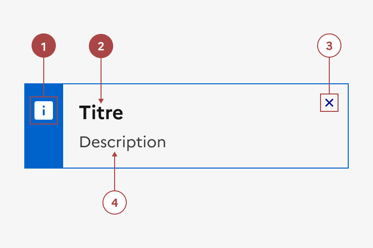
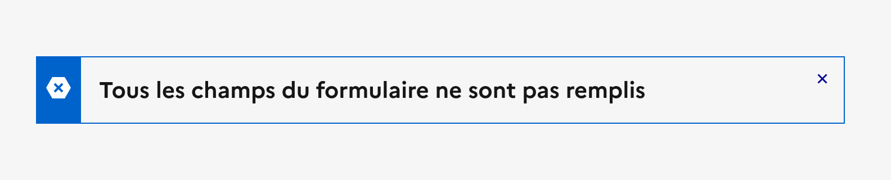
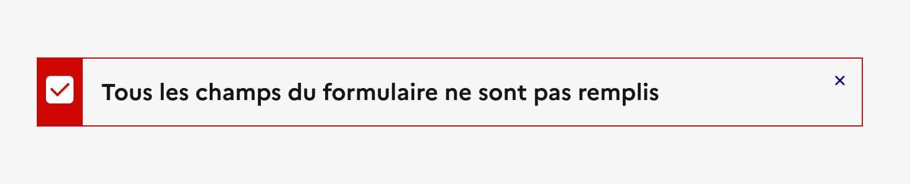

## Alerte

L’alerte est un élément d’indication poussé par l’interface pour relayer une information à l’usager.

:::dsfr-doc-tab-navigation

- [Présentation](../index.md)
- [Démo](../demo/index.md)
- Design
- [Code](../code/index.md)
- [Accessibilité](../accessibility/index.md)

:::

:::dsfr-doc-anatomy{imageWidth=384 col=12}

::dsfr-doc-pin[Une icône]{required=true}

::dsfr-doc-pin[Un titre]{required=true add="en option sur la version SM"}

::dsfr-doc-pin[Une croix de fermeture]

::dsfr-doc-pin[Un texte de description]{add="obligatoire sur la version SM"}

:::

### Variations

**Alerte simple**

::dsfr-doc-storybook{storyId=alert--title}

Utiliser l’alerte simple lorsqu’un titre seul permet de donner l’information à l’usager.

**Alerte avec description**

::dsfr-doc-storybook{storyId=alert--description}

Préférer l’alerte avec description pour donner des informations complémentaires et nécessaire à l’usager, en plus du titre.

**Alerte avec bouton de fermeture**

::dsfr-doc-storybook{storyId=alert--dismissible}

Ajouter un bouton de fermeture à l’alerte pour permettre à l’usager de la masquer une fois consultée.

Les variations suivantes permettent de donner des informations de natures différentes.

**Erreur**

::dsfr-doc-storybook{storyId=alert--error}

Utiliser l'alerte erreur lorsqu’il y a plusieurs erreurs dans un formulaire ou des erreurs bloquantes à remonter à l’usager.

**Succès**

::dsfr-doc-storybook{storyId=alert--success}

Utiliser l'alerte succès pour indiquer à l’usager qu’une action ou une tâche a été terminée avec succès.

**Information**

::dsfr-doc-storybook{storyId=alert--information}

Utiliser l'alerte information pour mettre en exergue des informations importantes.

**Attention**

::dsfr-doc-storybook{storyId=alert--warning}

Utiliser l'alerte attention (warning) pour mettre en exergue des risques ou points d’attention importants.

### Tailles

L’alerte est disponibles en 2 tailles :

- SM pour small

::dsfr-doc-storybook{storyId=alert--size-sm}

Utiliser l’alerte en small lorsque l’espace d’affichage est réduit.

- MD pour medium - taille par défaut

::dsfr-doc-storybook{storyId=alert--size-md}

Utiliser l’alerte en medium lorsque l’espace d’affichage est important.

### États

L’alerte n’est sujette à aucun changement d’état.

### Personnalisation

L’alerte n’est pas personnalisable.

Toutefois, certains éléments sont optionnels - voir [la structure du composant](#alerte).

::::dsfr-doc-guidelines

:::dsfr-doc-guideline[❌ À ne pas faire]{col=6 valid=false}

Ne pas changer la couleur d’une alerte car elle est directement liée au message qu’elle porte.

:::

:::dsfr-doc-guideline[❌ À ne pas faire]{col=6 valid=false}

Ne pas changer le pictogramme d’une alerte car il est directement lié au message qu’elle porte.

:::

::::
