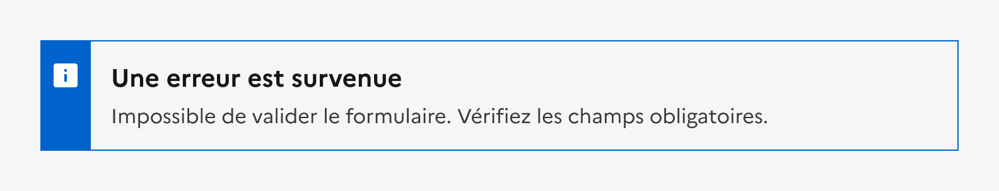
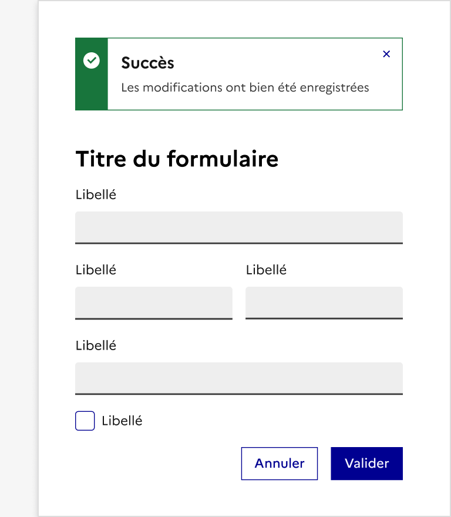
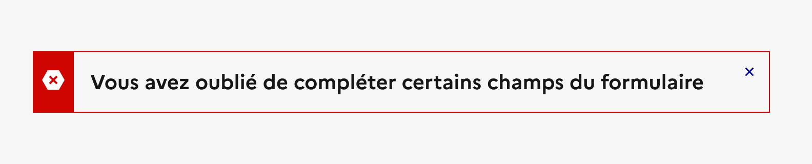
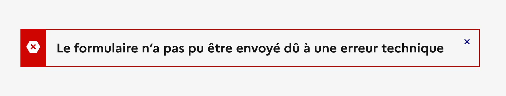
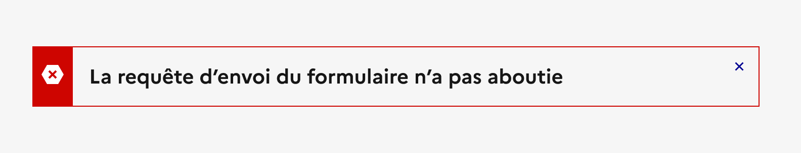

## Alerte

L’alerte est un élément d’indication poussé par l’interface pour relayer une information à l’usager.

:::dsfr-doc-tab-navigation

- Présentation
- [Démo](./demo/index.md)
- [Design](./design/index.md)
- [Code](./code/index.md)
- [Accessibilité](./accessibility/index.md)

:::

::dsfr-doc-storybook{storyId=alert--alert}

### Quand utiliser ce composant ?

**Intégrer des alertes pour attirer l’attention de l’usager** sur une information sans interrompre sa tâche en cours.

Les alertes s’affichent de manière contextuelle dans une page ou un formulaire, suite à une interaction de l’usager (exemple : à la soumission d’un formulaire) ou lors d’événements côté application/système (exemple : au rechargement d’une page).

### Comment utiliser ce composant ?

- **Choisir la variation de l’alerte adéquate**, correspondant à la nature de l’information qu’elle relaie (erreur, succès, information etc.)

::::dsfr-doc-guidelines

:::dsfr-doc-guideline[✅ À faire]{col=12 valid=true}

Adapter l’alerte à la nature de l’information relayée.

:::

::::

::::dsfr-doc-guidelines

:::dsfr-doc-guideline[❌ À ne pas faire]{col=12 valid=false}

Ne pas proposer une variation de l’alerte ne correspondant pas à la nature de l’information relayée.

:::

::::

- **Placer l’alerte en première place du contenu auquel elle est associée** (exemple : en haut d’une page, d’un formulaire, d’un container etc.)

::::dsfr-doc-guidelines

:::dsfr-doc-guideline[✅ À faire]{col=6 valid=true}

Placer l’alerte de succès en haut de page suite à la soumission d’un formulaire, par exemple.

:::

:::dsfr-doc-guideline[❌ À ne pas faire]{col=6 valid=false}

Ne pas placer l’alerte de succès en bas de page suite à la soumission d’un formulaire.

:::

::::

- **Rendre toute action induite suite à l’affichage d’une alerte aussi simple que possible**, notamment en détaillant ce qui est attendu de l’usager dans la description.

::::dsfr-doc-guidelines

:::dsfr-doc-guideline[✅ À faire]{col=6 valid=true}

Préciser à l’usager l’action attendue suite à l’apparition de l’alerte.

:::

:::dsfr-doc-guideline[❌ À ne pas faire]{col=6 valid=false}

Ne pas laisser l’usager supposer du problème rencontré. La marche à suivre doit être claire.

:::

::::

### Règles éditoriales

- **Choisir un titre d'alerte clair et concis** permettant à l’usager de comprendre facilement la situation.
- **Détailler clairement l’information ou le problème ainsi que l’action attendue** (si elle existe) à l’usager à l’aide de la description.
- **Arborer un ton courtois**, l’objectif étant d’accompagner l’usager et non de le blâmer.

::::dsfr-doc-guidelines

:::dsfr-doc-guideline[✅ À faire]{col=6 valid=true}

Employer un ton courtois, l’objectif étant d’accompagner l’usager au sein de son parcours.

:::

:::dsfr-doc-guideline[❌ À ne pas faire]{col=6 valid=false}

Ne pas employer un ton laissant suggérer que l’on blâme l’usager pour son erreur.

:::

::::

- **Employer un langage compréhensible facilement** en évitant tout jargon technique.

::::dsfr-doc-guidelines

:::dsfr-doc-guideline[✅ À faire]{col=6 valid=true}

S’affranchir de tout terme technique pour permettre la compréhension par un plus grand nombre.

:::

:::dsfr-doc-guideline[❌ À ne pas faire]{col=6 valid=false}

Ne pas inclure de termes techniques à une alerte, au risque d’altérer la bonne compréhension des usagers.

:::

::::

- **Expliciter la nature du message** porté par le composant (succès, erreur, information etc.) dans le titre de l’alerte. L’icône et la couleur ne garantissent pas à elles seules la bonne compréhension du message pour la totalité des usagers.

::::dsfr-doc-guidelines

:::dsfr-doc-guideline[✅ À faire]{col=6 valid=true}

Préciser la nature du message porté par l’alerte dans son titre.

:::

:::dsfr-doc-guideline[❌ À ne pas faire]{col=6 valid=false}

Ne pas s’appuyer uniquement sur l’icône et la couleur de l’alerte pour restituer la nature du message.

:::

::::
