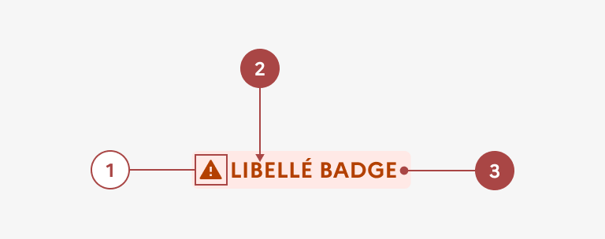

## Badge

Le badge est un élément d’indication permettant de valoriser une information liée à un élément précis du site.

:::dsfr-doc-tab-navigation

- [Présentation](../index.md)
- [Démo](../demo/index.md)
- Design
- [Code](../code/index.md)
- [Accessibilité](../accessibility/index.md)

:::

:::dsfr-doc-anatomy{imageWidth=384 col=12}

::dsfr-doc-pin[Une icône]{add='uniquement pour les badges système'}

::dsfr-doc-pin[Un libellé]{required=true add='en majuscule'}

::dsfr-doc-pin[Un fond]{required=true}

:::

### Variations

**Badge standard**

::dsfr-doc-storybook{storyId=badge--default}

**Badge système avec icône**

- Succès
- Avertissement
- Erreur
- Information
- Nouveauté

::dsfr-doc-storybook{storyId=badge--status}

Utiliser cette variation pour préciser l’information donnée par le texte du badge avec l’icône correspondante.

L’ajout d’une icône est autorisée, et automatique en code, uniquement pour les badges système.

**Badge système sans icône**

Il est possible d’utiliser un badge système sans icône.

::dsfr-doc-storybook{storyId=badge--status-no-icon}

### Tailles

Le badge est disponible en 2 tailles :

- SM pour small

::dsfr-doc-storybook{storyId=badge--size-sm}

- MD pour medium - taille par défaut

::dsfr-doc-storybook{storyId=badge--default}

### États

Le badge n’est sujet à aucun changement d’état.

### Personnalisation

Les badges systèmes ne sont pas personnalisables.

::::dsfr-doc-guidelines

:::dsfr-doc-guideline[✅ À faire]{col=6 valid=true}

Utiliser l’icône et la couleur système correspondantes à l’information fournie.

:::

:::dsfr-doc-guideline[❌ À ne pas faire]{col=6 valid=false}

Ne pas changer l’icône et la couleur d’un badge système.

:::

::::

La couleur des badges standard peut être personnalisée, parmi les couleurs illustratives autorisées uniquement.

:::fr-table[Tableau personnalisation design]{valign=top multiline=true caption=false}
| Éléments | Indice thème clair | Indice thème sombre |
|:-----|:-----|:-----|
| **Fond** | Indice **950** _exemple : `$pink-tuile-950`_ | Indice **100** _exemple : `$pink-tuile-100`_ |
| **Texte** | Indice **sun** _exemple : `$pink-tuile-sun-425`_ | Indice **moon** _exemple : `$pink-tuile-moon-750`_ |
:::

::::dsfr-doc-guidelines

:::dsfr-doc-guideline[✅ À faire]{col=6 valid=true}

Utiliser une couleur illustrative sur un badge standard (exemple : `$Pink-tuile`).

:::

:::dsfr-doc-guideline[❌ À ne pas faire]{col=6 valid=false}

Ne pas utiliser une icône dans un badge standard.

:::

::::

::::dsfr-doc-guidelines

:::dsfr-doc-guideline[❌ À ne pas faire]{col=6 valid=false}

Ne pas utiliser une couleur système pour un badge standard.

:::

::::
