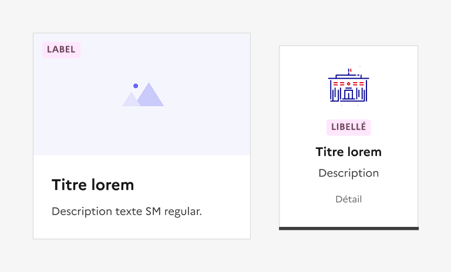
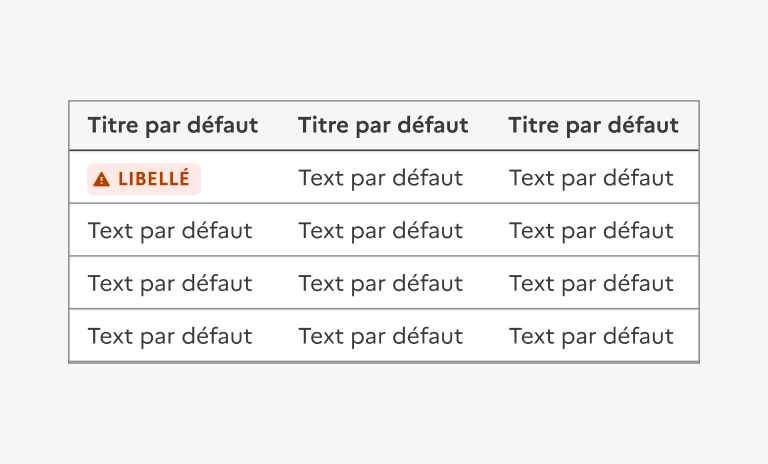

## Badge

Le badge est un élément d’indication permettant de valoriser une information liée à un élément précis du site.

:::dsfr-doc-tab-navigation

- Présentation
- [Démo](./demo/index.md)
- [Design](./design/index.md)
- [Code](./code/index.md)
- [Accessibilité](./accessibility/index.md)

:::

::dsfr-doc-storybook{storyId=badge--badge}

### Quand utiliser ce composant ?

Utiliser le badge pour mettre en avant une information de type “statut” ou “état” sur un élément du site.

> [!NOTE]
> Bien différencier le badge du tag. Opter pour le tag pour catégoriser, classer ou organiser des contenus à l'aide de mots-clés.

### Comment utiliser ce composant ?

- **Associer le badge à une information donnée** pour en préciser le statut ou l’état associé. Il ne s’agit pas d’un composant cliquable, son unique usage est informatif.
- **Placer le badge directement à côté** **de l’élément** qu’il illustre. Peu importe le contexte, le système veut que le badge soit au premier niveau de lecture.

::::dsfr-doc-guidelines

:::dsfr-doc-guideline[✅ À faire]{col=6 valid=true}

Associer un badge à du texte ou un lien, en haut d’une page article par exemple.

:::

:::dsfr-doc-guideline[✅ À faire]{col=6 valid=true}

Placer un badge au sein d’un élément de navigation, par exemple le menu latéral, pour apporter des précisions.

:::

::::

::::dsfr-doc-guidelines

:::dsfr-doc-guideline[✅ À faire]{col=6 valid=true}

Intégrer un badge au sein de cartes ou de tuiles.e.

:::

:::dsfr-doc-guideline[✅ À faire]{col=6 valid=true}

Utiliser un badge au sein d’une cellule d’un tableau.

:::

::::

### Règles éditoriales

- **Préférer un texte concis et explicite** afin de limiter la taille du badge.

::::dsfr-doc-guidelines

:::dsfr-doc-guideline[✅ À faire]{col=6 valid=true}

Proposer un libellé court et explicite.

:::

:::dsfr-doc-guideline[❌ À ne pas faire]{col=6 valid=false}

Ne pas rédiger des libellés trop longs. La taille du badge doit rester raisonnable.

:::

::::

- **Conserver une unité dans l’usage des badges** à travers le site pour en garantir la bonne compréhension par l’usager.

::::dsfr-doc-guidelines

:::dsfr-doc-guideline[✅ À faire]{col=6 valid=true}

Utiliser des badges identiques pour indiquer une information similaire à travers le site.

:::

:::dsfr-doc-guideline[❌ À ne pas faire]{col=6 valid=false}

Ne pas utiliser le même badge pour traduire des informations distinctes.

:::

::::
