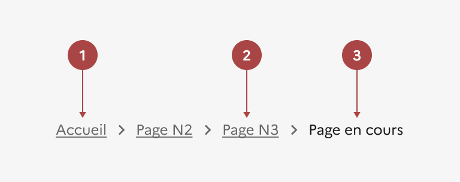
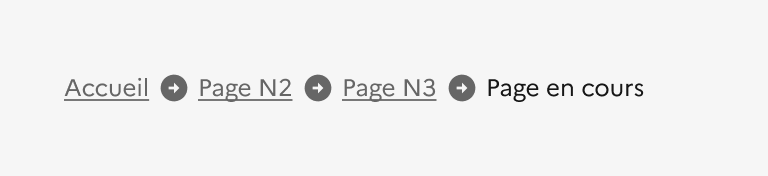

## Fil d'Ariane

Le fil d’Ariane est un système de navigation secondaire qui permet à l’usager de se situer sur le site qu’il consulte.

:::dsfr-doc-tab-navigation

- [Présentation](../index.md)
- [Démo](../demo/index.md)
- Design
- [Code](../code/index.md)
- [Accessibilité](../accessibility/index.md)

:::

:::dsfr-doc-anatomy{imageWidth=384 col=12}

::dsfr-doc-pin[Un lien vers la racine du site (page d’accueil)]{required=true}

::dsfr-doc-pin[Des liens vers les pages depuis la racine du site]{add="si la hiérarchie du site comporte plus d’un niveau" required=true}

::dsfr-doc-pin[Texte de la page courante]{add='seul élément non cliquable' required=true}

:::

### Variations

**Version mobile**

Le fil d’Ariane doit être maintenu sur mobile et apparaître de la manière suivante :

::dsfr-doc-storybook{storyId=breadcrumb--breadcrumb width=375}

- Afficher par défaut un bouton “Voir le fil d’Ariane”.
- Faire apparaître le fil d’Ariane au clic sur le bouton, sur plusieurs lignes si nécessaire.

### Tailles

La largeur du fil d’Ariane s’adapte à son contenu, tout en étant dépendante de la taille du conteneur principal de la page.

### États

Le fil d’Ariane n’est sujet à aucun changement d’état.

### Personnalisation

Le fil d’Ariane n’est pas personnalisable.

::::dsfr-doc-guidelines

:::dsfr-doc-guideline[❌ À ne pas faire]{col=6 valid=false}

Ne pas changer la structure du fil d’Ariane.

:::

:::dsfr-doc-guideline[❌ À ne pas faire]{col=6 valid=false}

Ne pas changer la couleur du texte du fil d’Ariane.

:::

::::
