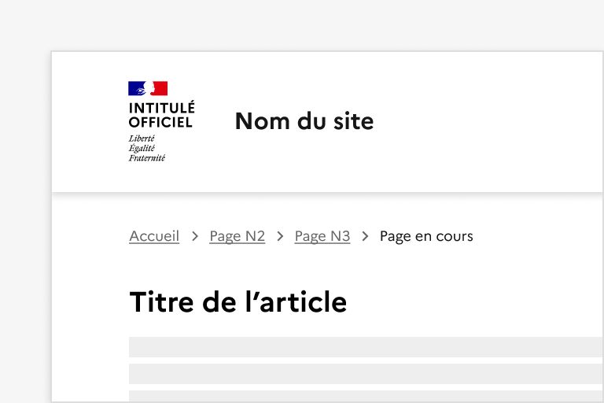
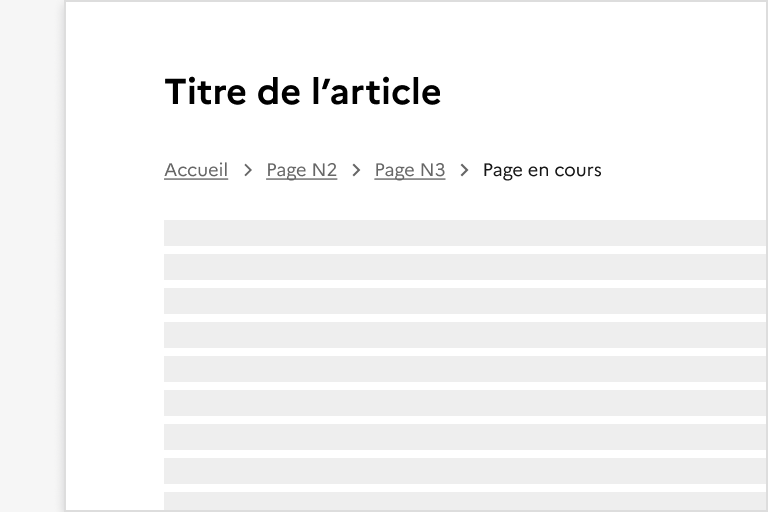
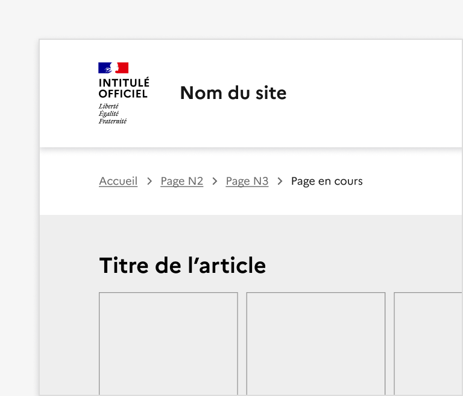
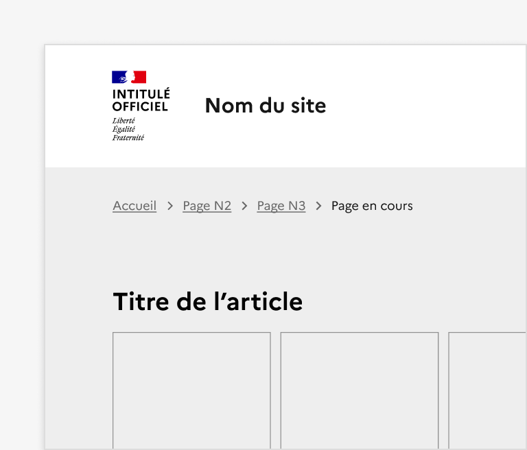
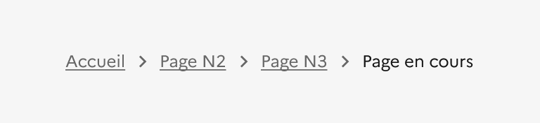
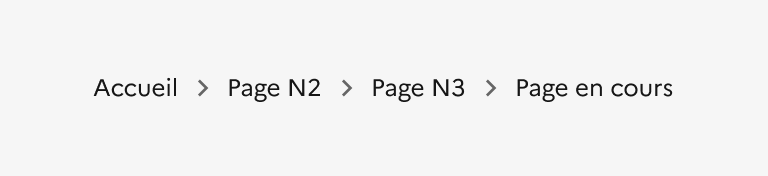
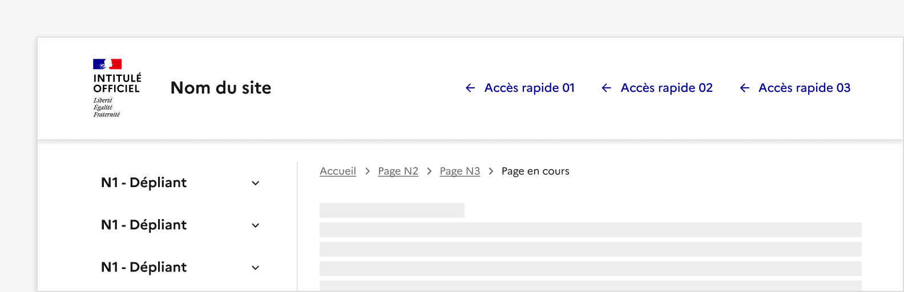
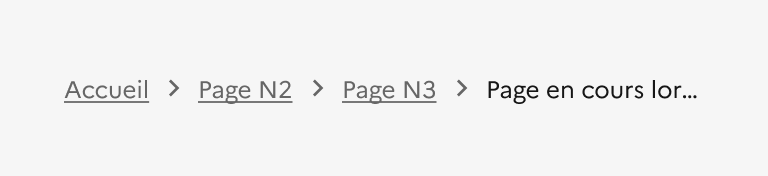
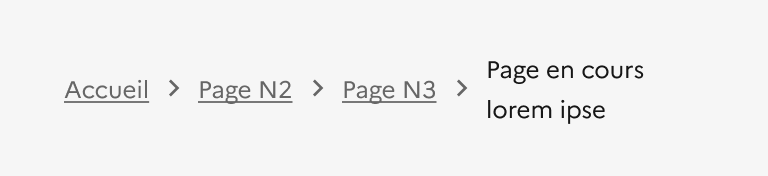

## Fil d'Ariane

Le fil d’Ariane est un système de navigation secondaire qui permet à l’usager de se situer sur le site qu’il consulte.

:::dsfr-doc-tab-navigation

- Présentation
- [Démo](./demo/index.md)
- [Design](./design/index.md)
- [Code](./code/index.md)
- [Accessibilité](./accessibility/index.md)

:::

::dsfr-doc-storybook{storyId=breadcrumb--breadcrumb}

### Quand utiliser ce composant ?

**Proposer un fil d'Ariane est fortement recommandé sur l’ensemble des sites**, particulièrement lorsque l’arborescence possède plus de 2 niveaux. Il permet à l’usager de revenir à une page de niveau supérieur en l’utilisant à la place du bouton « Retour » du navigateur ou de [la navigation principale.](../../../navigation/_part/doc/index.md)

**Utiliser le fil d’Ariane permet également d’aider l’usager à se repérer dans l’arborescence d’un site**. Il indique à l’usager sa position courante et donne des informations sur l’architecture du site.

### Comment utiliser ce composant ?

- **Afficher le fil d’Ariane sur l’ensemble des pages du site**, à l’exception de la page d'accueil.
- **Conserver le même emplacement pour le fil d’Ariane** au sein de l’ensemble des pages, de préférence entre le header et le contenu principal de la page.

::::dsfr-doc-guidelines

:::dsfr-doc-guideline[✅ À faire]{col=6 valid=true}

Positionner le fil d’Ariane sous le header

:::

:::dsfr-doc-guideline[❌ À ne pas faire]{col=6 valid=false}

Ne pas positionner le fil d’Ariane ailleurs que sous le header

:::

- **Positionner le fil d’Ariane sur fond neutre**. Il ne doit pas être superposé à un arrière-plan de couleur ou une image.

:::dsfr-doc-guideline[✅ À faire]{col=6 valid=true}

Appliquer le fil d’Ariane sur fond blanc avant le haut de page s’il propose un fond de couleur ou un motif.

:::

:::dsfr-doc-guideline[❌ À ne pas faire]{col=6 valid=false}

Ne pas superposer le fil d’Ariane à un fond de couleur ou un motif.

:::

- **Rendre chacun des éléments cliquable**, à l’exception de la page consultée.

:::dsfr-doc-guideline[✅ À faire]{col=6 valid=true}

Rendre chacun des éléments cliquable, à l’exception de la page consultée.

:::

:::dsfr-doc-guideline[❌ À ne pas faire]{col=6 valid=false}

Ne pas proposer un fil d’Ariane non cliquable.

:::

- **Mettre en place un fil d’Ariane basé sur la position courante de la page dans la hiérarchie principale du site** et non sur l’historique de navigation de l’usager, ce qui est susceptible de créer de la confusion. Si plusieurs chemins sont possibles pour une même page, le fil d’Ariane doit en présenter un seul afin de conserver une hiérarchie cohérente entre les pages.

:::dsfr-doc-guideline[✅ À faire]{col=12 valid=true}

Adapter le positionnement du fil d’Ariane lorsqu’il est accompagné d’un menu latéral.

:::

::::

### Règles éditoriales

- **Eviter que le fil d’Ariane soit trop long** et passe sur plusieurs lignes, afin qu’il reste lisible. Si les titres des pages du site sont longs, il est conseillé de n’afficher que les 4 premiers mots du nom de la page courante et d’indiquer que l’élément est tronqué par l’affichage de “…”

::::dsfr-doc-guidelines

:::dsfr-doc-guideline[✅ À faire]{col=6 valid=true}

Tronquer le libellé de la page lorsque le titre est trop long.

:::

:::dsfr-doc-guideline[❌ À ne pas faire]{col=6 valid=false}

Ne pas proposer un titre long sur deux lignes.

:::

::::