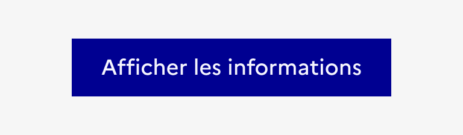
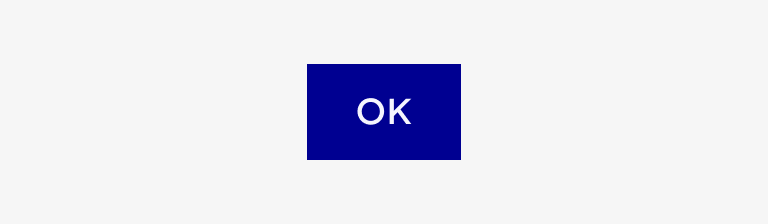
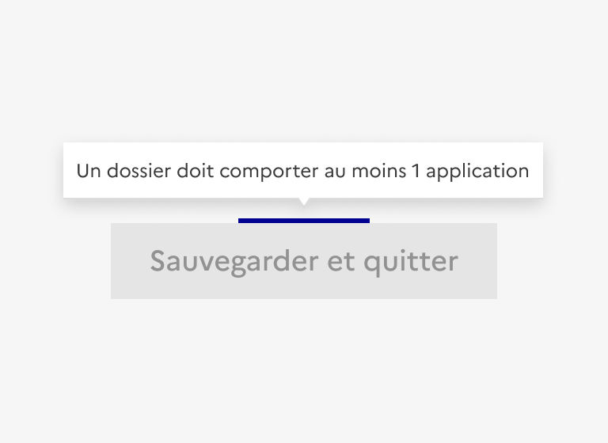
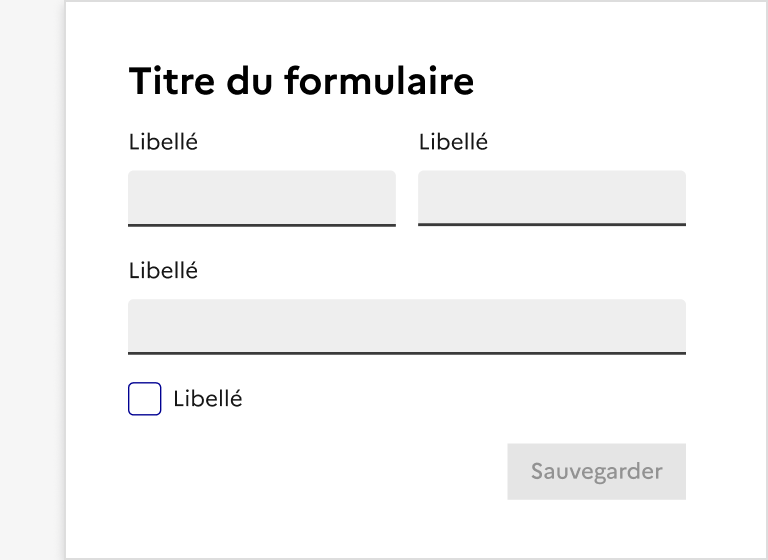

# Bouton

Le bouton est un élément d’interaction avec l’interface permettant à l’usager d’effectuer une action.

:::dsfr-doc-tab-navigation

- [Présentation](../index.md)
- [Démo](../demo/index.md)
- [Design](../design/index.md)
- [Code](../code/index.md)
- Accessibilité

:::

Le composant **Bouton** est conçu pour être accessible et respecter les critères du RGAA. Voici les points clés à prendre en compte pour en garantir l’accessibilité.

### Interactions clavier

Lorsque le focus est positionné sur le composant&nbsp;:

- `Entrée`&nbsp;: actionne le bouton.
- `Espace`&nbsp;: actionne le bouton.

### Règles d’accessibilité

#### Intitulé pertinent : nom accessible

Un bouton doit avoir un **intitulé pertinent**. On doit en comprendre la fonction sans ambiguïté.

Son nom accessible est calculé par ordre de priorité à partir de&nbsp;:

- l’attribut `aria-labelledby`,
- l’attribut `aria-label`,
- le contenu textuel à l’intérieur du bouton,
- l’attribut `title` en l’absence d’une autre méthode de nommage.

**Privilégier le contenu textuel** pour nommer le composant Bouton.

::::dsfr-doc-guidelines

:::dsfr-doc-guideline[✅ À faire]{col=6 valid=true}

Utiliser un intitulé textuel précis.

:::

:::dsfr-doc-guideline[❌ À ne pas faire]{col=6 valid=false}

Utiliser un intitulé générique et ambigu.

:::

::::

##### Nom visible et nom accessible

En cas d’utilisation des attributs `aria-labelledby` ou `aria-label` sur des boutons textuels, le **nom visible doit être repris dans le nom accessible** afin de répondre aux besoins des personnes qui utilisent la commande vocale.

##### Information complémentaire&nbsp;: description

Il est possible de compléter et d’expliciter l’intitulé d’un bouton avec une description en utilisant&nbsp;:

- l’attribut `aria-describedby` avec une valeur d’id qui référence un passage de texte&nbsp;;
- l’attribut `title`.

#### Bouton avec icône seule

Dans le cas des **boutons avec icône seule**, un attribut `title`, qui reprend l’intitulé du bouton, peut être ajouté afin d’expliciter le sens de l’icône pour les personnes qui en ont besoin.

> [!WARNING]
> L’attribut title n’apparaît pas à la navigation au clavier et le contenu de l’infobulle ne s’agrandit pas lorsque la page est zoomée.
>
> **Limiter l’usage des boutons avec icône seule** et les utiliser uniquement pour les actions récurrentes et facilement identifiables (ex. engrenage pour les paramètres ou loupe pour la recherche).

#### État désactivé

> [!CAUTION]
> **L’état désactivé d’un bouton peut poser des problèmes d’utilisabilité et d’accessibilité pour les personnes handicapées** (personnes aveugles, déficientes visuelles, handicapées motrices qui naviguent au clavier ainsi que les personnes qui ont un handicap cognitif ou mental).

- Le texte des boutons désactivés est insuffisamment contrasté. Il ne s’agit néanmoins pas d’une non-conformité au RGAA (cas particulier).
- Lorsqu’un bouton est désactivé avec l’attribut disabled, il ne prend pas le focus au clavier.

::::dsfr-doc-guidelines

:::dsfr-doc-guideline[❌ À ne pas faire]{col=6 valid=false}

Ne pas désactiver un bouton avec une infobulle (tooltip).

:::

:::dsfr-doc-guideline[❌ À ne pas faire]{col=6 valid=false}

Ne pas désactiver un bouton de soumission d’un formulaire.

:::

::::

#### Contrastes de couleurs
Le composant Bouton est suffisamment contrasté en thème clair. Au survol, le texte des boutons secondaires et tertiaires est insuffisamment contrasté.

##### Bouton primaire

:::fr-table[Contrastes du bouton primaire en thème clair et sombre]{valign=top multiline=true caption=false}
| État |  Thème clair | Thème sombre |
|------|-----|-----|
|**par défaut**| 14,9:1 | 4,7:1 |
|**au survol**| 8,2:1| 7,5:1 |
|**désactivé**| 2,47:1 | 2,5:1 |
:::

##### Bouton secondaire et tertiaire

:::fr-table[Contrastes du bouton secondaire et tertiaire en thème clair et sombre]{valign=top multiline=true caption=false}
| État |  Thème clair | Thème sombre |
|------|-----|-----|
|**par défaut**|14,9:1|5,8:1|
|**au survol**|13,8:1|4,1:1|
|**désactivé**|3,1:1|3,2:1|
:::

#### Bouton ou lien&nbsp;?

>[!NOTE]
>Il est nécessaire de distinguer un bouton d’un lien.
>
>Un bouton permet de **déclencher une action ou un événement**&nbsp;:
>- **nativement** en fonction du type du bouton&nbsp;: envoi d’un formulaire (`submit`), suppression de contenu de champs de formulaire (`reset`)&nbsp;;
>- **en JavaScript**&nbsp;: ouverture d’une fenêtre modale, fermeture d’un contenu, modification de la page…
>
>Un lien `<a href>` permet de rediriger vers une autre page ou à un autre endroit dans la page (ancre).
>

**Éviter d’utiliser le style du composant Bouton sur les liens et inversement**.

---

### Restitution par les lecteurs d’écran

Par défaut, les lecteurs d’écran restituent le **nom, la description, l’état et le type**. L’ordre peut varier en fonction des lecteurs d’écran et de leur configuration.

L’attribut `disabled` est restitué différemment selon les lecteurs d’écran&nbsp;:

- VoiceOver macOS et iOS&nbsp;: «&nbsp;estompé&nbsp;»
- NVDA et JAWS&nbsp;: «&nbsp;non disponible&nbsp;»
- Narrateur et Talkback &nbsp;: «&nbsp;désactivé&nbsp;»

:::fr-accordion[#### Versions navigateurs et lecteurs d’écran]{id=sr-le-desktop}

Les tests de restitution ont été effectués en ajoutant le lecteur d’écran intégré à Windows 11 (Narrateur) et le navigateur web Chrome à l’environnement de tests du RGAA.

Versions des navigateurs web&nbsp;:

- Firefox 137
- Chrome 135
- Safari 18.4 (sur macOS uniquement)
- Microsoft Edge 135 (sur Windows 11 uniquement)

Version des lecteurs d’écran&nbsp;:
- NVDA 2024.4.2
- JAWS 2024
- VoiceOver macOS 15.4
- Narrateur (Windows 11)
- VoiceOver iOS
:::

---

### Critères RGAA applicables

- **Couleurs** : 3.2, 3.3
- **Scripts** : 7.1, 7.3
- **Présentation de l’information** : 10.1, 10.2, 10.4, 10.5, 10.7, 10.11, 10.12
- **Formulaires** : 11.9
- **Navigation** : 12.8, 12.9
- **Consultation&nbsp;:** 13.9, 13.11

---

### Références

- [Référentiel général d’amélioration de l’accessibilité (RGAA 4.1.2)](https://accessibilite.numerique.gouv.fr/methode/criteres-et-tests/)
- [Spécification HTML – élément button](https://html.spec.whatwg.org/#the-button-element)
