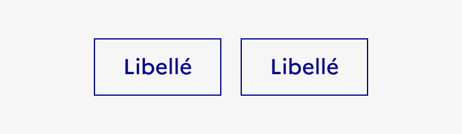

## Bouton

Le bouton est un élément d’interaction avec l’interface permettant à l’usager d’effectuer une action.

:::dsfr-doc-tab-navigation

- [Présentation](../index.md)
- [Démo](../demo/index.md)
- Design
- [Code](../code/index.md)
- [Accessibilité](../accessibility/index.md)

:::

:::dsfr-doc-anatomy{imageWidth=384 col=12}

::dsfr-doc-pin[Un libellé]{required=true}

::dsfr-doc-pin[Une icône]{add='pouvant être modifiée'}

:::

### Variations

**Bouton primaire**

::dsfr-doc-storybook{storyId=button--primary}

**Bouton secondaire**

::dsfr-doc-storybook{storyId=button--secondary}

**Bouton tertiaire**

::dsfr-doc-storybook{storyId=button--tertiary}

Le bouton tertiaire est caractérisé par un fond transparent.

**Bouton tertiaire sans contour**

::dsfr-doc-storybook{storyId=button--tertiary args="{ kind: 4 }"}

Le bouton tertiaire peut aussi être proposé sans bordure.

**Bouton avec icône**

Pour permettre une meilleure compréhension de l’action engendrée par votre bouton, il est possible d'y ajouter une icône ([voir la documentation des icônes](../../../../../core/_part/doc/icon/index.md)).

Trois déclinaisons sont possibles :

- Bouton avec icône à droite du libellé

::dsfr-doc-storybook{storyId=button--icon-right}

- Bouton avec icône à gauche du libellé

::dsfr-doc-storybook{storyId=button--icon-left}

- Bouton sans libellé avec icône seule

::dsfr-doc-storybook{storyId=button--icon-only}

> [!NOTE]
> Limiter l’usage de ces boutons sans libellé. Ils doivent uniquement être utilisés pour les actions récurrentes, facilement identifiables de l’usager (exemple : engrenage pour les paramètres ou loupe pour la recherche).

**Responsive design**

En mobile, le bouton prend automatiquement toute la largeur.

**Groupe de boutons**

Le groupe de boutons permet à l’usager de réaliser plusieurs actions au sein d’un bloc.

Il comporte ses propres règles d’usage :

- **Utiliser un seul bouton primaire** pour l'action principale, les autres boutons doivent être secondaires ou tertiaires.
- **Limiter le nombre de boutons** au sein d’un groupe à 3 maximum.

::::dsfr-doc-guidelines

:::dsfr-doc-guideline[✅ À faire]{col=6 valid=true}

Limiter le nombre de boutons utiliser au sein d’un groupe.

:::

:::dsfr-doc-guideline[❌ À ne pas faire]{col=6 valid=false}

Ne pas excéder plus de 3 boutons au sein d’un groupe.

:::

::::

- **Positionner le bouton primaire avant les boutons secondaires** ou tertiaires quand le groupe est ferré à gauche ou centré.
- **Positionner le bouton primaire après les boutons secondaires** ou tertiaires quand le groupe est ferré à droite.

::::dsfr-doc-guidelines

:::dsfr-doc-guideline[✅ À faire]{col=6 valid=true}

Positionner le bouton primaire avant les boutons secondaires ou tertiaires quand le groupe est ferré à gauche ou centré.

:::

:::dsfr-doc-guideline[✅ À faire]{col=6 valid=true}

Positionner le bouton primaire après les boutons secondaires ou tertiaires quand le groupe est ferré à droite.

:::

::::

::::dsfr-doc-guidelines

:::dsfr-doc-guideline[❌ À ne pas faire]{col=12 valid=false}

Ne pas encadrer un bouton primaire d’autres boutons secondaires ou tertiaires.

:::

::::

- **Conserver une unité** en utilisant la même taille (SM, MD ou LG) pour tous les boutons du groupe.

::::dsfr-doc-guidelines

:::dsfr-doc-guideline[✅ À faire]{col=6 valid=true}

Utiliser la même taille pour tous les boutons du groupe.

:::

:::dsfr-doc-guideline[❌ À ne pas faire]{col=6 valid=false}

Ne pas mélanger différentes tailles de boutons au sein d’un groupe.

:::

::::

**Groupe de boutons vertical**

Le groupe de boutons vertical, option par défaut, permet d’associer plusieurs boutons d’action les uns en-dessous des autres.

::dsfr-doc-storybook{storyId=buttons-group--vertical}

- Aligner les boutons en colonne avec un espacement de 16px.
- Par défaut, la largeur des boutons prend 100% de la largeur du container (« full width »).

**Groupe de boutons horizontal**

Le groupe de boutons horizontal permet d’associer plusieurs boutons d’action les uns à côté des autres.

::dsfr-doc-storybook{storyId=buttons-group--horizontal}

- Appliquer un espacement de 16px à droite de chaque bouton excepté le dernier (en savoir plus sur les [espacements du DSFR](../../../../../core/_part/doc/spacing/index.md)).
- Appliquer un espacement de 16px en dessous de chaque bouton.
- Forcer un retour à la ligne dès lors que la juxtaposition des boutons dépasse la taille du conteneur.

### Tailles

Les boutons sont disponibles en 3 tailles :

- SM pour small
- MD pour medium - taille par défaut
- LG pour large

::dsfr-doc-storybook{storyId=button--sizes}

- **Utiliser en priorité les formats MD et LG**. Le format SM pourra quant à lui être utilisé à l’intérieur d'autres composants.
- **Conserver une unité** dans la taille des boutons au sein d’une même page.

**A noter :** Dans un groupe de boutons, la taille se définit au niveau du groupe.

### États

**État désactivé**

L’état désactivé indique que l'usager ne peut pas interagir avec le bouton.

::dsfr-doc-storybook{storyId=button--disabled}

> [!NOTE]
> L’état désactivé est **fortement déconseillé** car il n’est pas accessible au clavier et il est source d’erreur pour les utilisateurs.

**État au survol**

L’état au survol correspond au comportement constaté par l’usager lorsqu’il survole le bouton avec sa souris.

**État au clic**

L’état au clic correspond au comportement constaté par l’usager lorsqu’il clique sur le bouton.

### Personnalisation

Les boutons ne sont pas personnalisables.

Toutefois, certains éléments sont optionnels et les icônes peuvent être changées - voir [la structure du composant](#bouton).

::::dsfr-doc-guidelines

:::dsfr-doc-guideline[✅ À faire]{col=6 valid=true}

Utiliser uniquement la couleur bleu pour les boutons primaires.

:::

:::dsfr-doc-guideline[❌ À ne pas faire]{col=6 valid=false}

Ne pas personnaliser la couleur des boutons primaires.

:::

::::

::::dsfr-doc-guidelines

:::dsfr-doc-guideline[✅ À faire]{col=6 valid=true}

Utiliser uniquement une typographie bleue pour les boutons secondaires.

:::

:::dsfr-doc-guideline[❌ À ne pas faire]{col=6 valid=false}

Ne pas personnaliser la couleur du libellé des boutons secondaires.

:::

::::

::::dsfr-doc-guidelines

:::dsfr-doc-guideline[✅ À faire]{col=6 valid=true}

Conserver un fond transparent pour les boutons tertiaires.

:::

:::dsfr-doc-guideline[❌ À ne pas faire]{col=6 valid=false}

Ne pas appliquer un fond aux boutons tertiaires.

:::

::::
