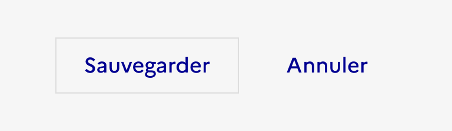
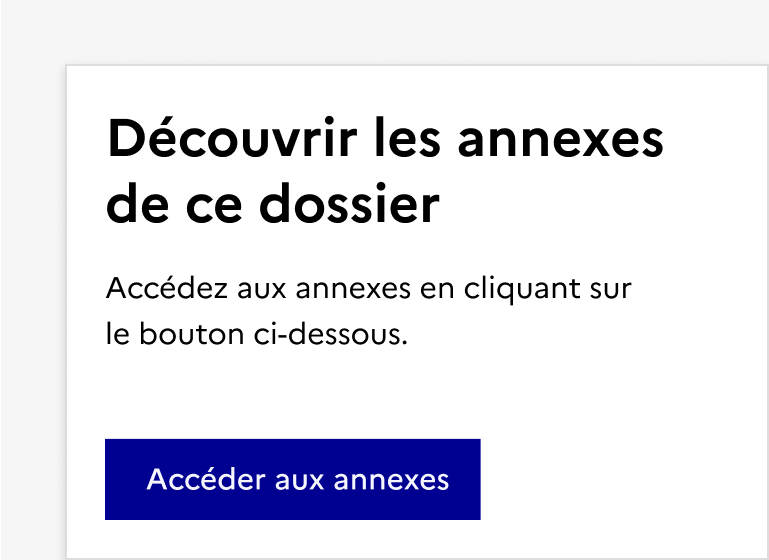

## Bouton

Le bouton est un élément d’interaction avec l’interface permettant à l’usager d’effectuer une action.

:::dsfr-doc-tab-navigation

- Présentation
- [Démo](./demo/index.md)
- [Design](./design/index.md)
- [Code](./code/index.md)
- [Accessibilité](./accessibility/index.md)

:::

::dsfr-doc-storybook{storyId=button--button}

### Quand utiliser ce composant ?

**Utiliser le bouton pour déclencher une action dans la page.**

> [!NOTE]
> Bien différencier les boutons des liens.

Le [lien](../../../link/_part/doc/index.md) est utilisé pour naviguer à l’intérieur (ou à l’extérieur) de votre site.

### Comment utiliser ce composant ?

- **Utiliser le bouton primaire pour les actions principales** (soumettre un formulaire, rediriger vers un contenu priorisé, etc.). Il est recommandé de limiter son usage à un bouton primaire par page.

::::dsfr-doc-guidelines

:::dsfr-doc-guideline[✅ À faire]{col=6 valid=true}

Aligner un bouton primaire avec un bouton secondaire ou un lien.

:::

:::dsfr-doc-guideline[❌ À ne pas faire]{col=6 valid=false}

Ne pas utiliser deux boutons primaires côte à côte.

:::

::::

- **Choisir le bouton secondaire pour des actions moins importantes** (réinitialiser les valeurs d’un formulaire, par exemple)
- **Réserver le bouton tertiaire pour des actions contextuelles ou alternatives** (fermeture de modale, annuler, partager, suivre sur un réseau social, copier un lien, etc.)

::::dsfr-doc-guidelines

:::dsfr-doc-guideline[❌ À ne pas faire]{col=6 valid=false}

Ne pas indiquer une hiérarchie entre 2 boutons tertiaires via la présence ou non de contour.

:::

::::

- **Attention à hiérarchiser les actions proposées à l’usager**. Utiliser une combinaison de bouton de styles différents pour maintenir l’attention sur l’action principale (cf. composant “Groupe de boutons”).
- **Utiliser uniquement la couleur bleue**. Cette couleur est utilisée pour signaler une interaction sur les éléments principaux (cf. couleurs).

### Règles éditoriales

- **Rédiger un texte concis et explicite sur l’action** que le bouton va initier.

::::dsfr-doc-guidelines

:::dsfr-doc-guideline[✅ À faire]{col=6 valid=true}

Rédiger un texte clair, explicite et prévisible. L’usager doit savoir ce qui va se passer.

:::

:::dsfr-doc-guideline[❌ À ne pas faire]{col=6 valid=false}

Ne pas tromper l’usager. Fournir le contexte que l’usager sache quelle action va être réalisée.

:::

::::

::::dsfr-doc-guidelines

:::dsfr-doc-guideline[❌ À ne pas faire]{col=6 valid=false}

Ne pas rédiger des libellés trop longs pour éviter le passage du bouton sur 2 lignes.

:::

::::

- **Indiquer ce que l’usager va faire**, sans nommer le bouton ou sa localisation.

::::dsfr-doc-guidelines

:::dsfr-doc-guideline[✅ À faire]{col=6 valid=true}

Se concentrer sur l’action principale, en restant concis et clair.

:::

:::dsfr-doc-guideline[❌ À ne pas faire]{col=6 valid=false}

Ne pas mentionner le composant bouton, ni sa localisation.

:::

::::

- **Commencer les textes des boutons avec un verbe d’action.**

::::dsfr-doc-guidelines

:::dsfr-doc-guideline[✅ À faire]{col=6 valid=true}

Commencer les textes des boutons avec un verbe d’action à l’infinitif.

:::

:::dsfr-doc-guideline[❌ À ne pas faire]{col=6 valid=false}

Ne pas utiliser  “Je” ou ne pas conjuguer le verbe.

:::

::::

- **Conserver une unité** dans le format d’écriture de tous vos libellés de boutons.

::::dsfr-doc-guidelines

:::dsfr-doc-guideline[✅ À faire]{col=6 valid=true}

Mettre des majuscules en début de phrase.

:::

:::dsfr-doc-guideline[❌ À ne pas faire]{col=6 valid=false}

Ne pas rédiger les libellés de vos boutons en lettres capitales.

:::

::::

- **Éviter les redondances** entre instructions et boutons. Ces éléments sont complémentaires.

::::dsfr-doc-guidelines

:::dsfr-doc-guideline[✅ À faire]{col=6 valid=true}

Accompagner vos boutons d’instructions pour garantir la bonne compréhension de l’usager, lorsque nécessaire.

:::

:::dsfr-doc-guideline[❌ À ne pas faire]{col=6 valid=false}

Ne pas créer de redondances entre instructions et boutons. Ces éléments sont complémentaires.

:::

::::
