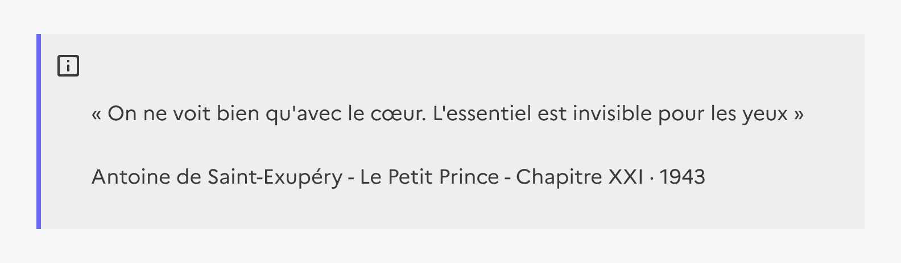

## Mise en avant

La mise en avant est un élément éditorial permettant de mettre en forme du contenu dans une page.

:::dsfr-doc-tab-navigation

- [Présentation](../index.md)
- [Démo](../demo/index.md)
- [Design](../design/index.md)
- [Code](../code/index.md)
- Accessibilité

:::

Le composant **Mise en avant** est conçu pour être accessible et respecter les critères du RGAA. Voici les points clés à prendre en compte pour en garantir l’accessibilité.

### Interactions clavier

Aucune interaction au clavier spécifique au composant.

### Règles d’accessibilité

#### Structuration

Il n’y a pas de sémantique spécifique associée à ce composant. La mise en avant n’est donc pas restituée par les lecteurs d’écran, seul son contenu l’est.

L'icône et la bordure sont une mise en avant visuelle et décorative du contenu. **L’information doit être portée uniquement par le texte.**

- Pour insister sur la mise en avant et permettre aux personnes aveugles d’y accéder rapidement, ajouter un titre.
- Le niveau de titre dépend du contexte de la page et ne sera pas toujours un `<h3>`.

::::dsfr-doc-guidelines

:::dsfr-doc-guideline[❌ À ne pas faire]{col=12 valid=false}

Ne pas utiliser la mise en exergue pour une citation.

:::

::::

### Contrastes de couleurs

Par défaut, le texte du composant est suffisamment contrasté avec le fond en thème clair et en thème sombre.

---

### Restitution par les lecteurs d’écran

Aucun test de restitution n’est nécessaire pour le composant Mise en avant.

---

### Critères RGAA applicables

- **Couleurs** : 3.2
- **Scripts&nbsp;:** 7.1, 7.3
- **Éléments obligatoires&nbsp;:** 8.9
- **Structuration&nbsp;:** 9.3
- **Présentation de l’information&nbsp;:** 10.1, 10.2, 10.3, 10.4, 10.5, 10.7, 10.11, 10.12
- **Consultation&nbsp;:** 13.9, 13.11

---

### Références

- [Référentiel général d’amélioration de l’accessibilité (RGAA 4.1.2)](https://accessibilite.numerique.gouv.fr/methode/criteres-et-tests/)
