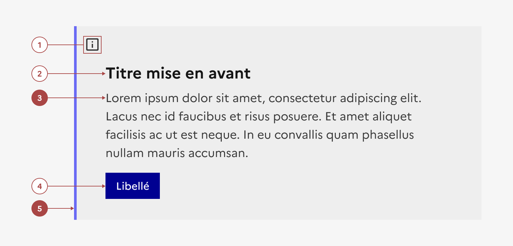
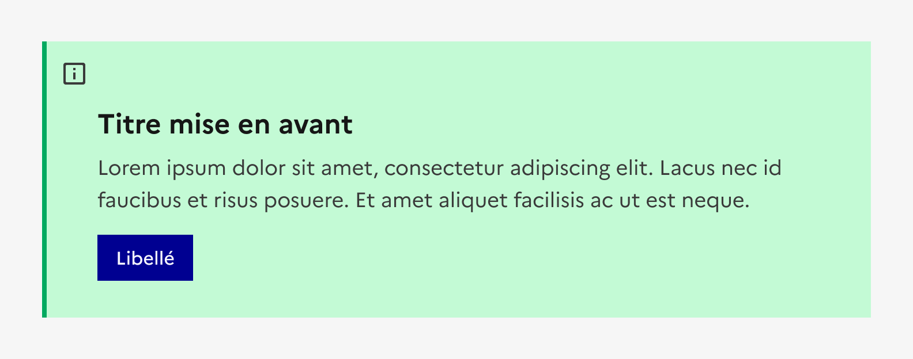
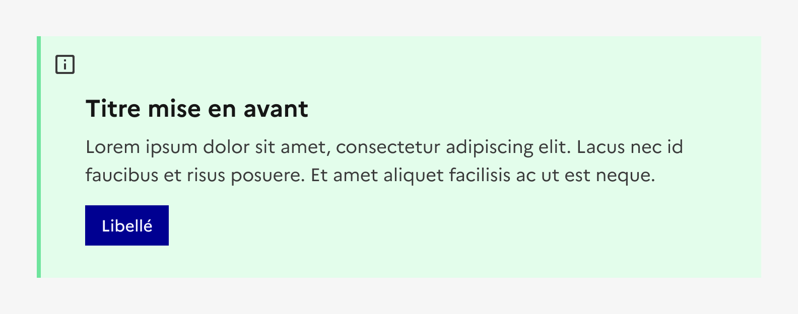

## Mise en avant

La mise en avant est un élément éditorial permettant de mettre en forme du contenu dans une page.

:::dsfr-doc-tab-navigation

- [Présentation](../index.md)
- [Démo](../demo/index.md)
- Design
- [Code](../code/index.md)
- [Accessibilité](../accessibility/index.md)

:::

:::dsfr-doc-anatomy{col=12}

::dsfr-doc-pin[Une icône]{add="pour aider à la compréhension du message"}

::dsfr-doc-pin[Un titre]

::dsfr-doc-pin[Une description]{required=true}

::dsfr-doc-pin[Un bouton pour inciter à l’action ou un lien pour naviguer vers un autre contenu]

::dsfr-doc-pin[Une bordure de couleur]{required=true}

:::

### Variations

La mise en avant ne propose aucune variation.

### Tailles

La largeur de la mise en avant s’adapte à la taille de son conteneur.

Toutefois, il est recommandé de ne pas excéder une largeur de 8 colonnes, s’agissant d’un composant à intégrer au sein de pages de contenu.

### États

La mise en avant n’est sujette à aucun changement d’état.

### Personnalisation

Les éléments fond et bordure de la mise en avant sont personnalisables et peuvent utiliser l’ensemble les couleurs illustratives.

::::dsfr-doc-guidelines

:::dsfr-doc-guideline[✅ À faire]{col=12 valid=true}

Personnaliser la mise en avant avec l’ensemble des couleurs illustratives d’indice $main pour la bordure et $950 pour le fond.

:::

:::dsfr-doc-guideline[❌ À ne pas faire]{col=12 valid=false}

Ne pas utiliser une couleur illustrative ou des indices autre que ceux autorisés.

:::

::::

:::fr-table[Titre du tableau]{valign=top multiline=true caption=false}
|  Éléments | Indice thème clair | Indice thème sombre |
|:-----|:-----|:-----|
| **Bordure `$border-default-blue-france`** | Indice **main**  exemple : `$green-emeraude-main-632` | Indice **main**  exemple : `$green-emeraude-main-632` |
| **Fond `$background-contrast-neutral`**| Indice **950**  exemple : `$green-emeraude-950` | Indice **100**  exemple : `$green-emeraude-100` |
:::

Par ailleurs, certains éléments sont optionnels et les icônes peuvent être changées - voir [la structure du composant](#mise-en-avant).
