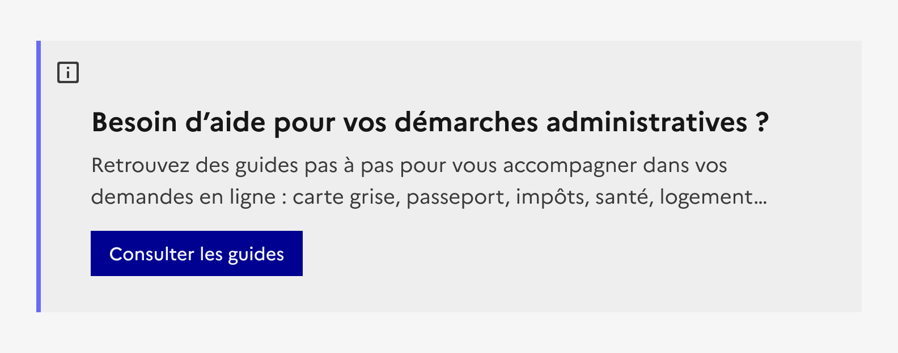
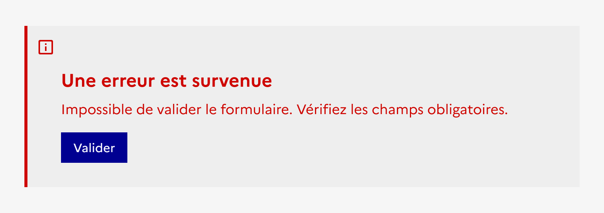

## Mise en avant

La mise en avant est un élément éditorial permettant de mettre en forme du contenu dans une page.

:::dsfr-doc-tab-navigation

- Présentation
- [Démo](./demo/index.md)
- [Design](./design/index.md)
- [Code](./code/index.md)
- [Accessibilité](./accessibility/index.md)

:::

::dsfr-doc-storybook{storyId=callout--callout}

### Quand utiliser ce composant ?

Utiliser la mise en avant pour mettre l’accent sur une information complémentaire au contenu principal.

Elle permet une distinction rapide et facile par l’usager.

> [!WARNING]
> Bien différencier la mise en avant de la mise en exergue.
> La [mise en exergue](../../../highlight/_part/doc/index.md) est utilisée pour distinguer une information importante au sein du contenu principal d’une page.

### Comment utiliser ce composant ?

- **Insérer la mise en avant** au sein d’un contenu éditorial.
- **Prioriser les informations que vous souhaitez valoriser** afin d’utiliser une ou deux mises en avant maximum par page. Plus leur nombre est important, moins elles attireront l’œil de l’usager.
- **Adapter l’usage de la mise en avant à l’information que vous souhaitez relayée**. Par exemple, les messages d’erreur ou de confirmation ne sont pas considérés comme des mises en avant mais bien des [alertes](../../../alert/_part/doc/index.md).

::::dsfr-doc-guidelines

:::dsfr-doc-guideline[✅ À faire]{col=12 valid=true}

Utiliser la mise en avant pour valoriser une information importante.

:::

:::dsfr-doc-guideline[❌ À ne pas faire]{col=12 valid=false}

Ne pas utiliser la mise en avant pour indiquer une erreur, par exemple.

:::

::::

### Règles éditoriales

- **Présenter l’information de façon synthétique** afin qu’elle soit facilement lue et comprise de l’usager.
