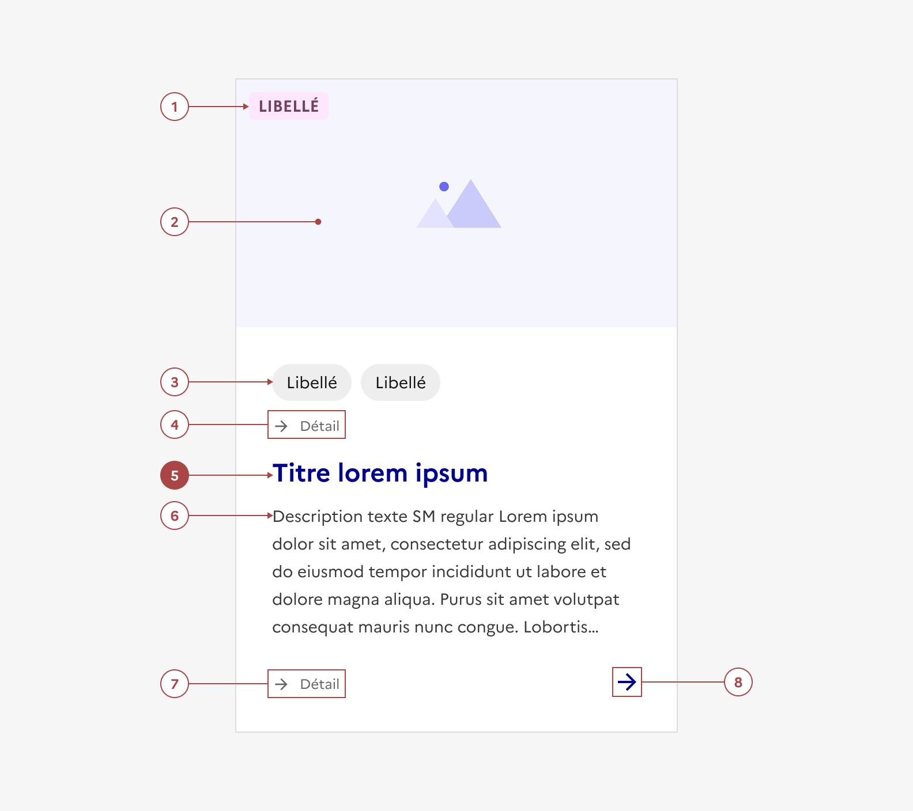
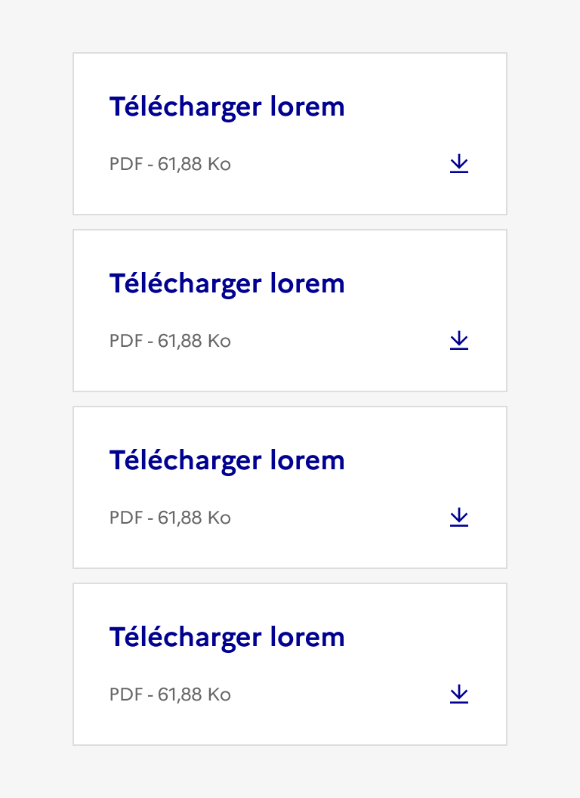

## Carte

La carte est un élément d’interaction avec l’interface permettant de rediriger l’usager vers une page éditoriale donc elle donne un aperçu.

:::dsfr-doc-tab-navigation

- [Présentation](../index.md)
- [Démo](../demo/index.md)
- Design
- [Code](../code/index.md)
- [Accessibilité](../accessibility/index.md)

:::

:::dsfr-doc-anatomy{col=12}

::dsfr-doc-pin[Un badge]{add="placé dans la zone de média"}

::dsfr-doc-pin[Un média (image ou vidéo)]{add="issu ou en lien avec la page de destination"}

::dsfr-doc-pin[Une précision]{add="sous forme de tag (cliquable ou non) ou de badge (jusqu'à 4 éléments maximum)"}

::dsfr-doc-pin[Une première zone de détail]{add="comprenant un texte accompagné d’une icône (si souhaité)"}

::dsfr-doc-pin[Un titre]{required=true add="reprenant celui de l’objet visé (page de destination, action, site etc.) et comprenant un lien dont la zone de clic peut s’étendre à toute la carte (mais incompatible avec une zone d’action ou des tags cliquables)"}

::dsfr-doc-pin[Une description]{add="de 5 lignes maximum (tronquée au-delà)"}

::dsfr-doc-pin[Une seconde zone de détail]{add="identique à la première"}

::dsfr-doc-pin[Une zone d’action]{add="composée de bouton ou de liens (jusqu'à 4 éléments maximum) mais incompatible avec la deuxième zone de détail"}

:::

### Variations

La carte existe en deux formats (horizontal et vertical) déclinés sur deux supports (desktop et mobile). Les cartes horizontales sont réservées au desktop et à la carte de téléchargement en format mobile. A cette exception près, une carte horizontale devient systématiquement verticale sur mobile.

**Carte verticale**

::dsfr-doc-storybook{storyId=card--vertical}

**Carte horizontale**

::dsfr-doc-storybook{storyId=card--horizontal}

Aucun ratio n’est imposé dans une carte horizontale.

La taille de l’image est déduite :

- En hauteur, par la hauteur du contenu.
- En largeur, par les proportions choisies de la carte parmi celles proposées : 33%, 40% et 50%.

Le ratio par défaut est de 40% pour l’image et 60% pour le contenu.

**Carte de téléchargement**

::dsfr-doc-storybook{storyId=card--download}

- Utiliser la carte de téléchargement pour mettre à disposition de l’usager un fichier en téléchargement.
- Le titre de la carte de téléchargement reprend le nom du fichier et doit systématiquement être précédé de la mention “Télécharger”. Préciser la langue du document dans le libellé si elle est différente de celle de la page courante.
- La seconde zone de détail affiche obligatoirement le format et le poids du fichier.
- L’icône de téléchargement est ici obligatoire.
- En mobile, la carte de téléchargement est toujours en format horizontal.

::::dsfr-doc-guidelines

:::dsfr-doc-guideline[❌ À ne pas faire]{col=6 valid=false}

Ne pas cumuler plus de 4 cartes de téléchargement.

:::

::::

**Variantes esthétiques**

- Carte avec fond gris
- Carte avec ombre portée
- Carte sans bordure
- Carte sans fond

### Tailles

La carte est disponible en trois tailles :

- SM pour small
- MD pour medium
- LG pour large

La hauteur de la carte s’adapte à son contenu. La largeur, elle, est définie selon [la grille](../../../../../core/_part/doc/grid/index.md) et les recommandations suivantes.

Pour une carte verticale, en desktop :

- SM : 3 à 4 colonnes

::dsfr-doc-storybook{storyId=card--size-sm}

- MD : 4 à 6 colonnes

::dsfr-doc-storybook{storyId=card--size-md}

- LG : 6 à 8 colonnes

::dsfr-doc-storybook{storyId=card--size-lg}

En mobile, peu importe la taille d’origine, la carte verticale prend systématiquement 12 colonnes de large.

Pour une carte horizontale, en desktop uniquement :

- SM : 4 à 6 colonnes

::dsfr-doc-storybook{storyId=card--horizontal-sm}

- MD : 6 à 8 colonnes

::dsfr-doc-storybook{storyId=card--horizontal-md}

- LG : 8 à 12 colonnes

::dsfr-doc-storybook{storyId=card--horizontal-lg}

En mobile, seule la carte de téléchargement conserve un format horizontal. Dans ce cas, elle prend systématiquement 12 colonnes de large.

> [!NOTE]
> La taille choisie a une influence sur les espacements, la taille du titre, de l’icône et des tags ou badges au sein de la carte.

### États

**État désactivé**

L’état désactivé indique que l'usager ne peut pas interagir avec la carte.

::dsfr-doc-storybook{storyId=card--disabled}

**État au survol**

L’état au survol correspond au comportement constaté par l’usager lorsqu’il survole la carte avec sa souris.

### Personnalisation

La carte comporte des variantes esthétiques (voir section “Variations”).

L’ensemble des composants imbriqués ([média](../../../../../core/_part/doc/media/index.md), [icône](../../../../../core/_part/doc/icon/index.md), [tag](../../../../tag/_part/doc/index.md), [badge](../../../../badge/_part/doc/index.md) et [bouton](../../../../button/_part/doc/index.md)) peuvent également être personnalisés selon leurs propres règles de personnalisation.

Par ailleurs, certains éléments sont optionnels - voir [la structure du composant](#carte).

### Maillage

- [Badge](../../../../badge/_part/doc/index.md)
- [Bouton](../../../../button/_part/doc/index.md)
- [Tag](../../../../tag/_part/doc/index.md)
- [Tuile](../../../../tile/_part/doc/index.md)
