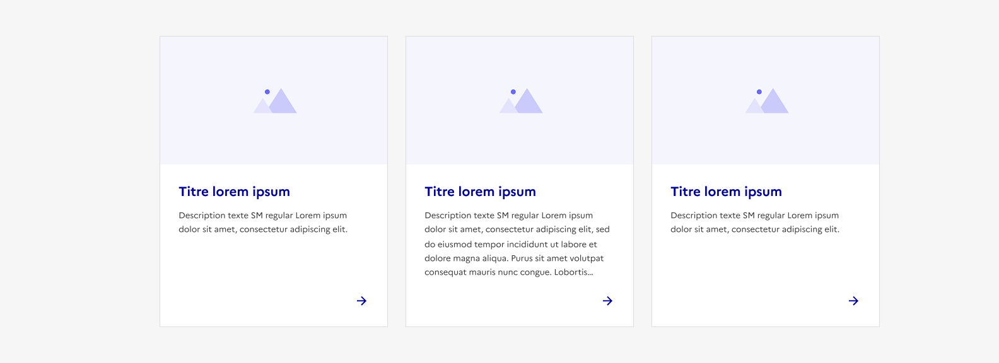
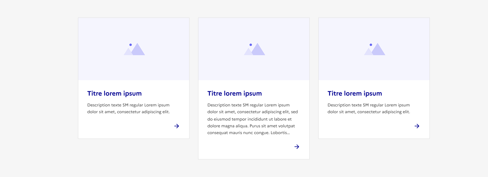
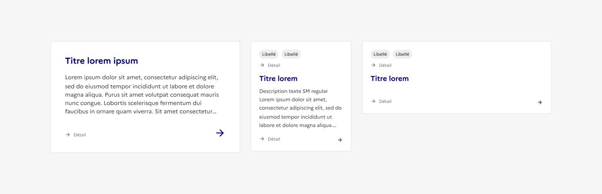
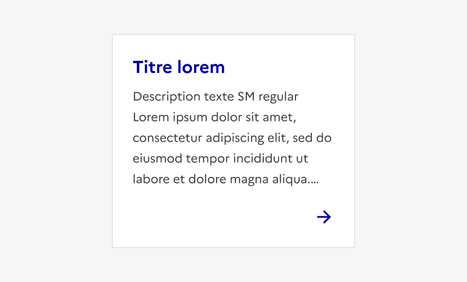
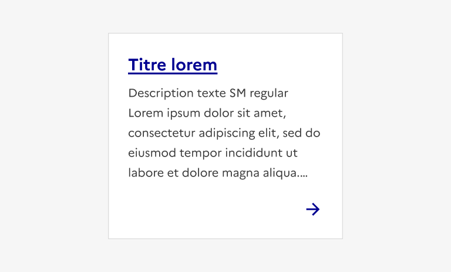
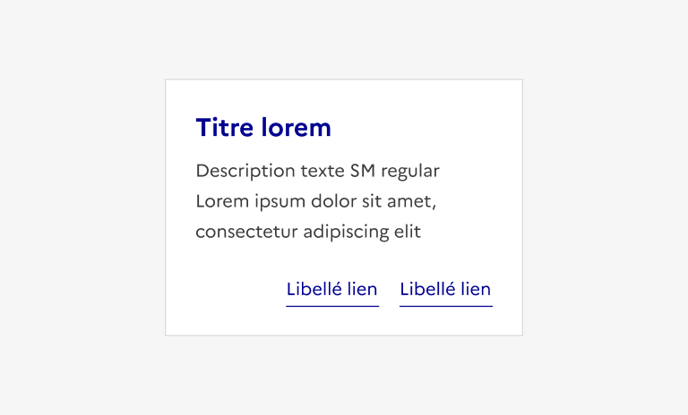
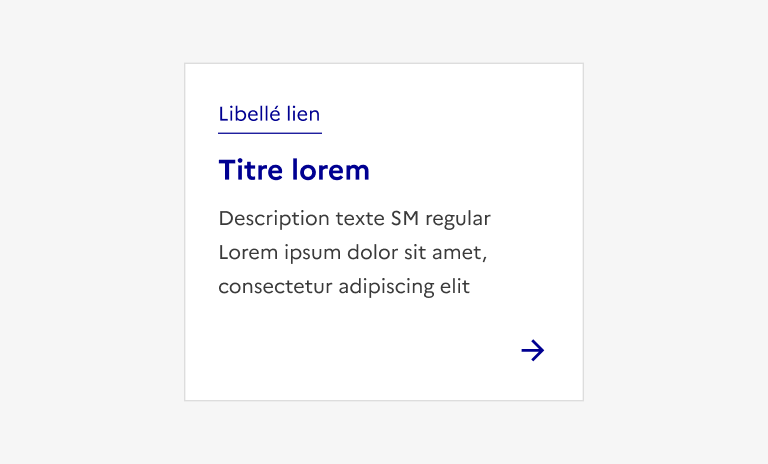

## Carte

La carte est un élément d’interaction avec l’interface permettant de rediriger l’usager vers une page éditoriale donc elle donne un aperçu.

:::dsfr-doc-tab-navigation

- Présentation
- [Démo](./demo/index.md)
- [Design](./design/index.md)
- [Code](./code/index.md)
- [Accessibilité](./accessibility/index.md)

:::

::dsfr-doc-storybook{storyId=card--card}

### Quand utiliser ce composant ?

Proposer la carte pour créer un raccourci ou un point d’entrée vers des pages de contenu, en permettant un aperçu.

La carte n’a pas d’usage imposé mais elle fait généralement partie d'une collection de contenus similaires. Elle peut en effet servir à construire des listes de liens, des grilles de contenus, des blocs de mise en avant ou des boutons d’actions habillés, par exemple.

> [!NOTE]
> Depuis la version 1.5.0, il n’y a plus de différence d’usage entre la carte et la tuile. La différence entre les deux composants est donc uniquement visuelle.

### Comment utiliser ce composant ?

- **Utiliser les cartes pour créer des collections ou listes d’éléments similaires**. La carte est rarement présentée de manière isolée.
- **Harmoniser la hauteur des cartes par ligne**, en prenant la plus importante comme référence, lorsque celles-ci sont disposées au sein d’une liste. Au sein d’une grille (plusieurs lignes), les hauteurs peuvent varier mais l’ensemble doit garder une cohérence visuelle.

::::dsfr-doc-guidelines

:::dsfr-doc-guideline[✅ À faire]{col=12 valid=true}

Contraindre toutes les cartes d’une même ligne à la même hauteur.

:::

::::

::::dsfr-doc-guidelines

:::dsfr-doc-guideline[❌ À ne pas faire]{col=12 valid=false}

Ne pas créer de disparité dans la hauteur des cartes d’une même ligne.

:::

::::

- **Proposer des cartes de même structure** lorsque celles-ci composent une liste ou une collection.

::::dsfr-doc-guidelines

:::dsfr-doc-guideline[✅ À faire]{col=12 valid=true}

Conserver un contenu commun au sein des cartes qui forment un même ensemble.

:::

::::

::::dsfr-doc-guidelines

:::dsfr-doc-guideline[❌ À ne pas faire]{col=12 valid=false}

Ne pas proposer des contenus différents entre chacune des cartes d’un même ensemble.

:::

::::

- **Conserver l’intégralité de la carte cliquable** lorsque vous proposez cette variation.

::::dsfr-doc-guidelines

:::dsfr-doc-guideline[✅ À faire]{col=6 valid=true}

Proposer un titre sans soulignement et une zone d’action pour signifier que le lien est étendu à toute la carte.

:::

:::dsfr-doc-guideline[❌ À ne pas faire]{col=6 valid=false}

Ne pas souligner le titre si le lien est étendu à toute la carte. Cela apporte de la confusion pour l’usager.

:::

::::

- **Respecter la structure de la carte telle qu’existante**, les différentes zones qui la constituent ayant un rôle défini.

::::dsfr-doc-guidelines

:::dsfr-doc-guideline[✅ À faire]{col=6 valid=true}

Proposer les liens et actions dans la zone d’action, prévue à cet effet.

:::

:::dsfr-doc-guideline[❌ À ne pas faire]{col=6 valid=false}

Ne pas mettre de liens ou actions dans la zone de détail.

:::

::::

### Règles éditoriales

- **Rédiger des titres et descriptions synthétiques**.
- **Proposer des contenus distincts pour chaque carte**, en évitant de réutiliser plusieurs fois la même image d’illustration.
- **Être vigilant sur les dimensions des images d’illustration utilisées** afin de garantir leur adaptation aux différents types d’affichages responsive.
