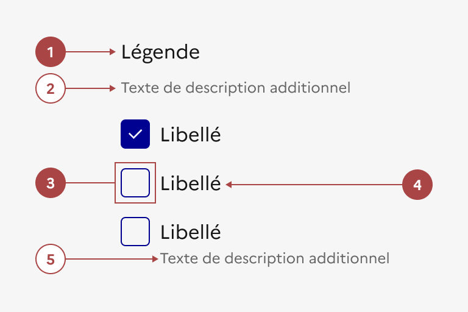
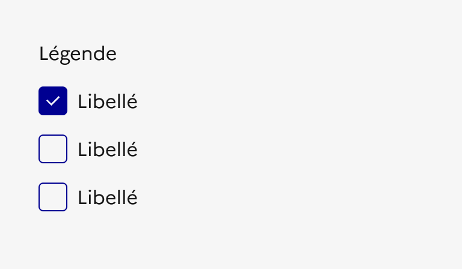
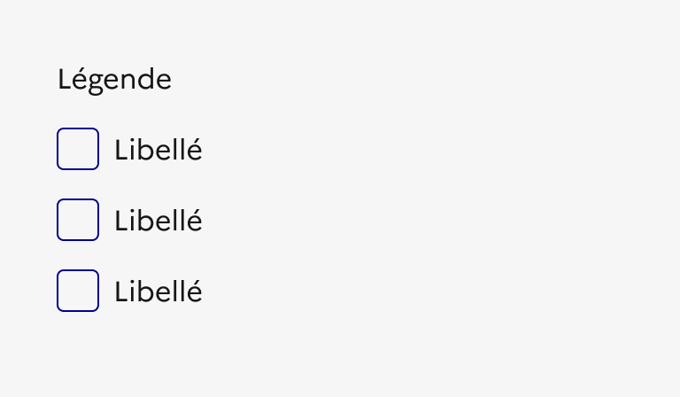
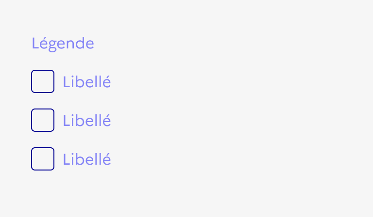

## Case à cocher

La case à cocher est un élément d’interaction avec l’interface permettant à l’usager de sélectionner une ou plusieurs options dans une liste.

:::dsfr-doc-tab-navigation

- [Présentation](../index.md)
- [Démo](../demo/index.md)
- Design
- [Code](../code/index.md)
- [Accessibilité](../accessibility/index.md)

:::

:::dsfr-doc-anatomy{imageWidth=384 col=12}

::dsfr-doc-pin[Une légende]{required=true add="décrivant le contexte du groupe de cases à cocher"}

::dsfr-doc-pin[Une description additionnelle]{add="pour la légende"}

::dsfr-doc-pin[Une case à cocher]{required=true}

::dsfr-doc-pin[Un libellé]{required=true add="associé à la case à cocher"}

::dsfr-doc-pin[Un texte additionnel]{add="accompagnant chaque case à cocher / libellé"}

:::

### Variations

**Liste verticale**

::dsfr-doc-storybook{storyId=checkboxes-group--default-group}

La variation verticale d’une liste de cases à cocher est la plus courante et la plus facile à lire pour l’utilisateur.

**Liste horizontale**

::dsfr-doc-storybook{storyId=checkboxes-group--inline}

La variation horizontale d’une liste de cases à cocher est à utiliser uniquement lorsqu’il n’y a 2 options ou que les libellés des entrées sont courts.

**Liste avec texte d’aide**

Il est recommandé d’ajouter un texte d’aide qui accompagne les cases à cocher afin de faciliter le choix de l’utilisateur. Ces précisions peuvent être apportées de deux façons :

- Par l’ajout d’un texte sous le titre du groupe de cases à cocher, afin d’apporter une précision à l’intitulé du groupe.

::dsfr-doc-storybook{storyId=checkboxes-group--hint}

- Par l’ajout d’un texte sous le libellé de chaque case à cocher, afin d’apporter une précision à chaque élément.

::dsfr-doc-storybook{storyId=checkboxes-group--hint-group}

### Tailles

La case à cocher est proposée en taille MD par défaut (24px) afin d’optimiser son ergonomie et son accessibilité en ayant une zone cliquable confortable.

::dsfr-doc-storybook{storyId=checkboxes-group--size-md}

Il existe également une version en taille SM (16 px) correspondant à la taille standard proposée par les navigateurs.

::dsfr-doc-storybook{storyId=checkboxes-group--size-sm}

### États

**État d’erreur**

L'état d’erreur est signalé par un changement de couleur ainsi que l’affichage d’une ligne rouge (cf. couleurs fonctionnelles : le rouge est la couleur de l’état erreur) et d’un message d’erreur en-dessous du composant.

::dsfr-doc-storybook{storyId=checkboxes-group--error}

**État de succès**

L'état de succès est signalé par un changement de couleur ainsi que l’affichage d’une ligne verte (cf. couleurs fonctionnelles : le vert est la couleur de l’état succès) et d’un message de succès en-dessous du composant.

::dsfr-doc-storybook{storyId=checkboxes-group--success}

**État désactivé**

L'état désactivé indique que l’utilisateur ne peut pas interagir avec la case à cocher.

::dsfr-doc-storybook{storyId=checkboxes-group--disabled}

> [!NOTE]
> L'état “Indeterminate” n’est pas géré actuellement par le Système de Design de l'Etat.

### Personnalisation

Les cases à cocher ne sont pas personnalisables. Toutefois, certains éléments sont optionnels - voir [la structure du composant](#case-à-cocher).

::::dsfr-doc-guidelines

:::dsfr-doc-guideline[✅ À faire]{col=6 valid=true}

Utiliser uniquement la couleur bleu pour les cases à cocher.

:::

:::dsfr-doc-guideline[❌ À ne pas faire]{col=6 valid=false}

Ne pas personnaliser la couleur des cases à cocher.

:::

::::

::::dsfr-doc-guidelines

:::dsfr-doc-guideline[✅ À faire]{col=6 valid=true}

Utiliser uniquement une typographie noire.

:::

:::dsfr-doc-guideline[❌ À ne pas faire]{col=6 valid=false}

Ne pas personnaliser la couleur des textes.

:::

::::
