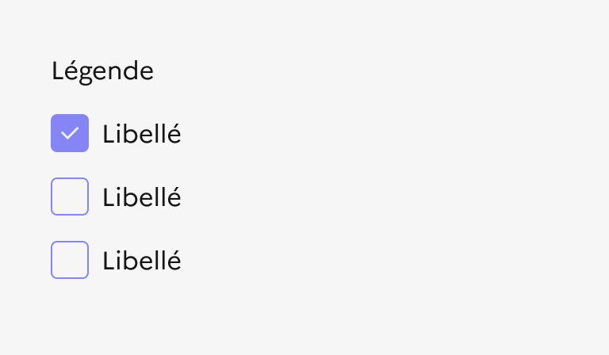

## Case à cocher

:::dsfr-doc-tab-navigation

- [Présentation](../index.md)
- [Démo](../demo/index.md)
- Design
- [Code](../code/index.md)
- [Accessibilité](../accessibility/index.md)

:::

### Design

:::dsfr-doc-anatomy{col=6}

::dsfr-doc-pin[Une légende, décrivant le contexte du groupe de cases à cocher]{required=true}

::dsfr-doc-pin[Une description additionnelle pour la légende]

::dsfr-doc-pin[Une case à cocher]{required=true}

::dsfr-doc-pin[Un libellé, associé à la case à cocher]{required=true}

::dsfr-doc-pin[Un texte additionnel, accompagnant chaque case à cocher / libellé]

::dsfr-doc-pin[Un message d’erreur ou de succès]{required=true add="si un changement d'état doit être notifié à l’usager"}

:::

#### **Variations**

**Liste verticale**

Cette organisation verticale d’une liste de cases à cocher est la plus courante et la plus facile à lire pour l’usager.

**Liste horizontale**

Cette organisation horizontale d’une liste de cases à cocher est à utiliser uniquement lorsqu’il n’y a 2 options ou que les libellés des entrées sont courts.

**Liste avec texte d’aide**

Il est recommandé d’ajouter un texte d’aide qui accompagne les cases à cocher afin de faciliter le choix de l’usager. Ces précisions peuvent être apportées de 2 façons :

- Via un texte sous le titre du groupe de cases à cocher, afin d’apporter une précision à l’intitulé du groupe.

- Via un texte sous le libellé de chaque case à cocher, afin d’apporter une précision à chaque élément.

#### **Tailles**

La case à cocher est proposée en MD par défaut (24px) afin d’optimiser son ergonomie et son accessibilité en ayant une zone cliquable confortable.

Il existe également une version SM (16 px) correspondant à la taille standard proposée par les navigateurs.

#### **États**

**État d’erreur**

L'état d’erreur est signalé par un changement de couleur ainsi que l’affichage d’une ligne rouge (cf. couleurs fonctionnelles : le rouge est la couleur de l’état erreur) et d’un message d’erreur en-dessous du composant.

**État de succès**

L'état de succès est signalé par un changement de couleur ainsi que l’affichage d’une ligne verte (cf. couleurs fonctionnelles : le vert est la couleur de l’état succès) et d’un message de succès en-dessous du composant.

Pour le composant seul
Sur une case à cocher simple (choix binaire), l'état d’erreur est signalé par le changement de couleur de la bordure - qui devient rouge - , et par l’affichage un message d’erreur apparait en-dessous du composant (cf. couleurs fonctionnelles : le rouge est la couleur de l’état erreur).

**État désactivé**

L'état désactivé indique que l’usager ne peut pas interagir avec la case à cocher.

>[!NOTE]
>L'état “Indeterminate” n’est pas géré actuellement par le Système de Design de l’État.

#### **Personnalisation**

Les cases à cocher ne sont pas personnalisables. Toutefois, certains éléments sont optionnels - voir [la structure du composant](#design).

::::dsfr-doc-guidelines

:::dsfr-doc-guideline[✅ À faire]{col=6 valid=true}

Utiliser uniquement la couleur bleu pour les cases à cocher.

:::

:::dsfr-doc-guideline[❌ À ne pas faire]{col=6 valid=false}

Ne pas personnaliser la couleur des cases à cocher.

:::

::::

::::dsfr-doc-guidelines

:::dsfr-doc-guideline[✅ À faire]{col=6 valid=true}

Utiliser uniquement une typographie noire.

:::

:::dsfr-doc-guideline[❌ À ne pas faire]{col=6 valid=false}

Ne pas personnaliser la couleur des textes.

:::

::::

#### Maillage

- [Bouton radio](../../../../radio/_part/doc/index.md)
- [Liste déroulante](../../../../select/_part/doc/index.md)
- [Champs de saisie](../../../../input/_part/doc/index.md)
- [Formulaire](../../../../form/_part/doc/index.md)
