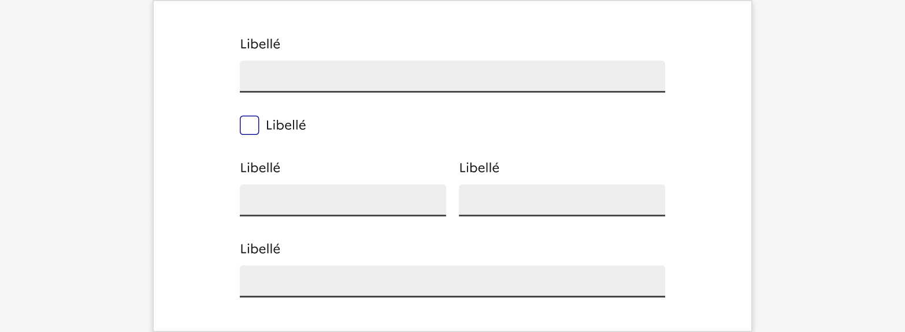
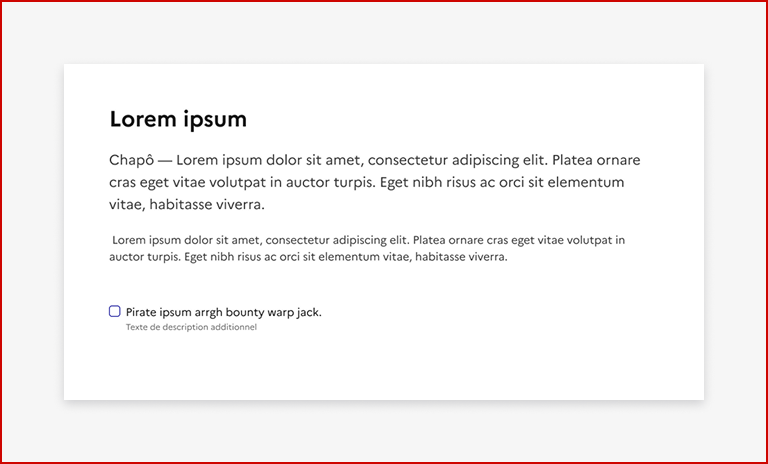
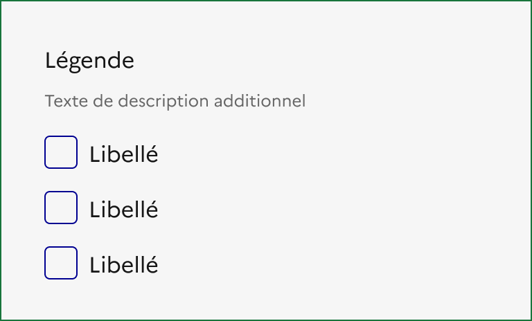
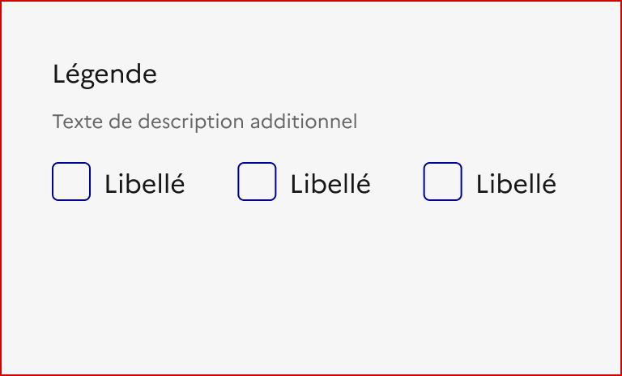
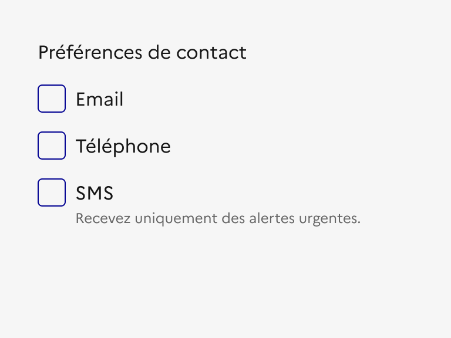
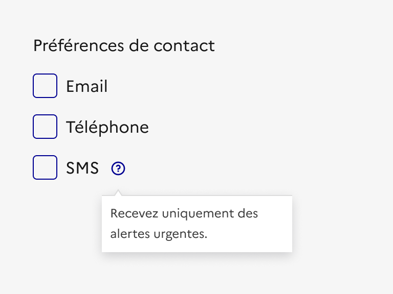
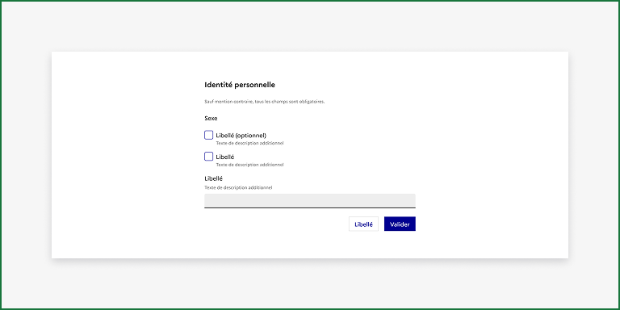

## Case à cocher

:::dsfr-doc-tab-navigation

- Présentation
- [Démo](./demo/index.md)
- [Design](./design/index.md)
- [Code](./code/index.md)
- [Accessibilité](./accessibility/index.md)

:::

### Présentation

La case à cocher est un élément d’interaction avec l’interface permettant à l’usager de sélectionner une ou plusieurs options au sein d’une liste.

#### **Quand utiliser ce composant ?**

Utiliser les cases à cocher pour permettre à l’usager de sélectionner une ou plusieurs options dans une liste.

> [!WARNING]
> Bien différencier les cases à cocher des boutons radio ou listes déroulantes. Les cases à cocher sont recommandées lorsque l’usager doit effectuer une sélection multiple (de 0 à N éléments) dans une liste ou pour permettre un choix binaire (lorsque l’usager peut sélectionner ou désélectionner une seule option).

Évitez les listes de cases à cocher de plus de 5 items. Dans ce cas, optez plutôt pour une liste déroulante.

Si vous souhaitez contraindre le choix de l’usager à une seule option, choisissez les boutons radios.

#### **Comment utiliser ce composant ?**

- **Utiliser la case à cocher seule ou en liste**, selon son contexte d’utilisation.

::::dsfr-doc-guidelines

:::dsfr-doc-guideline[✅ À faire]{col=6 valid=true}

Utiliser la case à cocher au sein d’un formulaire.

:::

:::dsfr-doc-guideline[❌ À ne pas faire]{col=6 valid=false}

Ne pas isoler la case à cocher au sein d’un contenu, sans contexte spécifique.

:::

::::

- **Privilégier une disposition en liste verticale** des cases à cocher lorsqu’elles sont en liste, la liste horizontale étant plus difficile à lire des usagers, notamment lorsque les options sont nombreuses.

::::dsfr-doc-guidelines

:::dsfr-doc-guideline[✅ À faire]{col=6 valid=true}

Préférer l’affichage des cases à cocher en liste verticale lorsqu’elles sont nombreuses.

:::

:::dsfr-doc-guideline[❌ À ne pas faire]{col=6 valid=false}

Ne pas proposer un affichage des cases à cocher en liste horizontale lorsque les options sont nombreuses. Cela rend la lecture plus difficile pour l’usager.

:::

::::

#### **Règles éditoriales**

- **Rédiger un libellé de case à cocher clair et concis**. L’usager doit comprendre facilement le choix à réaliser.
- **Maintenir une cohérence dans les libellés** des cases à cocher en utilisant les mêmes termes à chaque fois.
- **Conserver une unité** dans le format d’écriture de tous les libellés de cases à cocher, en mettant uniquement la première lettre en majuscule et sans ponctuer la fin d’un libellé.
- **Accompagner la case à cocher d’un texte d’aide pour clarifier la nature du contenu attendu,** lorsque nécessaire. ****Si cette information est essentielle, éviter de la masquer dans une infobulle.

::::dsfr-doc-guidelines

:::dsfr-doc-guideline[✅ À faire]{col=6 valid=true}

Accompagner les cases à cocher d’un texte d’aide pour clarifier la nature du contenu attendu.

:::

:::dsfr-doc-guideline[❌ À ne pas faire]{col=6 valid=false}

Ne pas masquer le texte d’aide dans une infobulle.

:::

::::

>[!NOTE]
>Si les cases à cocher sont utilisées au sein d’un formulaire, ajouter une mention “optionnel” à la suite des libellés des cases à cocher non obligatoires pour en informer l’usager. Une légende explicative “Sauf mention contraire, tous les champs sont obligatoires” doit également figurer en haut du formulaire.

::::dsfr-doc-guidelines

:::dsfr-doc-guideline[✅ À faire]{col=6 valid=true}

Préciser en haut de formulaire que “Sauf mention contraire, tous les champs sont obligatoires”. Au besoin, accompagner les cases à cocher non obligatoires de la mention “optionnel”.

:::

::::
