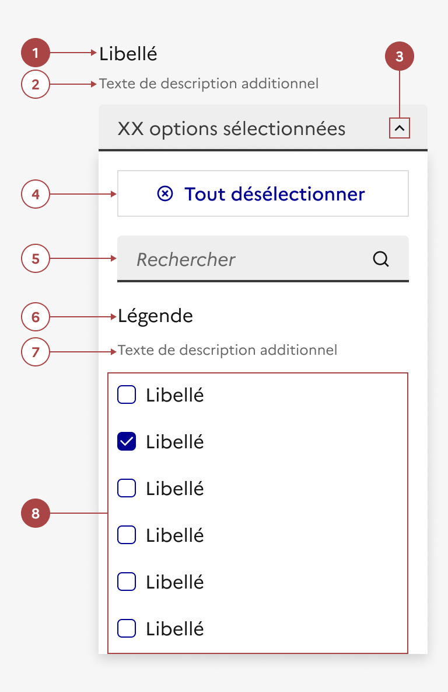

## Liste déroulante riche

> [!NOTE]
> **Ce composant est en version bêta.** Il n'existe pas en code et son design ou ses fonctionnalités peuvent encore être amenés à évoluer. N'hésitez pas à nous partager vos cas d'usage ou retours qui le concerne via notre formulaire de contact ou notre Tchap pour que nous puissions les étudier.

Retrouvez ces composants sur Figma [dans un fichier dédié bêta disponible sur Community](https://www.figma.com/community/file/1096003483468520396).

La liste déroulante riche est un élément d’interaction avec l’interface permettant à l’usager de choisir une ou plusieurs options dans une liste donnée.

:::dsfr-doc-tab-navigation

- [Présentation](../index.md)
- Design

:::

:::dsfr-doc-anatomy{imageWidth=384 col=12}

::dsfr-doc-pin[Un libellé]{required=true}

::dsfr-doc-pin[Une description]

::dsfr-doc-pin[Un chevron]{required=true add="permettant de déplier la liste"}

::dsfr-doc-pin[Un bouton “Tout sélectionner” ou “Tout désélectionner”]

::dsfr-doc-pin[Un champ de recherche]

::dsfr-doc-pin[Une légende]{add="qui peut être masquée à l’écran"}

::dsfr-doc-pin[Une description du groupe]{add="qui peut être masquée à l’écran"}

::dsfr-doc-pin[Une liste]{required=true add="composée d’un ensemble d’options sélectionnables"}

:::

### Variations

La liste déroulante riche ne propose aucune variation.

### Tailles

La liste déroulante riche existe en une taille MD unique.

Les composants imbriqués à l’intérieur sont quant à eux en taille SM.

### États

**Etat d’erreur**

L'état d’erreur est signalé par un changement de couleur ainsi que l’affichage d’une ligne rouge (cf. couleurs fonctionnelles : le rouge est la couleur de l’état erreur) et d’un message d’erreur en-dessous du composant.

**Etat de succès**

L'état de succès est signalé par un changement de couleur ainsi que l’affichage d’une ligne verte (cf. couleurs fonctionnelles : le vert est la couleur de l’état succès) et d’un message de succès en-dessous du composant.

**Etat désactivé**

L'état désactivé indique que l’usager ne peux pas interagir avec la liste déroulante riche.

Cet état peut être utilisé pour empêcher l'usager d'interagir avec la liste jusqu'à ce qu'une autre action soit terminée.

### Personnalisation

La liste déroulante riche n’est pas personnalisable.

Toutefois, certains éléments sont optionnels - voir [la structure du composant](#liste-déroulante-riche).

### Maillage

- [Bouton radio](../../../../radio/_part/doc/index.md)
- [Case à cocher](../../../../checkbox/_part/doc/index.md)
- [Liste déroulante](../../../../select/_part/doc/index.md)
