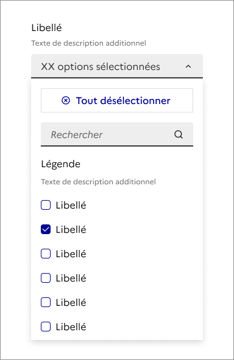

## Liste déroulante riche

> [!NOTE]
> **Ce composant est en version bêta.** Il n'existe pas en code et son design ou ses fonctionnalités peuvent encore être amenés à évoluer. N'hésitez pas à nous partager vos cas d'usage ou retours qui le concerne via notre formulaire de contact ou notre Tchap pour que nous puissions les étudier.

Retrouvez ces composants sur Figma [dans un fichier dédié bêta disponible sur Community](https://www.figma.com/community/file/1096003483468520396).

La liste déroulante riche est un élément d’interaction avec l’interface permettant à l’usager de choisir une ou plusieurs options dans une liste donnée.

:::dsfr-doc-tab-navigation

- Présentation
- [Design](./design/index.md)

:::

### Quand utiliser ce composant ?

Utiliser la liste déroulante riche pour permettre à l’usager de sélectionner une ou plusieurs options dans une liste ou si vous souhaitez lui permettre de faire une recherche ou d’appliquer un filtrage dans la liste d’options mise à disposition.

> [!NOTE]
> Bien différencier la liste déroulante riche de la [liste déroulante](../../../select/_part/doc/index.md) simple. Opter pour cette dernière si vous souhaitez restreindre l’usager à un choix unique.

Évitez également l’usage de listes déroulantes lorsqu’elles comportent peu de propositions (moins de 3 options). Dans ce cas, préférez des [boutons radio](../../../radio/_part/doc/index.md), si le choix est unique, ou des [cases à cocher](../../../checkbox/_part/doc/index.md), si c’est un choix multiple.

Si les options doivent être facilement comparables (exemple : le prix de produits), préférez les [boutons radio](../../../radio/_part/doc/index.md) aux listes déroulantes.

### Comment utiliser ce composant ?

- **Utiliser les listes déroulantes au sein de formulaire** afin de distinguer leur usage de celui des menus déroulants.
- **Effectuer la validation des entrées côté client en temps réel**, si possible, et fournir un retour immédiat à l’usager après la sélection.
- **Fournir une description textuelle de l’erreur**, dans le cas d’une sélection erronée, ainsi que des instructions claires sur la manière de la corriger à l'usager.
- **Définir une option par défaut pour une liste déroulante de sélection unique** est recommandé. Si l'option par défaut est également l'option recommandée, vous pouvez marquer l'option avec le texte « (recommandé) ».

### Règles éditoriales

- **Rédiger des libellés clairs et concis** pour faciliter la compréhension des options et du choix à réaliser.
- **Évitez de proposer des options longues**, qui s'étendraient sur plusieurs lignes.
