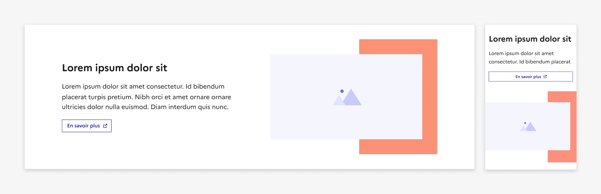

## Zone d'expression visuelle

La zone d’expression visuelle est une section de page à l’intérieur de laquelle il est possible de faire des compositions créativement plus riches que généralement autorisé par le DSFR.

:::dsfr-doc-tab-navigation

- [Présentation](../index.md)
- Design

:::

### Variations

La zone d’expression visuelle permet la combinaison de plusieurs éléments (texte, image, background) dans un jeu de superposition pour maximiser l’impact d’une section en lui donnant du relief. En ce sens, elle propose différentes compositions possibles.

**Composition sur fond blanc ou alternatif**

Dans cette combinaison, vous pouvez associer une image et une forme de couleur à un bloc “texte + bouton”.

- Version sur fond blanc

::::dsfr-doc-guidelines

:::dsfr-doc-guideline[✅ À faire]{col=12 valid=true}

:::

::::

::::dsfr-doc-guidelines

:::dsfr-doc-guideline[✅ À faire]{col=12 valid=true}

:::

::::

- Version sur fond alternatif

::::dsfr-doc-guidelines

:::dsfr-doc-guideline[✅ À faire]{col=12 valid=true}

:::

::::

::::dsfr-doc-guidelines

:::dsfr-doc-guideline[✅ À faire]{col=12 valid=true}

:::

::::

Dans cette combinaison, la forme de couleur qui accompagne l’image peut être remplacée par un motif.

::::dsfr-doc-guidelines

:::dsfr-doc-guideline[✅ À faire]{col=12 valid=true}

:::

::::

**Composition sur fond de couleur ou motif**

Dans cette combinaison, vous pouvez associer un bloc de texte sur fond blanc superposé sur l’image, le tout sur un fond de couleur au choix dans la palette DSFR ou un motif, sur toute la largeur.

- Version sur fond de couleur

::::dsfr-doc-guidelines

:::dsfr-doc-guideline[✅ À faire]{col=12 valid=true}

:::

::::

::::dsfr-doc-guidelines

:::dsfr-doc-guideline[✅ À faire]{col=12 valid=true}

:::

::::

::::dsfr-doc-guidelines

:::dsfr-doc-guideline[❌ À ne pas faire]{col=12 valid=false}

Ne pas couvrir 2 bords (ou plus) de l’image avec un bloc de texte, quelque soit l’écran sur lequel il est affiché.

:::

::::

::::dsfr-doc-guidelines

:::dsfr-doc-guideline[❌ À ne pas faire]{col=12 valid=false}

Ne pas sortir le bloc de texte de la zone d’expression visuel ou créer de décalage visuel.

:::

::::

- Version sur motif

::::dsfr-doc-guidelines

:::dsfr-doc-guideline[✅ À faire]{col=12 valid=true}

:::

::::

- Autre disposition possible avec image

::::dsfr-doc-guidelines

:::dsfr-doc-guideline[✅ À faire]{col=12 valid=true}

:::

::::

::::dsfr-doc-guidelines

:::dsfr-doc-guideline[❌ À ne pas faire]{col=12 valid=false}

Ne pas superposer plusieurs images les unes sur les autres pour conserver la lisibilité de la composition.

:::

::::

### Tailles

La zone d’expression visuelle doit s’intégrer dans les 12 colonnes de la grille du DSFR.

### États

La zone d’expression visuelle n’est sujette à aucun changement d’état.

### Personnalisation

Le background de la zone d’expression visuelle est personnalisable et peut utiliser l’ensemble des [couleurs de la palette du DSFR](../../../../../core/_part/doc/palette/index.md) (dans la limite du respect des prérogatives liées à l’accessibilité).
