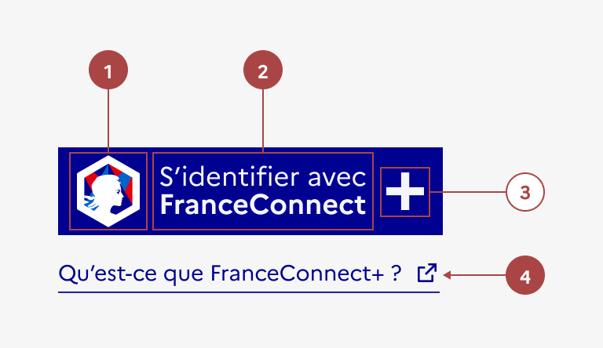
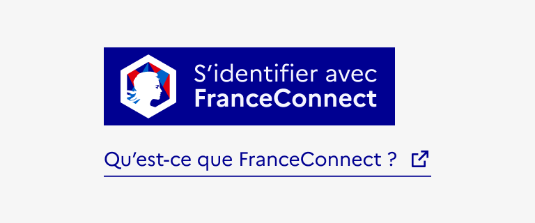
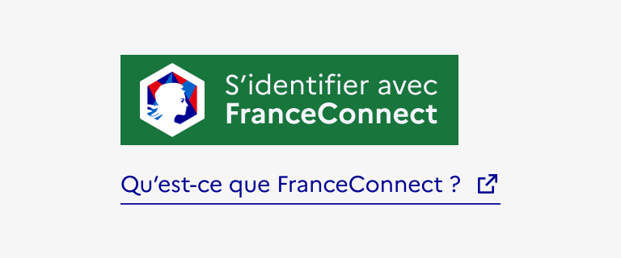
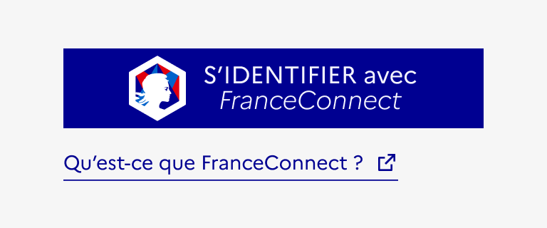
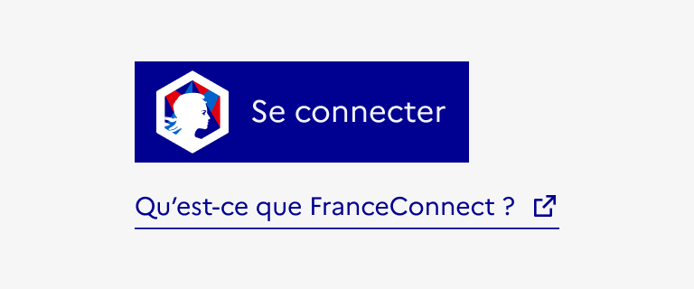

## Boutons FranceConnect et ProConnect

Les boutons FranceConnect et ProConnect sont des éléments d’interaction avec l’interface proposant à l’usager de se connecter à un service via un compte appelé fournisseur d’identité (type [impots.gouv.fr](http://impots.gouv.fr/), [ameli.fr](http://ameli.fr/), [l’Identité Numérique La Poste](https://lidentitenumerique.laposte.fr/), [France Identité](https://france-identite.gouv.fr/), etc.).

Le service sur lequel l’usager se connecte récupère auprès de FranceConnect et/ou ProConnect un identifiant technique unique ainsi que des données d’identité vérifiées par l’INSEE qui permettent de garantir l’authentification de l’usager.

Retrouver le détail de leurs fonctionnements et conditions d’éligibilité ici : [https://franceconnect.gouv.fr](https://franceconnect.gouv.fr/partenaires) et [https://www.proconnect.gouv.fr/](https://www.proconnect.gouv.fr/)

:::dsfr-doc-tab-navigation

- [Présentation](../index.md)
- [Démo](../demo/index.md)
- Design
- [Code](../code/index.md)
- [Accessibilité](../accessibility/index.md)

:::

:::dsfr-doc-anatomy{imageWidth=384 col=12}

::dsfr-doc-pin[Le logo]{required=true}

::dsfr-doc-pin[Un libellé “S’identifier avec [nom du service]”]{required=true}

::dsfr-doc-pin[Une icône plus - En option, uniquement pour le variant FranceConnect.]

::dsfr-doc-pin[Un lien “Qu’est-ce que [nom du service] ?”]{required=true add='qui redirige vers l’URL dédiée'}

:::

### Variations

**FranceConnect+**

Si le service utilise FranceConnect+ (pour les démarches nécessitant une sécurité renforcée), il faut utiliser la variante du bouton FranceConnect+.

La structure est sensiblement la même que celle du bouton FranceConnect, à l’exception du lien “Qu’est-ce que FranceConnect+ ?” qui pointe vers l’URL [https://franceconnect.gouv.fr/france-connect-plus](https://franceconnect.gouv.fr/france-connect-plus).

**ProConnect**

Si le service utilise ProConnect (pour en faciliter l’accès aux agents publics), il faut utiliser la variante du bouton ProConnect.

La structure est sensiblement la même que celle du bouton FranceConnect, à l’exception du logo et du lien “Qu’est-ce que ProConnect ?” qui pointe vers l’URL [https://proconnect.gouv.fr](https://proconnect.gouv.fr).

### Tailles

La taille des boutons de connexion n’est pas personnalisable. Elle s’ajuste à son contenu.

### États

**Etat désactivé**

L’état désactivé indique que l'usager ne peut pas interagir avec le bouton de connexion.

::dsfr-doc-storybook{storyId="connect--default" args="{ disabled: true }"}

> [!NOTE]
> Utiliser cet état que très ponctuellement, pour indiquer à l’usager qu’il doit procéder à une action en amont par exemple.

**État au survol**

L’état au survol correspond au comportement constaté par l’usager lorsqu’il survole le bouton de connexion avec sa souris.

### Personnalisation

Les boutons de connexion ne sont pas personnalisables.

::::dsfr-doc-guidelines

:::dsfr-doc-guideline[✅ À faire]{col=6 valid=true}

Utiliser le bouton en l’état.

:::

:::dsfr-doc-guideline[❌ À ne pas faire]{col=6 valid=false}

Ne pas personnaliser la couleur du bouton.

:::

::::

::::dsfr-doc-guidelines

:::dsfr-doc-guideline[❌ À ne pas faire]{col=6 valid=false}

Ne pas personnaliser la typographie du bouton.

:::

:::dsfr-doc-guideline[❌ À ne pas faire]{col=6 valid=false}

Ne pas modifier le libellé du bouton.

:::

::::
