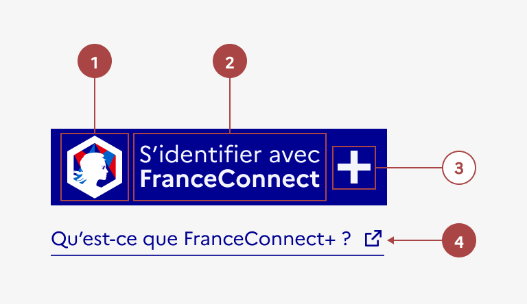

## Bouton FranceConnect

Le bouton FranceConnect est un élément d’interaction avec l’interface proposant à l’usager d’utiliser ses identifiants de connexion à l’un des fournisseurs d’identités ([impots.gouv.fr](http://impots.gouv.fr/), [ameli.fr](http://ameli.fr/), [l’Identité Numérique La Poste](https://lidentitenumerique.laposte.fr/), [MobileConnect et moi](https://www.yris.eu/fr/) ou [msa.fr](http://msa.fr/)) pour se connecter à un autre site.

Le fournisseur de service récupère auprès de FranceConnect un identifiant unique et une identité vérifiée par l’INSEE.

Il est primordial dans l’usage du service FranceConnect et garantit sa reconnaissance et la confiance en la marque.

Retrouver le fonctionnement en détail ici : [https://franceconnect.gouv.fr/partenaires](https://franceconnect.gouv.fr/partenaires)

:::dsfr-doc-tab-navigation

- [Présentation](../index.md)
- [Démo](../demo/index.md)
- Design
- [Code](../code/index.md)
- [Accessibilité](../accessibility/index.md)

:::

:::dsfr-doc-anatomy{imageWidth=384 col=12}

::dsfr-doc-pin[Le logo FranceConnect]{required=true}

::dsfr-doc-pin[Un libellé “S’identifier avec FranceConnect”]{required=true}

::dsfr-doc-pin[Une icône plus]

::dsfr-doc-pin[Un lien “Qu’est-ce que FranceConnect ?”]{required=true add='qui redirige vers l’URL franceconnect.gouv.fr'}

:::

### Variations

**FranceConnect+**

Si le service utilise FranceConnect+ (pour les démarches nécessitant une sécurité renforcée), il faut utiliser la variante du bouton FranceConnect+.

La structure est sensiblement la même que celle du bouton FranceConnect, à l’exception du lien “Qu’est-ce que FranceConnect+ ?” qui pointe vers l’URL [https://franceconnect.gouv.fr/france-connect-plus](https://franceconnect.gouv.fr/france-connect-plus).

### Tailles

La taille du bouton FranceConnect n’est pas personnalisable. Elle s’ajuste à son contenu.

### États

**Etat désactivé**

L’état désactivé indique que l'usager ne peut pas interagir avec le bouton FranceConnect.

::dsfr-doc-storybook{storyId="connect--default" args="{ disabled: true }"}

> [!NOTE]
> Utiliser cet état que très ponctuellement, pour indiquer à l’usager qu’il doit procéder à une action en amont par exemple.

**État au survol**

L’état au survol correspond au comportement constaté par l’usager lorsqu’il survole le bouton FranceConnect avec sa souris.

### Personnalisation

Le bouton FranceConnect n’est pas personnalisable.

::::dsfr-doc-guidelines

:::dsfr-doc-guideline[✅ À faire]{col=6 valid=true}

Utiliser le bouton en l’état.

:::

:::dsfr-doc-guideline[❌ À ne pas faire]{col=6 valid=false}

Ne pas personnaliser la couleur du bouton.

:::

::::

::::dsfr-doc-guidelines

:::dsfr-doc-guideline[❌ À ne pas faire]{col=6 valid=false}

Ne pas personnaliser la typographie du bouton.

:::

:::dsfr-doc-guideline[❌ À ne pas faire]{col=6 valid=false}

Ne pas modifier le libellé du bouton.

:::

::::

### Maillage

- [Bouton](../../../../button/_part/doc/index.md)
- [Page de création de compte](../../../../../layout/page/register/_part/doc/index.md)
- [Page de connexion](../../../../../layout/page/login/_part/doc/index.md)
