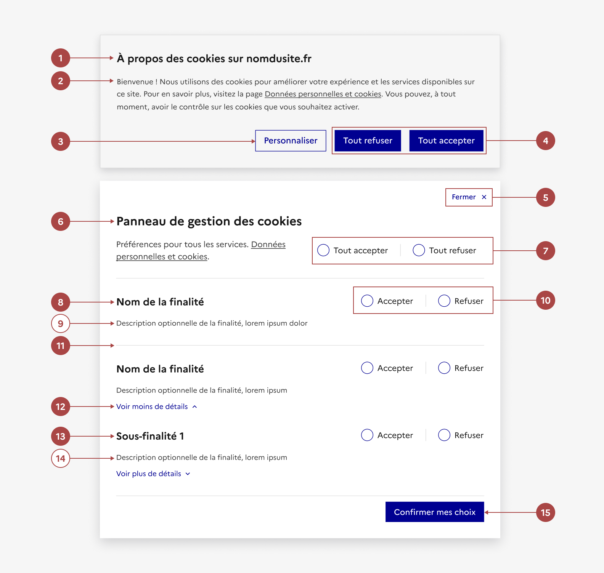

## Gestionnaire de consentement

Le gestionnaire de consentement permet à l'usager de définir ses préférences sur l'utilisation de ses données personnelles, notamment le dépôt de cookies non fonctionnels dans son navigateur.

:::dsfr-doc-tab-navigation

- [Présentation](../index.md)
- [Démo](../demo/index.md)
- Design
- [Code](../code/index.md)
- [Accessibilité](../accessibility/index.md)

:::

:::dsfr-doc-anatomy{col=12}

::dsfr-doc-pin[Un titre]{required=true}

::dsfr-doc-pin[Une description]{required=true add="contenant un texte explicatif"}

::dsfr-doc-pin[Un bouton “Personnaliser”]{required=true add="qui ouvre la modale de gestion du consentement"}

::dsfr-doc-pin[Des bouton “Tout refuser” et “Tout accepter”]{required=true add="qui ferment le bandeau et enregistrent le choix de l’usager"}

::dsfr-doc-pin[Un bouton “Fermer”]{required=true add="permettant de fermer la modale"}

::dsfr-doc-pin[Un titre de modale]{required=true}

::dsfr-doc-pin[Des boutons radio “Tout accepter” et “Tout refuser”]{required=true}

::dsfr-doc-pin[Un libellé]{required=true add="pour chacune des finalités listée"}

::dsfr-doc-pin[Une description]{add="recommandée pour apporter des précisions sur la finalité"}

::dsfr-doc-pin[Des boutons radio “Accepter” et “Refuser”]{required=true}

::dsfr-doc-pin[Un séparateur]{required=true}

::dsfr-doc-pin[Un dépliant “Voir plus de détails”]{required=true add="permettant d’afficher les sous-finalités associées"}

::dsfr-doc-pin[Un libellé]{required=true add="pour chacune des sous-finalités listée"}

::dsfr-doc-pin[Une description]{add="recommandée pour apporter des précisions sur la sous-finalité"}

::dsfr-doc-pin[Un bouton de confirmation]{required=true}

:::

### Variations

Le gestionnaire de consentement ne propose aucune variation.

### Tailles

Le gestionnaire de consentement propose une taille fixe.

### États

**Services désactivés**

::dsfr-doc-storybook{storyId=placeholder--consent-placeholder}

Le refus sur certains cookies peut amener le blocage de certaines fonctionnalités, notamment les services tiers affichés dans les pages du site via une iFrame, comme les lecteurs vidéo, par exemple.

Dans ce cas, il faut désactiver le service et afficher un texte d’information accompagné d'un lien permettant de consentir au service.

### Personnalisation

Le gestionnaire de consentement n’est pas personnalisable.

La place du bandeau, les styles et l’ordre des boutons ne peuvent pas être modifiés. Seul le texte est à adapté en fonction du contexte.

Par ailleurs, certains éléments sont optionnels - voir [la structure du composant](#gestionnaire-de-consentement).

### Maillage

- [Modale](../../../../modal/_part/doc/index.md)
- [Paramètres d’affichage](../../../../display/_part/doc/index.md)
- [Pied de page](../../../../footer/_part/doc/index.md)
