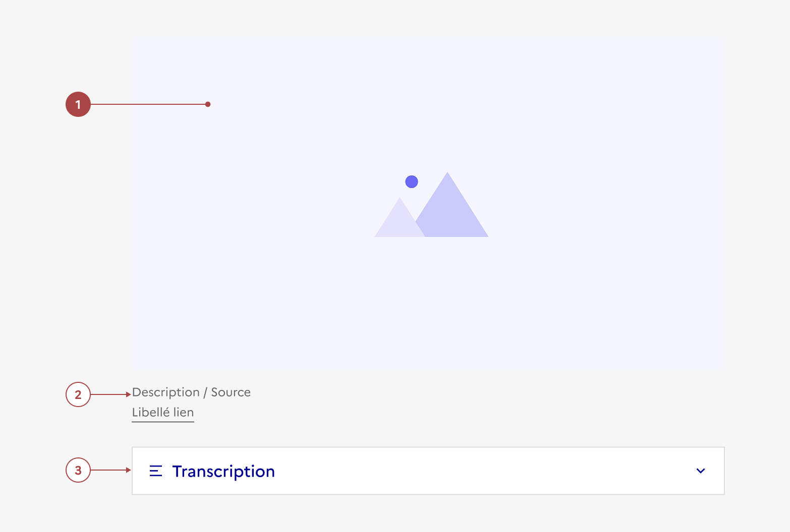

## Contenu médias

Le composant **Contenu médias** permet d'intégrer des contenus multimédias tels que des vidéos, des images de manière accessible et responsive.

:::dsfr-doc-tab-navigation

- [Présentation](../index.md)
- [Démo](../demo/index.md)
- Design
- [Code](../code/index.md)
- [Accessibilité](../accessibility/index.md)

:::

:::dsfr-doc-anatomy{col=12}

::dsfr-doc-pin[Un média]{add='image, vidéo ou audio' required=true}

::dsfr-doc-pin[Une légende]

::dsfr-doc-pin[Une transcription]

:::

### Variations

**Ratio 16:9**

::dsfr-doc-storybook{storyId=content--content}

Il s’agit du format conseillé par défaut pour les images et vidéos lorsqu’elles sont intégrées dans un contenu éditorial.

> [!NOTE]
> L’iFrame générée par l’hébergeur de la vidéo peut être différent du ratio par défaut de 16:9.

**Autres ratios**

D’autres ratios sont toutefois disponibles : voir [la section ratios dans les fondamentaux](../../../../../core/_part/doc/media/index.md).

Il est notamment possible d’opter pour un format de vidéo en 4:3.

### Tailles

Utiliser les différentes tailles à votre disposition pour accentuer la visibilité d'un contenu média.

Le contenu média est disponible en trois tailles :

- SM pour small (75%)

::dsfr-doc-storybook{storyId=content--size-sm}

La largeur du contenu média est inférieure à celle de la zone de texte.

- MD pour medium (100%)

::dsfr-doc-storybook{storyId=content--size-md}

La largeur du contenu média correspond à celle de la zone de texte.

- LG pour large (125%)

::dsfr-doc-storybook{storyId=content--size-lg}

La largeur du contenu média est supérieure à celle de la zone de texte.

### États

Le contenu média n’est sujet à aucun changement d’état.

### Personnalisation

Le contenu média n’est pas personnalisable.

Toutefois, certains éléments sont optionnels - voir [la structure du composant](#contenu-médias).
