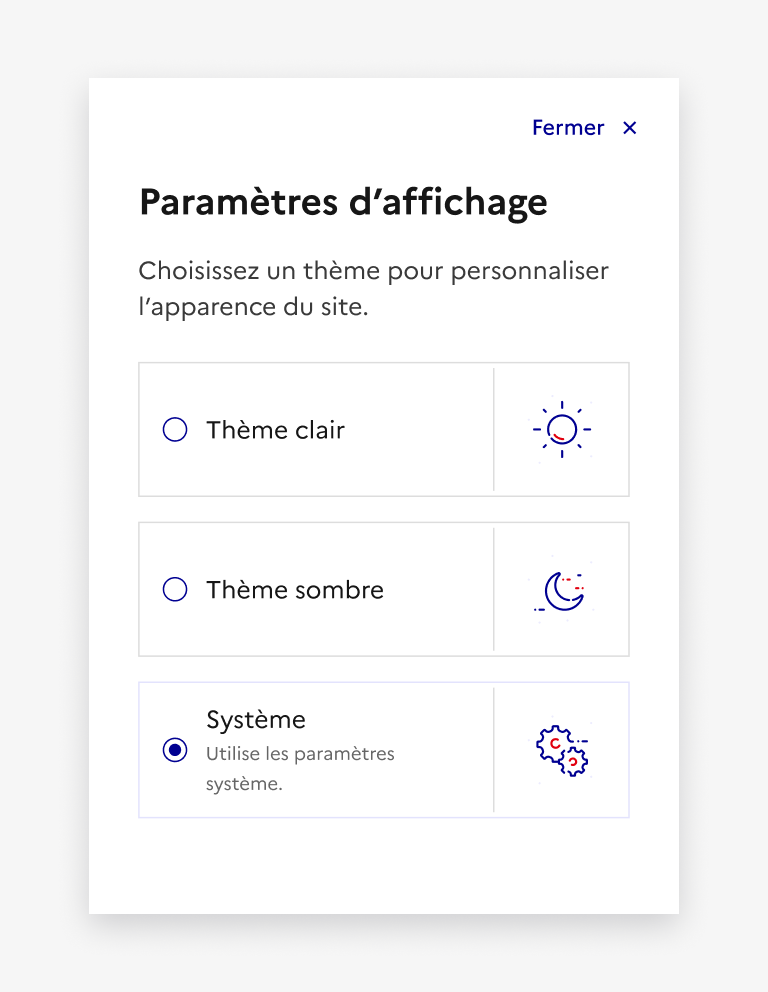
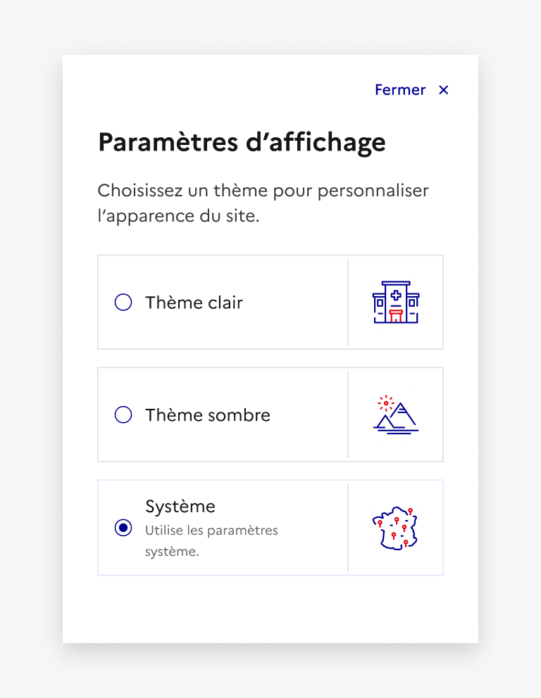

## Paramètres d'affichage

Les paramètres d’affichage représentent un parcours simple permettant à l’usager d’interagir avec l’interface afin de modifier le thème d’un site.

:::dsfr-doc-tab-navigation

- [Présentation](../index.md)
- [Démo](../demo/index.md)
- Design
- [Code](../code/index.md)
- [Accessibilité](../accessibility/index.md)

:::

:::dsfr-doc-anatomy{col=12}

::dsfr-doc-pin[Un bouton]{add="à intégrer à l’en-tête ou au pied de page de votre site" required=true}

::dsfr-doc-pin[Un titre]{required=true}

::dsfr-doc-pin[Un bouton “Fermer”]{required=true}

::dsfr-doc-pin[Une description]{required=true}

::dsfr-doc-pin[Des boutons radio riches]{add="au moins deux" required=true}

::dsfr-doc-pin[Une modale]{add="s’ouvrant au clic sur le lien" required=true}

:::

### Variations

**Paramètres d’affichage intégrés dans l’en-tête du site**

::dsfr-doc-storybook{storyId=display--header-display}

Lorsque le bouton “paramètres d’affichage” est mis en avant dans l’en-tête de la page, il prend la forme d’un lien d’accès rapide.

En version mobile, l’accès rapide au bouton “paramètres d’affichage” se trouve dans le menu.

**Paramètres d’affichage intégrés dans le pied de page**

::dsfr-doc-storybook{storyId=display--footer-display}

Lorsque le bouton “paramètres d’affichage” est mis en avant dans le pied de page, il est intégré au niveau des mentions légales.

Quelque soit la variation choisie, en responsive, les éléments du parcours paramètres d’affichage affichent automatiquement les versions mobiles des composants en-tête avec accès rapide et [modale](../../../../modal/_part/doc/index.md).

### Tailles

La taille des paramètres d’affichage reprend les options disponibles au sein de la [modale](../../../../modal/_part/doc/index.md).

### États

Les paramètres d’affichage ne sont sujets à aucun changement d’état.

### Personnalisation

Les paramètres d’affichage ne sont pas personnalisables, à l’exception du texte de description.

::::dsfr-doc-guidelines

:::dsfr-doc-guideline[✅ À faire]{col=6 valid=true}

Personnaliser le texte de description des paramètres d’affichage.

:::

:::dsfr-doc-guideline[❌ À ne pas faire]{col=6 valid=false}

Ne pas personnaliser les pictogrammes par défaut des boutons riches.

:::

::::
