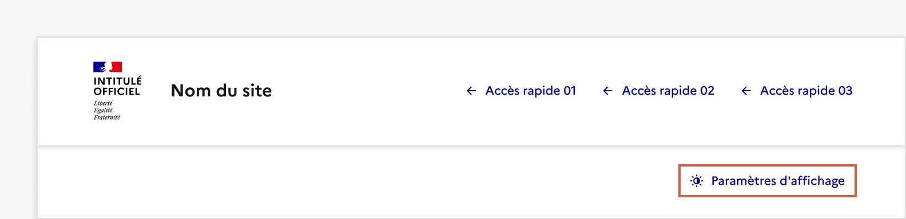

## Paramètres d'affichage

Les paramètres d’affichage représentent un parcours simple permettant à l’usager d’interagir avec l’interface afin de modifier le thème d’un site.

:::dsfr-doc-tab-navigation

- Présentation
- [Démo](./demo/index.md)
- [Design](./design/index.md)
- [Code](./code/index.md)
- [Accessibilité](./accessibility/index.md)

:::

::dsfr-doc-storybook{storyId=display--display}

### Quand utiliser ce composant ?

Utiliser les paramètres d’affichage pour donner la possibilité à l’usager de choisir d’afficher le site en thème clair ou en thème sombre (pour en savoir plus sur ces deux thèmes, consultez [la page relative aux couleurs](../../../../core/_part/doc/color/index.md)).

### Comment utiliser ce composant ?

- **Intégrer les paramètres d’affichage dans l’en-tête ou le pied de page** de votre site, selon vos préférences.

::::dsfr-doc-guidelines

:::dsfr-doc-guideline[✅ À faire]{col=12 valid=true}

Intégrer les paramètres d’affichage au sein de l’en-tête, à l’emplacement de l’un des accès rapides.

:::

:::dsfr-doc-guideline[❌ À ne pas faire]{col=12 valid=false}

Ne pas proposer les paramètres d’affichage en dehors des accès rapides.

:::

:::dsfr-doc-guideline[✅ À faire]{col=12 valid=true}

Intégrer les paramètres d’affichage au sein du pied de page.

:::

::::

- **Figer la page en arrière plan** lorsque la modale de paramètres est ouverte. L’usager ne peut pas scroller le contenu d’arrière plan avant d’avoir clôturé la modale.
- **Opérer la modification du thème dès lors que l’usager a effectué son choix au sein de la modale**. Le changement est immédiat et ne nécessite aucune action complémentaire.
- **Permettre à l’usager de reprendre sa navigation** à l’endroit où il se trouvait auparavant dans la page simplement en fermant la modale de paramètres.

### Règles éditoriales

Les paramètres d’affichage ne sont régis par aucune règle éditoriale spécifique.
