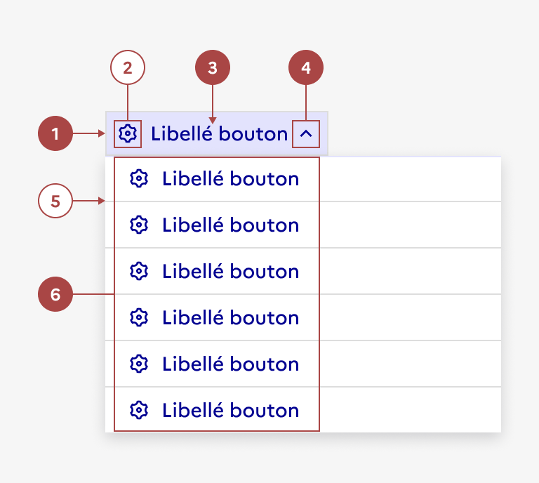

## Menu déroulant

> [!NOTE]
> **Ce composant est en version bêta.** Il n'existe pas en code et son design ou ses fonctionnalités peuvent encore être amenés à évoluer. N'hésitez pas à nous partager vos cas d'usage ou retours qui le concerne via notre formulaire de contact ou notre Tchap pour que nous puissions les étudier.

Retrouvez ces composants sur Figma [dans un fichier dédié bêta disponible sur Community](https://www.figma.com/community/file/1096003483468520396).

Le menu déroulant présente une liste d'actions ou de choix parmi lesquels un usager peut sélectionner une ou plusieurs options.

:::dsfr-doc-tab-navigation

- [Présentation](../index.md)
- Design

:::

:::dsfr-doc-anatomy{imageWidth=384 col=12}

::dsfr-doc-pin[Un bouton tertiaire]{required=true}

::dsfr-doc-pin[Une icône]{add="placée à gauche du libellé"}

::dsfr-doc-pin[Un libellé de bouton]{required=true}

::dsfr-doc-pin[Un chevron]{required=true add="placé à droite du libellé"}

::dsfr-doc-pin[Un séparateur]

::dsfr-doc-pin[Une liste d’options]{required=true}

:::

### Variations

Le menu déroulant ne propose aucune variation.

### Tailles

Le menu déroulant est disponible en 3 tailles :

- SM pour small
- MD pour medium
- LG pour large

La taille des éléments à l’intérieur dépend de la taille du bouton d’ouverture utilisé.

### États

**État désactivé**

L’état désactivé indique que l'usager ne peut pas interagir avec le menu déroulant.

**État au survol**

L’état au survol correspond au comportement constaté par l’usager lorsqu’il survole le menu déroulant avec sa souris.

**État au clic**

L’état au clic correspond au comportement constaté par l’usager lorsqu’il clique sur le menu déroulant.

### Personnalisation

Le menu déroulant n’est pas personnalisable.
