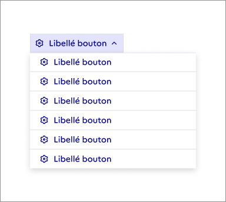

## Menu déroulant

> [!NOTE]
> **Ce composant est en version bêta.** Il n'existe pas en code et son design ou ses fonctionnalités peuvent encore être amenés à évoluer. N'hésitez pas à nous partager vos cas d'usage ou retours qui le concerne via notre formulaire de contact ou notre Tchap pour que nous puissions les étudier.

Retrouvez ces composants sur Figma [dans un fichier dédié bêta disponible sur Community](https://www.figma.com/community/file/1096003483468520396).

Le menu déroulant présente une liste d'actions ou de choix parmi lesquels un usager peut sélectionner une ou plusieurs options.

:::dsfr-doc-tab-navigation

- Présentation
- [Design](./design/index.md)

:::

### Quand utiliser ce composant ?

Utiliser le menu déroulant pour permettre à l’usager d’avoir plus d’actions ou d’options possibles sans surcharger son écran. Le menu déroulant sert à rassembler des actions ou des types d’éléments similaires et contextuels à un élément de l’interface.

Il permet à l’usager de :

- Naviguer vers d’autres page avec des liens
- Réaliser des actions liées à un contenu avec des bouton d’action
- Activer ou désactiver des éléments dans une page avec des interrupteurs
- Filtrer ou sélectionner des options avec des groupes de boutons radio ou cases à cocher

Le menu déroulant est donc utilisable pour toute information, action, navigation, commande ou saisie de donnée affichée au-dessus d’un contexte tout en conservant la même apparence.

> [!NOTE]
> Bien différencier le menu déroulant des boutons radio, cases à cocher ou liste déroulante. Pour de la saisie de données dans un formulaire, privilégiez la liste déroulante.

Les boutons radio sont eux recommandés lorsque l’usager doit choisir un seul élément parmi 2 à 5 choix possibles. Si plusieurs choix sont possibles ou que la sélection n’est pas obligatoire, privilégiez le composant case à cocher.

Au-delà de 5 choix ou lorsque l’espace est restreint, utilisez une liste déroulante.

### Comment utiliser ce composant ?

- **Faire apparaître le contenu du menu déroulant par-dessus le reste de l’interface** pour permettre à l’usager de voir directement le résultat de ses choix.
- **Considérer que le libellé du déclencheur du menu déroulant ne change pas au clic ou à l’interaction avec son contenu**, à la différence des listes déroulantes par exemple. Il peut ainsi accueillir des liens, des boutons ou du contenu personnalisé.
- **Proposer des contenus courts**, moins de 8 éléments et pas plus d’une interaction. Pour afficher plus de contenu, utiliser une modale ou une page dédiée.
- **Veiller à ne pas utiliser de menu déroulant dans un formulaire**. Préférez une liste déroulante qui utilise la sélection native et pour laquelle la soumission de la donnée ainsi que l’apparence en mobile sont meilleures.
- **Eviter d’imbriquer des menus déroulants entre eux**.

### Règles éditoriales

- **Utiliser des libellés courts, concis et faciles à comprendre**.
- **Eviter de proposer des options qui s’étendent sur plusieurs lignes**.