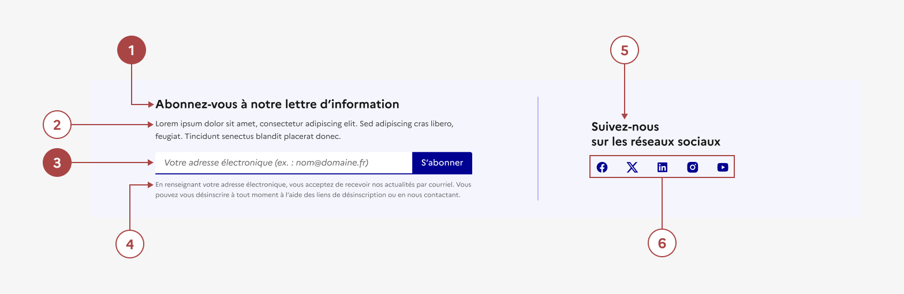

## Lettre d'information et Réseaux Sociaux

La lettre d’information et réseaux sociaux est un ensemble d’éléments d’interaction avec l’interface permettant à l’usager de s’inscrire à (aux) lettre(s) d’information proposée(s), ainsi que des liens vers les réseaux sociaux de l’entité.

:::dsfr-doc-tab-navigation

- [Présentation](../index.md)
- [Démo](../demo/index.md)
- Design
- [Code](../code/index.md)
- [Accessibilité](../accessibility/index.md)

:::

:::dsfr-doc-anatomy{col=12}

::dsfr-doc-pin[Un titre pour la lettre d’information]{required=true}

::dsfr-doc-pin[Une description]

::dsfr-doc-pin[Un champ d’inscription ou un bouton primaire]{required=true}

::dsfr-doc-pin[Un texte explicatif]

::dsfr-doc-pin[Un titre pour les réseaux sociaux]

::dsfr-doc-pin[Un ou plusieurs bouton(s) de lien vers les réseaux sociaux]

:::

### Variations

**Lettre d’information seule**

La lettre d’information seule permet uniquement à l’usager de s’inscrire à votre newsletter.

Elle est déclinée selon deux variantes :

- **Une mise en avant** avec un bouton redirigeant vers un formulaire d’inscription riche.

::dsfr-doc-storybook{storyId=follow--newsletter-button}

Utiliser la mise en avant pour les lettres d’information plus complexes qui nécessitent de recueillir plusieurs informations.

La description qui accompagne le titre du bloc sert à présenter la newsletter et le bouton redirige vers le formulaire d’inscription.

- **Un formulaire d’inscription** qui intègre directement un champ de saisie d’e-mail pour s’inscrire depuis le pied de page.

::dsfr-doc-storybook{storyId=follow--newsletter-form}

Utiliser le formulaire d’inscription pour les lettres d’information simples qui nécessitent de recueillir uniquement l’adresse mail et le consentement de l’usager.

La description qui accompagne le titre du bloc sert à présenter la newsletter.

Les mentions pour obtenir le consentement et les indications pour la désinscription sont à adapter en fonction des cas de figure.

Cette variante peut également servir à pré-saisir l’adresse mail de l’utilisateur pour ensuite renvoyer vers un formulaire plus détaillé, au clic sur le bouton.

**Réseaux sociaux seuls**

::dsfr-doc-storybook{storyId=follow--socials}

Les réseaux sociaux seuls permettent à l’usager d’accéder aux comptes de vos réseaux sociaux.

**Lettre d’information et réseaux sociaux**

Lorsque les deux éléments sont proposés, ils s’affichent l’un à coté de l’autre.

Il est possible d’utiliser les différentes déclinaisons de la lettre d’information (formulaire ou mise en avant).

- Formulaire d’inscription à la lettre d’information et réseaux sociaux

::dsfr-doc-storybook{storyId=follow--socials-newsletter-form}

- Mise en avant de la lettre d’information et réseaux sociaux

::dsfr-doc-storybook{storyId=follow--socials-newsletter-button}

### Tailles

La lettre d’information et réseaux sociaux a une largeur fixe, non personnalisable, quelle que soit la variation choisie.

### États

La gestion des messages d'erreur lors de la soumission du formulaire d’inscription suit les mêmes états que le composant [champ de saisie](../../../../input/_part/doc/index.md).

Utiliser le composant alerte pour indiquer le succès de l’inscription.

### Personnalisation

La lettre d’information et réseaux sociaux n’est pas personnalisable.

Toutefois, certains éléments sont optionnels - voir [la structure du composant](#lettre-d-information-et-reseaux-sociaux).

### Maillage

- [Bouton](../../../../button/_part/doc/index.md)
- [Champ de saisie](../../../../input/_part/doc/index.md)
