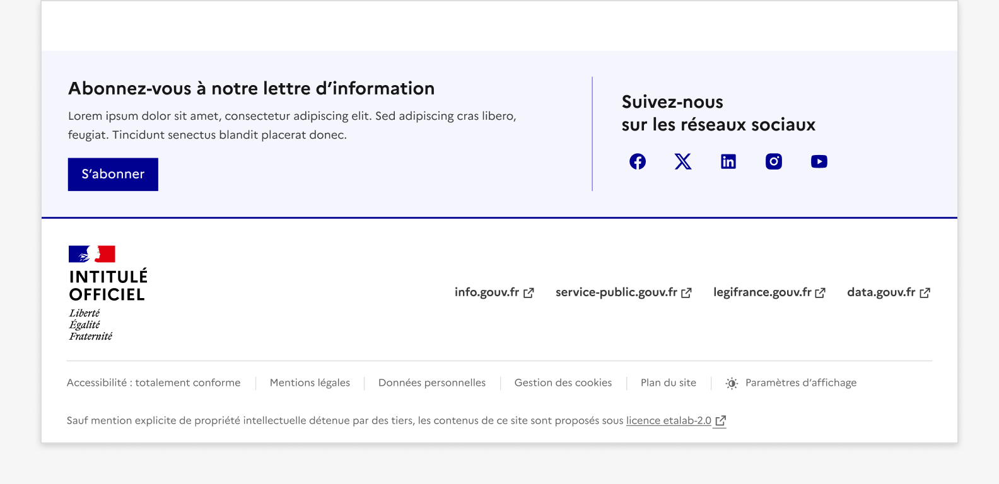

## Lettre d'information et Réseaux Sociaux

La lettre d’information et réseaux sociaux est un ensemble d’éléments d’interaction avec l’interface permettant à l’usager de s’inscrire à (aux) lettre(s) d’information proposée(s), ainsi que des liens vers les réseaux sociaux de l’entité.

:::dsfr-doc-tab-navigation

- Présentation
- [Démo](./demo/index.md)
- [Design](./design/index.md)
- [Code](./code/index.md)
- [Accessibilité](./accessibility/index.md)

:::

::dsfr-doc-storybook{storyId=follow--follow}

### Quand utiliser ce composant ?

Proposer la lettre d’information et réseaux sociaux pour permettre à l’usager de s’inscrire à la (aux) lettre(s) d’information proposée(s) et/ou de consulter les comptes de vos réseaux sociaux.

### Comment utiliser ce composant ?

- **Intégrer le composant à l’ensemble des pages du site**, juste au-dessus du footer.

::::dsfr-doc-guidelines

:::dsfr-doc-guideline[✅ À faire]{col=12 valid=true}

Mise en situation juste au dessus du pied de page.

:::

::::

### Règles éditoriales

- **Adapter le titre et la description en fonction du contexte**. Il s’agit ici de présenter la lettre d’information et la nature des contenus qu’elle traite.
- **Ajuster le texte explicatif “RGPD” sur l’utilisation des données personnelles** selon la politique de votre organisation.
