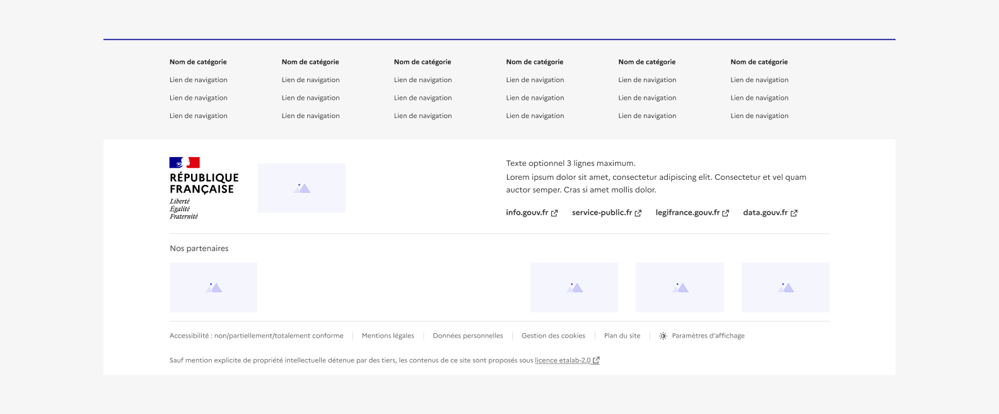
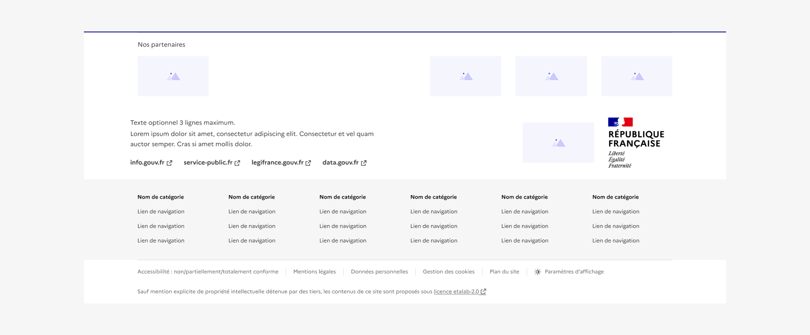

## Pied de page

Le pied de page est un élément de navigation secondaire mis à disposition de l’usager pour qu’il poursuive son parcours. Il propose également des éléments d’information complémentaires.

:::dsfr-doc-tab-navigation

- [Présentation](../index.md)
- [Démo](../demo/index.md)
- Design
- [Code](../code/index.md)
- [Accessibilité](../accessibility/index.md)

:::

:::dsfr-doc-anatomy{col=12}

::dsfr-doc-pin[Une bordure supérieure]{required=true add="marquant la séparation entre le corps de la page et le pied de page"}

::dsfr-doc-pin[Un titre de catégorie]

::dsfr-doc-pin[Un fond gris]{required=true add="dédié au bloc de liens de navigation"}

::dsfr-doc-pin[Un logo opérateur]{add="au format vertical ou horizontal"}

::dsfr-doc-pin[Le bloc marque]{required=true}

::dsfr-doc-pin[Un libellé “Nos partenaires”]

::dsfr-doc-pin[Un séparateur entre les blocs]{required=true}

::dsfr-doc-pin[Une liste de liens liés aux obligations légales]{required=true add="à définir en fonction du site mais incluant a minima “Accessibilité : non/partiellement/totalement conforme”, “Mentions légales” et “Données personnelles et gestions des cookies”"}

::dsfr-doc-pin[Une mention de la licence]{required=true add="“Sauf mention contraire, tous les contenus de ce site sont sous licence etalab-2.0”"}

::dsfr-doc-pin[Un texte de présentation]

::dsfr-doc-pin[Les quatre liens de références de l'écosystème institutionnel]{required=true}

::dsfr-doc-pin[Les logos des partenaires additionnels]{add="ferrés à droite"}

::dsfr-doc-pin[Des séparateurs verticaux]{required=true add="entre les liens d’obligations légales"}

::dsfr-doc-pin[Un bouton d’accès aux paramètres d’affichage]

:::

### Variations

**Pied de page en berne**

::dsfr-doc-storybook{storyId=footer--footer args="{ isMourning: true }"}

Lors des périodes de deuil national, il est possible d’utiliser la version en berne du footer. La Marianne s’affichera alors dans sa version en berne.

### Tailles

La largeur du pied de page est de taille fixe et prend les 12 colonnes disponibles de la grille.

### États

Le pied de page n’est sujet à aucun changement d’état.

### Personnalisation

Le pied de page n’est pas personnalisable.

Toutefois, certains éléments sont optionnels - voir [la structure du composant](#pied-de-page).

::::dsfr-doc-guidelines

:::dsfr-doc-guideline[✅ À faire]{col=12 valid=true}

Considérer que chaque élément du pied de page a une place définie.

:::

::::

::::dsfr-doc-guidelines

:::dsfr-doc-guideline[❌ À ne pas faire]{col=12 valid=false}

Ne pas modifier le positionnement des éléments du pied de page.

:::

::::

::::dsfr-doc-guidelines

:::dsfr-doc-guideline[❌ À ne pas faire]{col=12 valid=false}

Ne pas modifier les liens obligatoires de l’écosystème de l’Etat.

:::

::::
