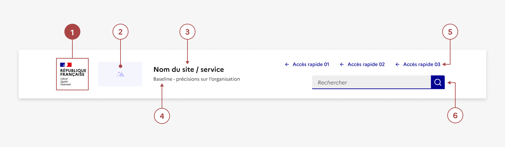
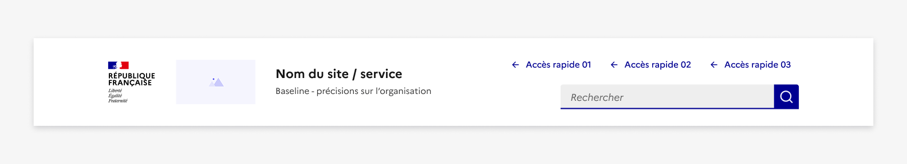

## En-tête

L’en-tête est un élément de navigation permettant aux usagers d’identifier sur quel site ils se trouvent et de leur donner un accès simplifié au moteur de recherche et à certaines pages ou fonctionnalités clés du site.

:::dsfr-doc-tab-navigation

- [Présentation](../index.md)
- [Démo](../demo/index.md)
- Design
- [Code](../code/index.md)
- [Accessibilité](../accessibility/index.md)

:::

:::dsfr-doc-anatomy{col=12}

::dsfr-doc-pin[Le bloc marque]{required=true}

::dsfr-doc-pin[Un logo opérateur]{add="au format vertical ou horizontal"}

::dsfr-doc-pin[Le nom du site]

::dsfr-doc-pin[Une baseline]{add="sous le nom du site"}

::dsfr-doc-pin[Des boutons d’accès rapides]{add="jusqu’à 3 maximum"}

::dsfr-doc-pin[Une barre de recherche]{add="de taille medium"}

:::

### Variations

**En-tête en berne**

::dsfr-doc-storybook{storyId=header--header-minimal args="{ isMourning: true }"}

Lors des périodes de deuil national, il est possible d’utiliser la version en berne du header. La Marianne s’affichera alors dans sa version en berne.

**Responsive**

::dsfr-doc-storybook{storyId=header--tool-links-search width=375}

En version mobile, l’en-tête se compose d’une zone haute intégrant les éléments obligatoires liés au bloc marque. Le bloc marque suit les mêmes règle de composition que pour le desktop et doit respecter [la charte de marque de l'État](https://www.gouvernement.fr/marque-Etat).

Il est complété d’une potentielle zone basse comprenant :

- Le nom du site - si présent,
- Le pictogramme “loupe” pour accéder à la recherche - si présente.

Il permet l’affichage de la barre de recherche dans un “overlay” dédié.

- Le pictogramme “burger” pour accéder au menu principal - si accès rapides et/ou navigation principale présents ([voir en détail la navigation mobile](../../../../navigation/_part/doc/index.md)).

Il permet l’affichage du menu principal dans “overlay’ dédié.

### Tailles

La largeur de l’en-tête est de taille fixe et prend les 12 colonnes disponibles de la grille.

La hauteur minimale de l’en-tête est également de taille fixe, puis celle-ci s’agrandit en fonction de la hauteur du bloc marque.

### États

L’en-tête n’est sujet à aucun changement d’état.

### Personnalisation

L’en-tête n’est pas personnalisable.

Toutefois, certains éléments sont optionnels - voir [la structure du composant](#en-tête).

::::dsfr-doc-guidelines

:::dsfr-doc-guideline[✅ À faire]{col=12 valid=true}

Considérer que chaque élément de l’en-tête à une place définie et conserver leur design en l’état, sans personnalisation.

:::

::::

::::dsfr-doc-guidelines

:::dsfr-doc-guideline[❌ À ne pas faire]{col=12 valid=false}

Ne pas modifier le positionnement des éléments de l’en-tête.

:::

::::

::::dsfr-doc-guidelines

:::dsfr-doc-guideline[❌ À ne pas faire]{col=12 valid=false}

Ne pas modifier les tailles et types de typographie du nom du site et de la baseline.

:::

::::

::::dsfr-doc-guidelines

:::dsfr-doc-guideline[❌ À ne pas faire]{col=12 valid=false}

Ne pas personnaliser le type de bouton des accès rapides.

:::

::::

::::dsfr-doc-guidelines

:::dsfr-doc-guideline[❌ À ne pas faire]{col=12 valid=false}

Ne pas proposer de contour aux boutons tertiaires, hormis s’il s’agit de celui positionner le plus à droite.

:::

::::
