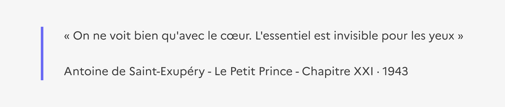

# Mise en exergue

La mise en exergue est un élément éditorial permettant de mettre en forme du contenu dans une page.

:::dsfr-doc-tab-navigation

- [Présentation](../index.md)
- [Démo](../demo/index.md)
- [Design](../design/index.md)
- [Code](../code/index.md)
- Accessibilité

:::

Le composant **Mise en exergue** est conçu pour être accessible et respecter les critères du RGAA. Voici les points clés à prendre en compte pour en garantir l’accessibilité.

### Interactions clavier

Aucune interaction au clavier spécifique au composant.

### Règles d’accessibilité

#### Structuration

Il n’y a pas de sémantique spécifique associée à ce composant. La mise en exergue n’est donc pas restituée par les lecteurs d’écran, seul son contenu l’est.

La bordure est une mise en avant visuelle et décorative du contenu. **L’information doit être portée uniquement par le texte.**

::::dsfr-doc-guidelines

:::dsfr-doc-guideline[❌ À ne pas faire]{col=12 valid=false}

Ne pas utiliser la mise en exergue pour une citation.

:::

::::

#### Contrastes de couleurs

Le texte du composant est suffisamment contrasté avec le fond en thème clair (11,4:1) et en thème sombre (11:1).
La bordure est perceptible en thème clair (4,2) et en thème sombre (4,3:1).

> [!NOTE]
> La bordure est décorative et n’a pas besoin d’être suffisamment contrastée.

---

### Restitution par les lecteurs d’écran

Aucun test de restitution n’est nécessaire pour le composant Mise en exergue.

---

### Critères RGAA applicables
- **Couleurs** : 3.2
- **Éléments obligatoires** : 8.9
- **Présentation de l’information** : 10.1, 10.2, 10.4, 10.5, 10.7, 10.11, 10.12

#### Références

- [https://accessibilite.numerique.gouv.fr/methode/criteres-et-tests/](https://accessibilite.numerique.gouv.fr/methode/criteres-et-tests/)
