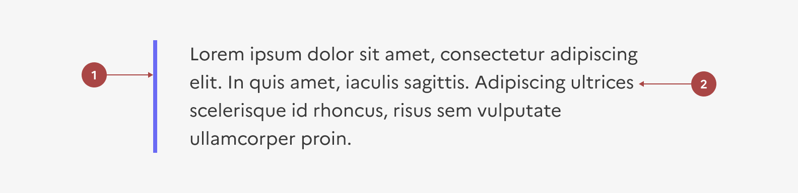
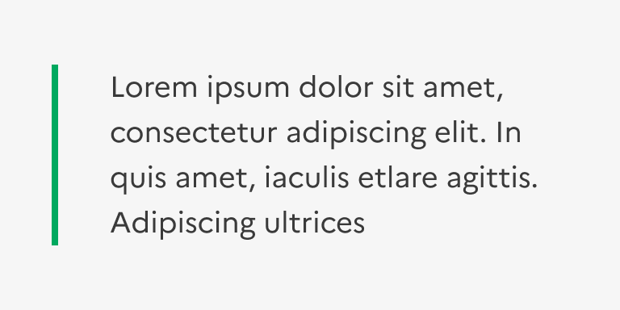
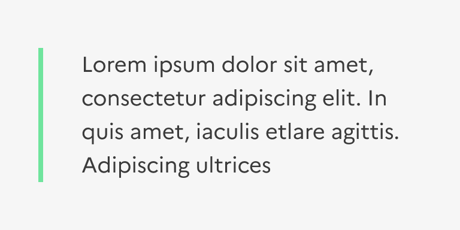

## Mise en exergue

La mise en exergue est un élément éditorial permettant de mettre en forme du contenu dans une page.

:::dsfr-doc-tab-navigation

- [Présentation](../index.md)
- [Démo](../demo/index.md)
- Design
- [Code](../code/index.md)
- [Accessibilité](../accessibility/index.md)

:::

:::dsfr-doc-anatomy{col=12}

::dsfr-doc-pin[Une bordure]{required=true}

::dsfr-doc-pin[Un texte]{required=true}

:::

### Variations

La mise en exergue ne propose aucune variation.

### Tailles

La mise en exergue est disponible en trois tailles :

- SM pour small

::dsfr-doc-storybook{storyId=highlight--size-sm}

- MD pour medium - taille par défaut.

::dsfr-doc-storybook{storyId=highlight--default}

- LG pour large.

::dsfr-doc-storybook{storyId=highlight--size-lg}

### États

La mise en exergue n’est sujette à aucun changement d’état.

### Personnalisation

Seule la couleur de la bordure de la mise en exergue est personnalisable.

Elle peut utiliser l’ensemble des couleurs illustratives.

::::dsfr-doc-guidelines

:::dsfr-doc-guideline[✅ À faire]{col=6 valid=true}

Personnaliser la bordure de la mise en exergue avec l’ensemble des couleurs illustratives d’indice $main.

:::

:::dsfr-doc-guideline[❌ À ne pas faire]{col=6 valid=false}

Ne pas utiliser une couleur illustrative ou des indices autre que ceux autorisés.

:::

::::

:::fr-table[Titre du tableau]{valign=top multiline=true caption=false}
|  Éléments | Indice thème clair | Indice thème sombre |
|:-----|:-----|:-----|
| **Bordure `$border-default-blue-france`** | Indice **main**  exemple : `$green-emeraude-main-632` | Indice **main**  exemple : `$green-emeraude-main-632` |

:::
