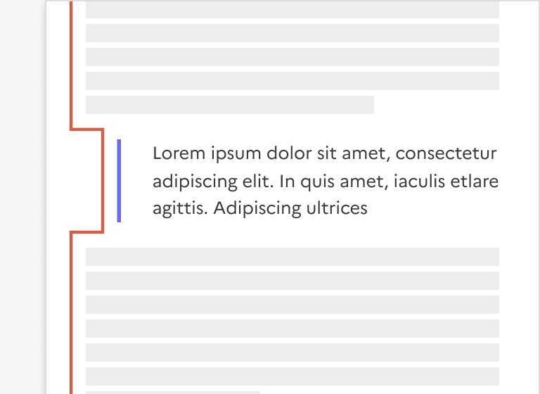
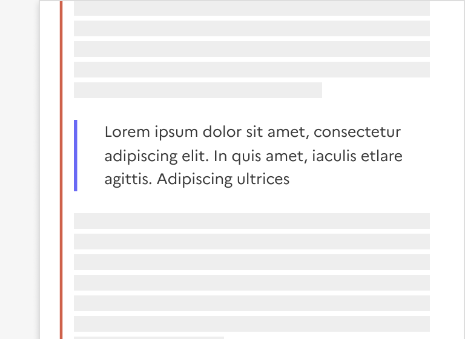

## Mise en exergue

La mise en exergue est un élément éditorial permettant de mettre en forme du contenu dans une page.

:::dsfr-doc-tab-navigation

- Présentation
- [Démo](./demo/index.md)
- [Design](./design/index.md)
- [Code](./code/index.md)
- [Accessibilité](./accessibility/index.md)

:::

::dsfr-doc-storybook{storyId=highlight--highlight}

### Quand utiliser ce composant ?

Utiliser la mise en exergue pour distinguer une information importante au sein du contenu principal d’une page (par exemple, une reformulation ou une reprise de texte).

Elle permet une identification rapide et facile par l’usager.

> [!WARNING]
> Bien différencier la mise en exergue de la mise en avant.
> La [mise en avant](../../../callout/_part/doc/index.md) est utilisée pour mettre l’accent sur une information complémentaire au contenu principal.

### Comment utiliser ce composant ?

- **Insérer la mise en exergue** au sein d’un contenu éditorial.
- **Conserver l’écart prévu** afin que la mise en exergue ne soit pas alignée à gauche avec le corps du texte.  Cela permet notamment de l’identifier plus facilement.

::::dsfr-doc-guidelines

:::dsfr-doc-guideline[✅ À faire]{col=6 valid=true}

Intégrer une mise en exergue au sein d’un contenu en conservant l’alinéa prévu. L’objectif étant d’opérer une distinction.

:::

:::dsfr-doc-guideline[❌ À ne pas faire]{col=6 valid=false}

Ne pas minimiser la mise en exergue au sein du contenu en alignant la bordure au corps du texte.

:::

::::

- **Adapter l’usage de la mise en exergue à l’information que vous souhaitez relayée**. Par exemple, les messages d’erreur ou de confirmation ne sont pas considérés comme des mises en avant mais bien des [alertes](../../../alert/_part/doc/index.md).

### Règles éditoriales

- **Présenter l’information de façon synthétique** afin qu’elle soit facilement lue et comprise de l’usager.
