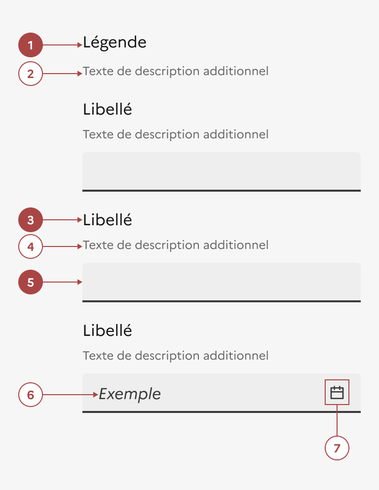

## Champ de saisie

Le champ de saisie est un élément d’interaction avec l’interface permettant à l’usager d’entrer du contenu et/ou des données.

:::dsfr-doc-tab-navigation

- [Présentation](../index.md)
- [Démo](../demo/index.md)
- Design
- [Code](../code/index.md)
- [Accessibilité](../accessibility/index.md)

:::

### Design

:::dsfr-doc-anatomy{imageWidth=384 col=12}

::dsfr-doc-pin[Une légende]{add='décrivant le contexte du groupe de champ' required=true}

::dsfr-doc-pin[Une description additionnelle pour la légende]

::dsfr-doc-pin[Un libellé]{add='associé au champ' required=true}

::dsfr-doc-pin[Un texte de description additionnelle]

::dsfr-doc-pin[Un champ]{required=true}

::dsfr-doc-pin[Un placeholder]

::dsfr-doc-pin[Une icône]{add="pouvant être modifiée"}

:::

### Variations

**Champ simple**

::dsfr-doc-storybook{storyId=input--default}

Le champ simple est un champ de saisie libre qui accepte une courte ligne de contenu (texte et/ou nombre).

**Zone de texte**

::dsfr-doc-storybook{storyId=input--textarea}

La zone de texte est un champ de saisie libre qui accepte plus d’une ligne de contenu (texte ou/et nombre). Il reprend le style du champ simple, seule sa hauteur augmente.

**Autres types de champs**

::dsfr-doc-storybook{storyId=input--icon}

::dsfr-doc-storybook{storyId=input--date}

::dsfr-doc-storybook{storyId=input--number}

::dsfr-doc-storybook{storyId=input--button}

::dsfr-doc-storybook{storyId=input--action}

L'ajout d'icône n'a qu'un but illustratif (voir [les icônes disponibles](../../../../../core/_part/doc/icon/index.md)).

### Tailles

La largeur du champ ne peut pas excéder la taille de son conteneur.

Toutefois, il est important de l’ajuster en fonction de la quantité de contenu attendu, afin d’accompagner l’usager dans sa saisie. Par exemple, les champs de saisie de codes postaux doivent avoir une largeur inférieure à celle des champs d’e-mails.

### États

**État d’erreur**

L'état d’erreur est signalé par un changement de couleur ainsi que l’affichage d’une ligne rouge (cf. couleurs système : le rouge est la couleur de l’état erreur) et d’un message d’erreur en-dessous du composant.

::dsfr-doc-storybook{storyId=input--error}

**État de succès**

L'état de succès est signalé par un changement de couleur ainsi que l’affichage d’une ligne verte (cf. couleurs système : le vert est la couleur de l’état succès) et d’un message de succès en-dessous du composant.

::dsfr-doc-storybook{storyId=input--valid}

**État désactivé**

L'état désactivé indique que l’usager ne peut pas interagir avec le champ.

::dsfr-doc-storybook{storyId=input--disabled}

Dans le cas d’un champ de saisie, il indique à l’usager qu’il ne peut pas saisir de contenu jusqu'à ce qu'une autre action soit terminée, par exemple.

> [!NOTE]
> Utiliser l’état désactivé que très ponctuellement. Il est notamment recommandé de masquer le champ si sa complétion n’est pas requise.

### Personnalisation

Le champ de saisie n’est pas personnalisable.

Toutefois, certains éléments sont optionnels et les icônes peuvent être changées - voir [la structure du composant](#champ-de-saisie).

### Maillage

- [Bouton radio](../../../../radio/_part/doc/index.md)
- [Case à cocher](../../../../checkbox/_part/doc/index.md)
- [Interrupteur](../../../../toggle/_part/doc/index.md)
- [Formulaires](../../../../form/_part/doc/index.md)
