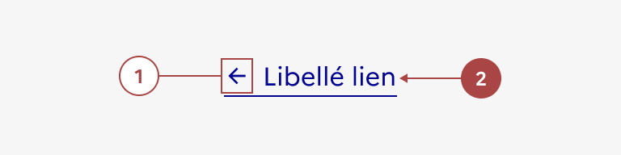
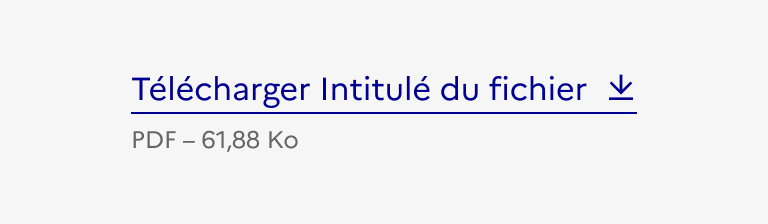
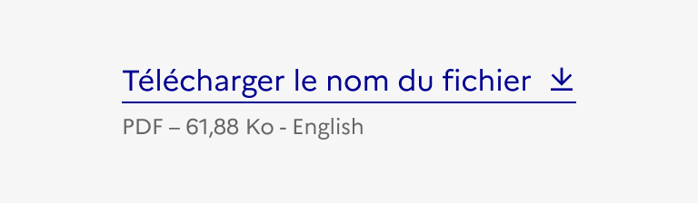
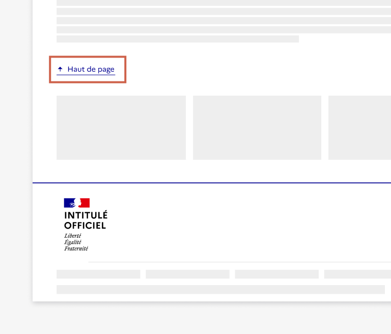
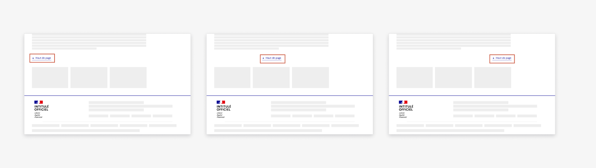

## Lien

Le lien est un système de navigation secondaire qui permet à l’usager de se déplacer au sein d’une même page, entre deux pages d’un même site ou vers un site externe.

:::dsfr-doc-tab-navigation

- [Présentation](../index.md)
- [Démo](../demo/index.md)
- Design
- [Code](../code/index.md)
- [Accessibilité](../accessibility/index.md)

:::

:::dsfr-doc-anatomy{imageWidth=384 col=12}

::dsfr-doc-pin[Une icône]{add="placée à droite ou à gauche du texte visible ou seule"}

::dsfr-doc-pin[Un libellé]{required=true}

:::

### Variations

**Lien au fil du texte**

::dsfr-doc-storybook{storyId=link--text-link}

- **Utiliser ce lien au sein d’un texte**. Il reprend les caractéristiques typographiques de celui-ci (font, couleur, taille) tout en étant souligné. Il peut également être suivi d’une icône (par exemple : lien externe).

**Lien simple**

Le lien simple se décline en différentes variations :

- Texte seul

::dsfr-doc-storybook{storyId=link--link}

- Avec une icône à droite
- Avec une icône à gauche

::dsfr-doc-storybook{storyId=link--icon}

- Icône seule
- **Utiliser le lien simple en dehors de tout contenu**.
- **Ajouter une icône pour rendre l’action à venir ou la destination plus explicite** pour l’usager. L’icône n’est pas à vocation décorative.
- **Préférer les liens avec libellé.** L’icône seule n’est à utiliser que très rarement, pour des actions facilement identifiables par l’usager.

**Lien interne**

::dsfr-doc-storybook{storyId=link--link}

- **Utiliser le lien interne pour pointer vers d’autres pages d’un même site**.

**Lien externe**

::dsfr-doc-storybook{storyId=link--external}

- **Utiliser le lien externe pour pointer vers un autre site**, en ouvrant un nouvel onglet ou une nouvelle page dans le navigateur. Le lien externe est matérialisé par une icône obligatoire placée à droite du lien.

**Lien de téléchargement**

::dsfr-doc-storybook{storyId=link--download}

- **Utiliser le lien de téléchargement pour permettre à l’usager de télécharger un fichier** depuis votre site.
- **Précéder le nom du document de la mention “Télécharger”.** L’usager doit comprendre l’action qu’il réalise.

::::dsfr-doc-guidelines

:::dsfr-doc-guideline[✅ À faire]{col=6 valid=true}

Précéder le nom du document de la mention “Télécharger”.

:::

::::

- **Accompagner le lien d’une icône** qui explicite l’action.
- **Préciser le format et le poids du fichier** de façon systématique.
- **Indiquer la langue du document** si elle est différente de la langue de la page courante.

::::dsfr-doc-guidelines

:::dsfr-doc-guideline[✅ À faire]{col=6 valid=true}

Préciser la langue du document si elle est différente de la langue de la page courante.

:::

::::

**Lien de retour en haut de page**

::dsfr-doc-storybook{storyId=link--back-to-top}

- **Utiliser le retour en haut de page dans les pages de contenu longues** pour éviter à l’usager de trop scroller.
- **Placer le retour en haut de page à la fin du contenu de la page**, avant le pied de page. Si il y a des blocs de poursuite de lecture (exemple : liens vers d’autres articles), il est conseillé de placer le retour en haut de page avant ces blocs.

::::dsfr-doc-guidelines

:::dsfr-doc-guideline[✅ À faire]{col=6 valid=true}

Positionner le retour en haut de page avant le maillage.

:::

:::dsfr-doc-guideline[❌ À ne pas faire]{col=6 valid=false}

Ne pas positionner le retour en haut de page après le maillage.

:::

::::

- **Conserver le même emplacement** pour le retour en haut de page sur toutes les pages où vous le proposez. Aligné à gauche avec le contenu par défaut, il peut aussi être centré ou aligné à droite.

::::dsfr-doc-guidelines

:::dsfr-doc-guideline[✅ À faire]{col=12 valid=true}

Choisir l’un des trois emplacements ci-dessus pour le retour en haut de page. Il doit être harmoniser à travers l’ensemble des pages du site.

:::

::::

**Groupe de liens**

- Liste de liens

::dsfr-doc-storybook{storyId=links-group--size-md}

- Liste de liens de téléchargement

::dsfr-doc-storybook{storyId=links-group--download}

- Groupe de liens en ligne

::dsfr-doc-storybook{storyId=links-group--horizontal}

- **Utiliser un groupe de liens afin de mettre à disposition plusieurs liens consécutivement**, qu’ils soient complémentaires ou substituables.

### Tailles

Le lien est disponible en trois tailles :

- SM pour small

::dsfr-doc-storybook{storyId=links-group--size-sm}

- MD pour medium - taille par défaut

::dsfr-doc-storybook{storyId=links-group--size-md}

- LG pour large

::dsfr-doc-storybook{storyId=links-group--size-lg}

- **Adapter la taille de votre lien à votre besoin**.

### États

**État désactivé**

L’état désactivé indique que l'usager ne peut pas interagir avec le lien.

::dsfr-doc-storybook{storyId=link--disabled}

> [!WARNING]
> N’utiliser cet état que très ponctuellement, pour indiquer à l’usager qu’il doit procéder à une action en amont par exemple.

**État au survol**

L’état au survol correspond au comportement constaté par l’usager lorsqu’il survole le lien avec sa souris.

### Personnalisation

Le lien n’est pas personnalisable.

Toutefois, certains éléments sont optionnels et les icônes peuvent être changées (à l’exception des icônes lien externe et lien de téléchargement) - [voir la structure du composant](#lien).

::::dsfr-doc-guidelines

:::dsfr-doc-guideline[❌ À ne pas faire]{col=6 valid=false}

Ne pas changer la couleur du lien.

:::

:::dsfr-doc-guideline[❌ À ne pas faire]{col=6 valid=false}

Ne pas supprimer le soulignement du lien.

:::

::::
