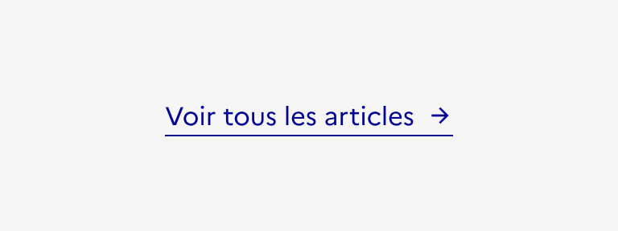
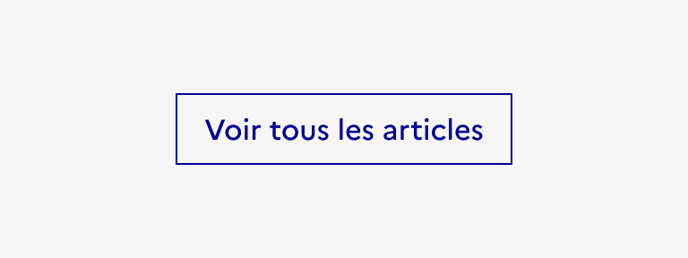

## Lien

Le lien est un système de navigation secondaire qui permet à l’usager de se déplacer au sein d’une même page, entre deux pages d’un même site ou vers un site externe.

:::dsfr-doc-tab-navigation

- Présentation
- [Démo](./demo/index.md)
- [Design](./design/index.md)
- [Code](./code/index.md)
- [Accessibilité](./accessibility/index.md)

:::

::dsfr-doc-storybook{storyId=link--link}

### Quand utiliser ce composant ?

Proposer le lien pour permettre à l’usager de naviguer au sein d’un site, en complément de la [navigation principale](../../../navigation/_part/doc/index.md).

> [!NOTE]
> Bien différencier le lien des autres composant permettant une interaction avec l’interface.

Le lien a vocation à faciliter la navigation vers d’autres contenus. Pour les actions d’un autre type, comme la soumission d’un formulaire par exemple, il faut utiliser [le bouton](../../../button/_part/doc/index.md).

### Comment utiliser ce composant ?

- **Utiliser le lien pour renvoyer l’usager vers davantage de contenus**.

::::dsfr-doc-guidelines

:::dsfr-doc-guideline[✅ À faire]{col=6 valid=true}

Proposer un lien pour consulter plus d’actualités.

:::

:::dsfr-doc-guideline[❌ À ne pas faire]{col=6 valid=false}

Ne pas utiliser un bouton pour renvoyer vers davantage de contenus.

:::

::::

- **Adapter le type de lien choisi au besoin rencontré**. Par exemple, le lien simple ne doit pas être utilisé au sein d’un paragraphe mais bien en dehors de tout contenu. Pour insérer un lien dans un paragraphe, utiliser les liens contextuels au fil du texte.
- **Eviter de démultiplier les liens** au sein d’une même page afin de préserver une navigation simple et claire par l’usager.

### Règles éditoriales

- **Privilégier des liens courts et explicites** garantissant la compréhension de l’usager.
