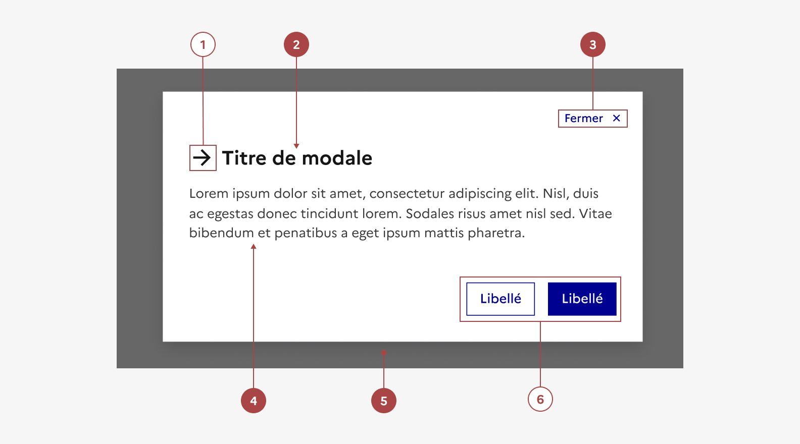

## Modale

La modale est un élément de mise en forme de contenu permettant de concentrer l’attention de l’usager exclusivement sur une tâche ou un élément d’information, sans perdre le contexte de la page en cours.

:::dsfr-doc-tab-navigation

- [Présentation](../index.md)
- [Démo](../demo/index.md)
- Design
- [Code](../code/index.md)
- [Accessibilité](../accessibility/index.md)

:::

:::dsfr-doc-anatomy{col=12}

::dsfr-doc-pin[Une icône]

::dsfr-doc-pin[Un titre]{required=true}

::dsfr-doc-pin[Un bouton “Fermer”]{required=true}

::dsfr-doc-pin[Une zone de contenu]{required=true}

::dsfr-doc-pin[Un overlay]{required=true add="disposé à l’arrière du composant"}

::dsfr-doc-pin[Une zone d’action fixe]

:::

### Variations

**Modale avec zone d’action**

::dsfr-doc-storybook{storyId=modal--footer}

La modale avec une zone d’action permet de guider l’utilisateur vers des actions attendues. Elle reprend les éléments de la modale simple, auxquels s’ajoute une zone d’action composée soit d’un bouton primaire, soit d’un [groupe de boutons hiérarchisé](../../../../button/_part/doc/design/index.md#variations).

**Modale alignée en haut en mobile**

::dsfr-doc-storybook{storyId=modal--modal args="{ top: true }" width=375}

Une variation permet à la modale d’être alignée en haut de l’écran en mobile plutôt qu’en bas.

### Tailles

La modale est disponible en trois tailles :

- SM pour small

::dsfr-doc-storybook{storyId=modal--size-sm}

- MD pour medium - taille par défaut

::dsfr-doc-storybook{storyId=modal--size-md}

- LG pour large

::dsfr-doc-storybook{storyId=modal--size-lg}

- **Adapter la taille de la modale au volume de votre contenu.**

En desktop, la hauteur maximum des modales est fixée à 80% de la hauteur de l'écran, seule la largeur varie selon la taille choisie. Si le contenu est trop long pour s’afficher dans la surface prévue par la modale, la barre de scroll du navigateur s’affiche et permet de faire défiler le contenu.

En version mobile, la modale s’affiche sur la quasi totalité de l'écran :

- 100% de largeur.
- La hauteur minimale dépend du contenu. 32px de marge laissée en haut de l'écran (ou en bas pour la variante avec modale alignée en haut).

::dsfr-doc-storybook{storyId=modal--modal width=375}

### États

La modale n’est sujette à aucun changement d’état.

### Personnalisation

La modale n’est pas personnalisable.

Toutefois, certains éléments sont optionnels et les icônes peuvent être changées - voir [la structure du composant](#modale).

### Note de version

### Maillage

- [Bouton](../../../../button/_part/doc/index.md)
- [Paramètres d’affichage](../../../../display/_part/doc/index.md)
