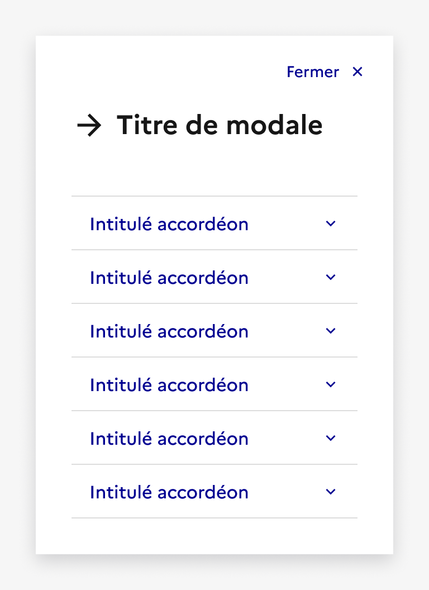

## Modale

La modale est un élément de mise en forme de contenu permettant de concentrer l’attention de l’usager exclusivement sur une tâche ou un élément d’information, sans perdre le contexte de la page en cours.

:::dsfr-doc-tab-navigation

- Présentation
- [Démo](./demo/index.md)
- [Design](./design/index.md)
- [Code](./code/index.md)
- [Accessibilité](./accessibility/index.md)

:::

::dsfr-doc-storybook{storyId=modal--modal}

### Quand utiliser ce composant ?

Utiliser la modale pour hiérarchiser l’information au sein d’une page ou afficher un contenu à part. Elle permet de mettre en évidence une information importante, à la suite du clic sur un bouton.

**Exemples de cas d’usage fréquents :** gestionnaire de consentement, paramètres d’affichage, formulaire simple, demande d’un choix à l’utilisateur, affichage d’un média etc.

### Comment utiliser ce composant ?

- **Utiliser les modales pour afficher des informations importantes**. Il est toutefois recommandé de les utiliser avec parcimonie car elles sont invasives dans l’expérience de l’usager.
- **Permettre à l’usager de reprendre sa navigation** à l’endroit où il se trouvait auparavant dans la page simplement en fermant la modale.
- **Figer la page en arrière plan** lorsqu’une modale est ouverte. L’usager ne peut pas scroller le contenu d’arrière plan avant d’avoir clôturé la modale.
- **Limiter le nombre d'interactions** dans une modale, et si celle-ci en propose, rester sur des interactions simples (exemples : bouton, bouton radio, lien etc.).

::::dsfr-doc-guidelines

:::dsfr-doc-guideline[✅ À faire]{col=6 valid=true}

Proposer uniquement des interactions simples et limités au sein de la modale.

:::

:::dsfr-doc-guideline[❌ À ne pas faire]{col=6 valid=false}

Ne pas insérer de composants complexes, inadaptés à l’usage de la modale.

:::

::::

- **Éviter de présenter des décisions complexes** dans une modale, notamment lorsque celles-ci nécessitent la consultation de sources d’informations supplémentaires.
- **Privilégier l’usage de l’accordéon** si l’objectif est de proposer un complément de contenu (exemple : “En savoir plus”).

### Règles éditoriales

- **Ajouter tout type de contenu** à votre modale, dans le respect des règles d’utilisation précédemment mentionnées.
