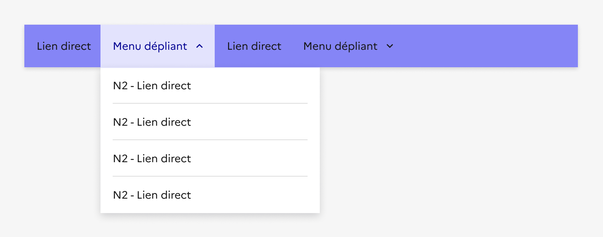
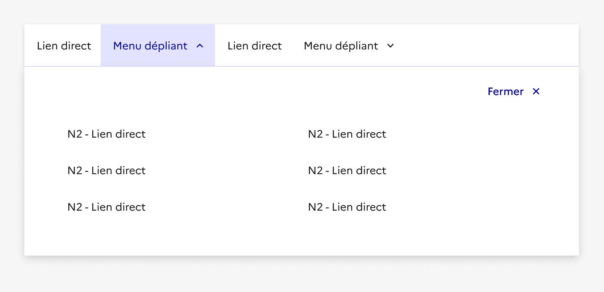

## Navigation principale

La navigation principale est le système central de navigation au sein d’un site. Elle permet d’orienter l’usager à travers les rubriques principales et secondaires du site.

:::dsfr-doc-tab-navigation

- [Présentation](../index.md)
- [Démo](../demo/index.md)
- Design
- [Code](../code/index.md)
- [Accessibilité](../accessibility/index.md)

:::

:::dsfr-doc-anatomy{col=12}

::dsfr-doc-pin[Un libellé]{add="de lien direct, de menu déroulant ou d’un méga-menu" required=true}

::dsfr-doc-pin[Un chevron]{add="dans le cas du menu déroulant et du mega menu" required=true}

::dsfr-doc-pin[Un fond blanc]{required=true}

::dsfr-doc-pin[Un bouton “Fermer”]{add="dans le cas du mega menu uniquement" required=true}

::dsfr-doc-pin[Un titre de rubrique du méga menu]

::dsfr-doc-pin[Un texte de description du méga menu]

::dsfr-doc-pin[Un lien vers la rubrique du méga menu]

::dsfr-doc-pin[Un titre de catégorie dans le méga menu]{add="pouvant être cliquable"}

::dsfr-doc-pin[Des liens direct vers les pages du site]{required=true}

::dsfr-doc-pin[Un séparateur en-dessous du titre de la catégorie]{required=true}

:::

### Variations

**Liens directs**

::dsfr-doc-storybook{storyId=navigation--link}

- Utiliser les liens directs vers des pages destination pour les sites ou les rubriques qui n’ont pas ou peu de second niveau d’arborescence, en les combinant par exemple avec un [menu latéral](../../../../sidemenu/_part/doc/index.md).

**Menu déroulant**

::dsfr-doc-storybook{storyId=navigation--menu}

- Utiliser les menus déroulant dans le cadre d’une architecture de l’information peu profonde, pour afficher les niveaux secondaires d’une rubrique.
- Proposer un maximum de 8 liens au sein d’un menu déroulant.

**Mega menu**

::dsfr-doc-storybook{storyId=navigation--mega-menu}

- Utiliser le mega menu lorsqu’une arborescence est profonde. Il s’agit d’un menu de navigation plus complexe qui donne accès à plusieurs niveaux de profondeur.
- Proposer un maximum de 8 liens au sein de chaque sous catégorie.

**Responsive**

En version mobile, la navigation principale est accessible depuis le pictogramme “burger”. Le clic sur le pictogramme déclenche l’affichage d’un overlay présentant les éléments de la navigation et les liens directs de l’en-tête, si présents.

Le système d’overlay permet l’affichage du contenu des différentes variations de menu, précédemment décrites.

### Tailles

La largeur de la navigation principale est de taille fixe et prend les 12 colonnes disponibles de la grille.

### États

**État au survol**

L’état au survol correspond au comportement constaté par l’usager lorsqu’il survole une entrée de la navigation principale.

**État au clic**

L’état au clic correspond au comportement constaté par l’usager après avoir cliqué sur une entrée de la navigation principale. Il existe 2 états au clic, selon la variation choisie :

- Lien direct

- Menu déroulant ou mega menu

### Personnalisation

La navigation principale n’est pas personnalisable.

Toutefois, certains éléments sont optionnels - voir [la structure du composant](#navigation-principale).

::::dsfr-doc-guidelines

:::dsfr-doc-guideline[✅ À faire]{col=12 valid=true}

Conserver un fond de couleur blanc derrière les entrées de la navigation principale.

:::

:::dsfr-doc-guideline[❌ À ne pas faire]{col=12 valid=false}

Ne pas personnaliser la couleur des entrées de la navigation principale

:::

:::dsfr-doc-guideline[✅ À faire]{col=12 valid=true}

Utiliser uniquement la couleur bleu pour les entrées de menu déroulant ou mega menu dans leur état cliqué.

:::

:::dsfr-doc-guideline[❌ À ne pas faire]{col=12 valid=false}

Ne pas personnaliser la couleur des entrées menu déroulant ou mega menu lorsqu’elles sont cliquées.

:::

:::dsfr-doc-guideline[✅ À faire]{col=12 valid=true}

Conserver le fond de couleur blanc du mega menu.

:::

:::dsfr-doc-guideline[❌ À ne pas faire]{col=12 valid=false}

Ne pas personnaliser ou retirer la couleur de fond du mega menu.

:::

:::dsfr-doc-guideline[✅ À faire]{col=12 valid=true}

Conserver les tailles, types et couleurs de typographie des différents libellés en l’état.

:::

:::dsfr-doc-guideline[❌ À ne pas faire]{col=12 valid=false}

Ne pas modifier les tailles, types et couleurs de typographie des différents libellés.

:::

::::
