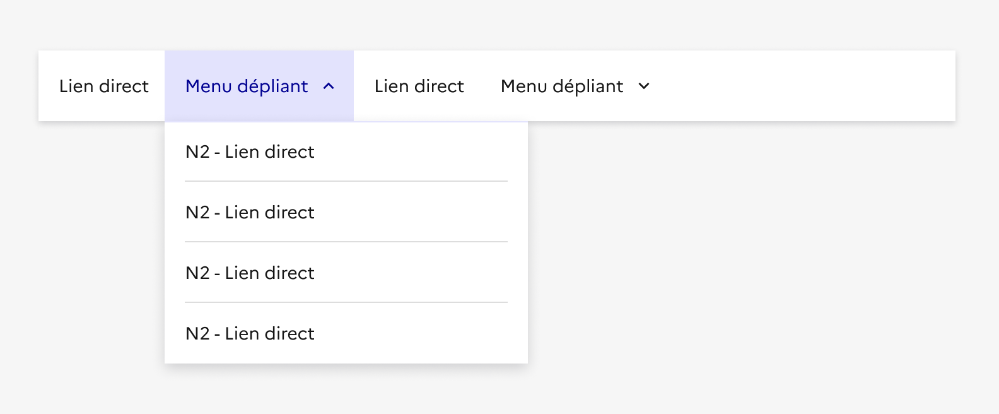
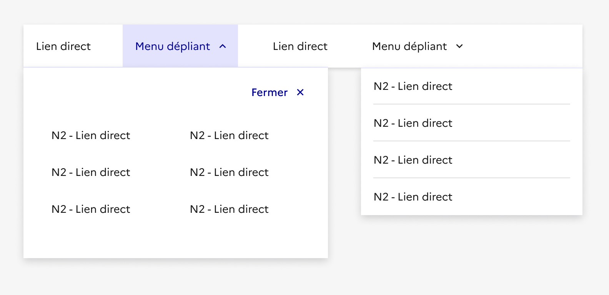

## Navigation principale

La navigation principale est le système central de navigation au sein d’un site. Elle permet d’orienter l’usager à travers les rubriques principales et secondaires du site.

:::dsfr-doc-tab-navigation

- Présentation
- [Démo](./demo/index.md)
- [Design](./design/index.md)
- [Code](./code/index.md)
- [Accessibilité](./accessibility/index.md)

:::

::dsfr-doc-storybook{storyId=navigation--navigation}

### Quand utiliser ce composant ?

**Utiliser la navigation principale pour orienter l’usager à travers les grandes sections du site**, éventuellement sur plusieurs niveaux de profondeur.

> [!NOTE]
> La navigation principale est liée à [l’en-tête](../../../header/_part/doc/index.md) et, lorsqu'elle est utilisée, doit donc se placer juste en-dessous. Néanmoins, contrairement à l’en-tête, elle n’est pas obligatoire.

### Comment utiliser ce composant ?

- **Moduler la navigation principale** selon vos besoins et l’arborescence de votre site. Elle permet d'afficher jusqu'à 8 entrées principales.
- **Opter pour la variation de la navigation principale qui convient le mieux à l’architecture de l’information de votre site**.
- **Considérer que la navigation principale est contrainte en hauteur**, même dans sa version la plus grande avec mega menu. Il faut donc l’anticiper lors de la conception de l’architecture de l’information afin d'éviter un nombre trop important de liens et de niveaux (et donc réfléchir la densité de l’information en conséquence).
- **Accompagner la navigation principale d’autres composants** permettant de guider encore davantage l’usager dans sa navigation, tels que la barre de recherche, le menu latéral, ou le pied de page par exemple.
- **Associer liens directs et menus déroulants ou mega menu** dans une même navigation. En revanche, il n’est pas recommandé de mélanger l’usage de menus déroulants et de mega menus.

::::dsfr-doc-guidelines

:::dsfr-doc-guideline[✅ À faire]{col=12 valid=true}

Proposer des liens directs et des menus déroulants au sein d’une même navigation selon le besoin identifié.

:::

:::dsfr-doc-guideline[❌ À ne pas faire]{col=12 valid=false}

Ne pas mélanger menus déroulants et mega menus pour ne pas apporter de la confusion à la navigation.

:::

::::

### Règles éditoriales

- **Proposer des libellés d’entrées de menu et de liens clairs et concis** pour permettre à l’usager de facilement comprendre où il se rend.
- **Profiter de la variation mega menu pour éditorialiser vos rubriques** et ainsi apporter un complément de contexte à l’usager.
