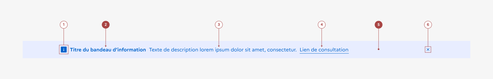

## Bandeau d'information importante

Le bandeau d’information importante est un élément éditorial permettant d’attirer l’attention des usagers sur une information importante et temporaire.

Le bandeau d’information importante est un élément éditorial permettant d’attirer l’attention des usagers sur une information importante et temporaire.

:::dsfr-doc-tab-navigation

- [Présentation](../index.md)
- [Démo](../demo/index.md)
- Design
- [Code](../code/index.md)
- [Accessibilité](../accessibility/index.md)

:::

:::dsfr-doc-anatomy{col=12}

::dsfr-doc-pin[Une icône]{add="obligatoire et normée pour les bandeaux de vigilance météo et les bandeaux d’alertes"}

::dsfr-doc-pin[Un titre en gras]{add="normé pour les bandeaux de vigilance météo et les bandeaux d’alertes" required=true}

::dsfr-doc-pin[Une description]{add="recommandée pour apporter du contexte"}

::dsfr-doc-pin[Un lien]{add="obligatoire et normé pour les bandeaux de vigilance météo et les bandeaux d’alertes"}

::dsfr-doc-pin[Un fond]{required=true}

::dsfr-doc-pin[Une croix de fermeture]

:::

### Variations

**Bandeaux génériques**

- Bandeau d'information importante - par défaut.

::dsfr-doc-storybook{storyId=notice--notice}

Utiliser le bandeau d’information importante pour afficher une information exceptionnelle, mais non critique pour la santé ou la sécurité de l’utilisateur.

- Bandeau d’avertissement

::dsfr-doc-storybook{storyId=notice--warning}

Utiliser le bandeau d’avertissement pour afficher une information qui peut affecter l’usager dans son usage du service (indisponibilité majeure du site ou d’une démarche importante par exemple) ou pour avertir d’un risque de sécurité lié au site ou au service (risque de phishing, usurpations etc.)

- Bandeau d’alerte

::dsfr-doc-storybook{storyId=notice--alert}

Utiliser le bandeau d’alerte pour afficher une information critique pour la santé ou la sécurité de l’utilisateur.

**Bandeaux de vigilance météo**

Ces bandeaux servent à relayer des informations sur les niveaux de vigilance et risques météorologiques communiqués par Météo France.

Une vidéo présentant les niveaux de vigilance est disponible sur la chaîne YouTube du Système de Météo France :

[Voir la vidéo sur YouTube](https://www.youtube.com/watch?v=pT98qCs58h4)

Le Système de Design de l’État prévoit que ces bandeaux soient affichés à partir du niveau de vigilance orange. Les niveaux de vigilance vert et jaune ne justifiant pas d’afficher un bandeau d’information sur les sites de l’État.

Les niveaux de vigilance étant revus quotidiennement par Météo France, il est demandé de ne plus afficher ces bandeaux dès lors que le niveau de vigilance revient à la normale.

- Vigilance orange

::dsfr-doc-storybook{storyId=notice--weather-orange}

Utiliser ce niveau de vigilance lorsque des phénomènes dangereux sont prévus. Son rôle est d’inciter l’usager à suivre l'évolution de la situation ainsi que les conseils de sécurité émis par les pouvoirs publics.

- Vigilance rouge

::dsfr-doc-storybook{storyId=notice--weather-red}

Utiliser ce niveau de vigilance lorsque des phénomènes dangereux, d'intensité exceptionnelle, sont prévus. Il doit inciter l’usager à suivre la situation et à impérativement respecter les consignes de sécurité émises par les pouvoirs publics.

- Vigilance violette

::dsfr-doc-storybook{storyId=notice--weather-purple}

Réserver ce niveau de vigilance aux territoires ultra-marins où les phénomènes météorologiques liés aux cyclones y font l’objet de dispositifs d’alertes spécifiques à chaque territoire ou région, donnant lieu à une couleur d’alerte violette figurant le niveau d’alerte maximale.

La vigilance violette ne fait pas partie du référentiel de Météo France, mais à un référentiel différent : celui de l’alerte cyclonique.

**Bandeaux d’alerte**

Les bandeaux d’alerte sont conçus pour relayer des alertes relatifs aux risques majeurs pour la Nation, mettant en danger la sécurité des biens et des personnes. **Ils sont utilisables uniquement dans les cas précis pour lesquels ils sont prévus**.

- Alerte attentat

::dsfr-doc-storybook{storyId=notice--attack}

Afficher ce bandeau uniquement lorsqu'un attentat est en cours. Cette information étant émise par le Ministère de l’Intérieur, les intitulés officiels doivent être respectés.

> [!WARNING]
> Ne pas utiliser ce bandeau pour signifier un relèvement, un abaissement ou le niveau en cours du plan Vigipirate : il s’agit d’une information et non d’une alerte.

- Appel à témoins

::dsfr-doc-storybook{storyId=notice--witness}

Afficher ce bandeau uniquement lorsqu'un appel à témoins est émis par le Ministère de l’Intérieur ou une préfecture. Les intitulés officiels doivent être respectés.

- Alerte technologique

::dsfr-doc-storybook{storyId=notice--cyberattack}

Afficher ce bandeau uniquement en cas de cyber-attaque d’ampleur nationale ou d’alerte technologique émise par le Ministère de l’Intérieur. Les intitulés officiels doivent être respectés.

### Tailles

La largeur du bandeau d’information importante est de taille fixe et prend les 12 colonnes disponibles de la grille, au même titre que [l’en-tête](../../../../header/_part/doc/index.md) et la [navigation principale](../../../../navigation/_part/doc/index.md) sous lesquelles il se positionne.

### États

Le bandeau d’information importante n’est sujet à aucun changement d’état.

### Personnalisation

Le bandeau d’information importante n’est pas personnalisable.

Toutefois, certains éléments sont optionnels - voir [la structure du composant](#bandeau-dinformation-importantee).

::::dsfr-doc-guidelines

:::dsfr-doc-guideline[✅ À faire]{col=6 valid=true}

Conserver les icônes et couleurs de fond proposées par défaut, chacune étant liée à un cas d’usage spécifique.

:::

:::dsfr-doc-guideline[❌ À ne pas faire]{col=6 valid=false}

Ne pas personnaliser les icônes et couleurs de fond, au risque de compromettre le message transmis et sa bonne compréhension par l’usager.

:::

::::
