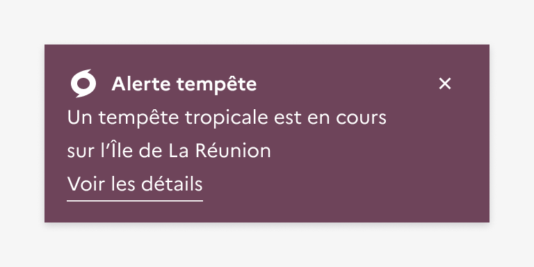

## Bandeau d'information importante

Le bandeau d’information importante est un élément éditorial permettant d’attirer l’attention des usagers sur une information importante et temporaire.

:::dsfr-doc-tab-navigation

- Présentation
- [Démo](./demo/index.md)
- [Design](./design/index.md)
- [Code](./code/index.md)
- [Accessibilité](./accessibility/index.md)

:::

::dsfr-doc-storybook{storyId=notice--notice}

### Quand utiliser ce composant ?

Utiliser le bandeau d’information importante pour permettre aux usagers d’être informés ou d’accéder à une information primordiale ou urgente, de façon temporaire.

> [!NOTE]
> Le bandeau d’information importante n’est pas conçu pour relayer une actualité, une information secondaire ou tout autre contenu informatif d’un site qui ne concernerait pas directement l’usager. Une utilisation excessive ou continue de ce type de bandeaux risquerait de rendre le composant invisible aux yeux des usagers, en les habituant à sa présence.

### Comment utiliser ce composant ?

- **Placer le bandeau d’information importante directement sous la navigation principale**, et visible sur toutes les pages du site, quel que soit l’appareil utilisé.
- **Transmettre l’essentiel de l’information dans le contenu du bandeau**. Il est toutefois possible d’ajouter un lien permettant de renvoyer l’usager vers une source d’information complète.

::::dsfr-doc-guidelines

:::dsfr-doc-guideline[✅ À faire]{col=6 valid=true}

Permettre à l’usager d’obtenir l’information principale à la seule lecture du bandeau d’information importante.

:::

:::dsfr-doc-guideline[❌ À ne pas faire]{col=6 valid=false}

Ne pas forcer l’usager à devoir consulter une source complémentaire pour comprendre l’information relayée.

:::

- **Utiliser de façon prioritaire l’état par défaut du bandeau** (voir ci-dessous), qui répond à la plupart des cas d’usages. Toutes les autres variations sont à utiliser dans un cadre strictement exceptionnel.

:::dsfr-doc-guideline[✅ À faire]{col=6 valid=true}

Utiliser les bandeaux d’information importante selon les cas d’usage définis.

:::

:::dsfr-doc-guideline[❌ À ne pas faire]{col=6 valid=false}

Ne pas utiliser un bandeau d’information importante dans un autre contexte que celui qui lui est strictement réservé.

:::

- **Afficher les bandeaux de manière pertinente**, notamment ceux de vigilance météo. Les niveaux de vigilance étant fixés à l’échelle départementale (sauf pour les phénomènes d’avalanches et vagues-submersion, localisés plus précisément), les bandeaux doivent être affichés en fonction de la localisation de l’usager.

:::dsfr-doc-guideline[✅ À faire]{col=6 valid=true}

Afficher un bandeau de vigilance météo sur un site ciblant un département ou une région particulière concerné par l’alerte.

:::

:::dsfr-doc-guideline[❌ À ne pas faire]{col=6 valid=false}

Ne pas généraliser un bandeau de vigilance météo à des sites en dehors de la zone géographique concernée par l’alerte.

:::

::::

### Règles éditoriales

**Bandeaux de vigilance météo**

- **Inclure le nom du phénomène météorologique** en plus du niveau de vigilance au titre du bandeau d’information importante (ou le plus prégnant s’il s’agit d’une combinaison de plusieurs phénomènes) et ce, peu importe le niveau de vigilance relayé.

::::dsfr-doc-guidelines

:::dsfr-doc-guideline[✅ À faire]{col=6 valid=true}

Préciser le phénomène météorologique en plus du niveau de vigilance dans le titre du bandeau.

:::

:::dsfr-doc-guideline[❌ À ne pas faire]{col=6 valid=false}

Ne pas indiquer uniquement le niveau de vigilance au sein du bandeau d’information importante. Il ne se suffit pas à lui-même.

:::

- **Préciser une zone géographique et une temporalité** au sein du texte d’accompagnement du bandeau d’information. Celui-ci doit comporter une notion du département concerné ou du nombre de départements concernés, pour les sites à portée nationale, ainsi que le moment de la journée auquel l’alerte s’applique (sans nécessairement détailler les heures, mais pour donner une idée de la temporalité).

:::dsfr-doc-guideline[✅ À faire]{col=6 valid=true}

Utiliser le texte d’accompagnement pour donner des précisions géographiques et temporelles liées au phénomène météorologique.

:::

:::dsfr-doc-guideline[❌ À ne pas faire]{col=6 valid=false}

Ne pas se contenter de simplement alerter sur le phénomène météorologique attendu.

:::

::::

- **Respecter les termes définis par la [circulaire interministérielle](https://www.legifrance.gouv.fr/download/pdf/circ?id=45225) et les icônes leur étant associées** en ce qui concerne les 8 phénomènes couverts par les bandeaux de vigilance météo.

Vent - 

Orages - 

Pluie-Inondation - 

Vagues-submersion - 

Grand froid - 

Canicule - 

Avalanches - 

Neige-Verglas - 
