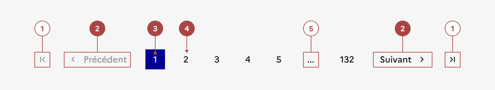

## Pagination

La pagination est un système de navigation qui permet à l’usager de naviguer entre les différentes pages d’une liste d’éléments.

:::dsfr-doc-tab-navigation

- [Présentation](../index.md)
- [Démo](../demo/index.md)
- Design
- [Code](../code/index.md)
- [Accessibilité](../accessibility/index.md)

:::

:::dsfr-doc-anatomy{col=12}

::dsfr-doc-pin[Un bouton tertiaire avec icône seule permettant de se rendre directement à la première ou à la dernière page]

::dsfr-doc-pin[Un bouton tertiaire avec icône permettant de revenir à la page précédente ou de passer à la page suivante]{required=true}

::dsfr-doc-pin[Un bouton primaire indiquant la page active]{required=true}

::dsfr-doc-pin[Des boutons tertiaires de numéros de page]{required=true}

::dsfr-doc-pin[Un bouton troncature]{add='sous forme de points de suspension pour éviter d’afficher tous les numéros de page lorsqu’ils sont nombreux'}

:::

### Variations

**Responsive**

::dsfr-doc-storybook{storyId=pagination--pagination}

- Conserver le même fonctionnel sur les différentes tailles d'écran.
- Cacher certains numéros de page pour alléger l'affichage sur les écrans mobiles.
- Limiter le nombre de pages visibles pour pouvoir idéalement afficher l’ensemble des éléments de la pagination sur une seule ligne.
- Privilégier les icônes “<“ et “>” pour les actions “Précédent” et “Suivant”.

### Tailles

La largeur de la pagination s’adapte à la taille de son conteneur.

### États

**État désactivé**

L’état désactivé indique que l'usager ne peut pas interagir avec un lien.

::dsfr-doc-storybook{storyId=pagination--last-page}

- Appliquer cet état aux liens “Précédent” et "première page" lorsque vous êtes sur la première page et sur les liens “Suivant” et "dernière page" lorsque vous êtes sur la dernière page.

**État au survol**

L’état au survol correspond au comportement constaté par l’usager lorsqu’il survole un des liens avec sa souris.

**État courant**

L’état courant permet d’indiquer à l’usager la page active, soit celle sur laquelle il se situe.

::dsfr-doc-storybook{storyId=pagination--pagination}

### Personnalisation

La pagination n’est pas personnalisable.

Toutefois, certains éléments sont optionnels - voir [la structure du composant](#pagination).

::::dsfr-doc-guidelines

:::dsfr-doc-guideline[✅ À faire]{col=6 valid=true}

Mettre en évidence la page active en appliquant un fond bleu derrière le numéro de page.

:::

:::dsfr-doc-guideline[❌ À ne pas faire]{col=6 valid=false}

Ne pas personnaliser la couleur du fond qui indique la page active.

:::

::::

### Maillage

- [Carte](../../../../card/_part/doc/index.md)
