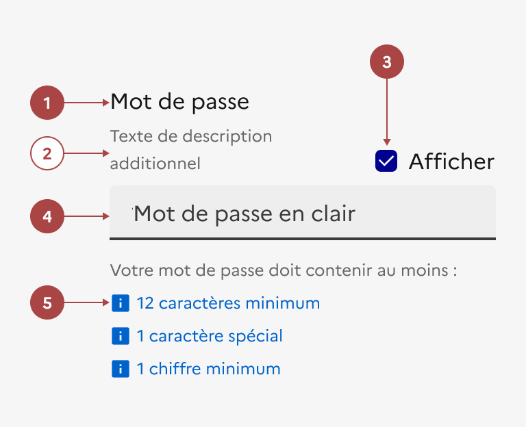

## Mot de passe

Le mot de passe est un élément d’interaction avec l’interface permettant d’aider l’usager à créer ou saisir un mot de passe.

:::dsfr-doc-tab-navigation

- [Présentation](../index.md)
- [Démo](../demo/index.md)
- Design
- [Code](../code/index.md)
- [Accessibilité](../accessibility/index.md)

:::

:::dsfr-doc-anatomy{imageWidth=384 col=12}

::dsfr-doc-pin[Un libellé “Mot de passe”]{required=true}

::dsfr-doc-pin[Un texte de description]{add="recommandé pour préciser les règles de sécurisation notamment dans les cas de création de compte"}

::dsfr-doc-pin[Une fonctionnalité d’affichage du mot de passe]{required=true}

::dsfr-doc-pin[Un champ de saisie “mot de passe”]{required=true}

::dsfr-doc-pin[Un message d’accompagnement]{required=true add="pour aider au remplissage"}

:::

### Variations

Le mot de passe se base sur le champ de saisie de type “mot de passe” et se décline en deux variations, couvrant les deux cas d’usages de référence.

**Demande de mot de passe pour la création d’un compte ou modification de mot de passe associé à un compte existant**

::dsfr-doc-storybook{storyId=password--login}

- Utiliser cette variation pour permettre à l’usager de créer ou modifier un mot de passe, soumis à des contraintes de règles de sécurisation.
- Préciser les règles à respecter et les éventuels formats attendus (longueurs, utilisation de caractères et de casse spécifiques, etc.) au sein du texte de description, prévu à cet effet.
- Rendre la description du champ dédié au mot de passe dynamique en fonction du contenu saisi.

**Demande de mot de passe pour la connexion**

::dsfr-doc-storybook{storyId=password--register}

- Utiliser cette variation pour permettre à l’usager de rentrer son mot de passe afin de se connecter à son compte.
- Proposer un lien vers la page de récupération de mot de passe en-dessous du champ de saisie.

### Tailles

La largeur du mot de passe s’adapte à la taille de son conteneur.

### États

**État d’erreur**

- Demande de mot de passe pour la création d’un compte ou modification de mot de passe associé à un compte existant

::dsfr-doc-storybook{storyId=password--register-validate}

Dans le cas d’une erreur de saisie, reprendre l’affichage d’erreur du champ de saisie et préciser dans le texte le type d’erreur rencontré en fonction des règles de sécurisation (exemple : “Le mot de passe doit comporter au moins un chiffre”).

- Demande de mot de passe pour la connexion

Dans le cas d’erreur de saisie, préférer l’usage d’une alerte proposant un message d’erreur global à l’identification (exemple : “Le couple mot de passe/identifiant saisi n’est pas correct” ou “Erreur d'identification : merci de vérifier votre email et votre mot de passe”).

Reprendre l’affichage d’erreur du champ de saisie inviduel risquerait en effet de donner des indications sur l’origine de l’erreur (entre l’identifiant ou le mot de passe).

### Personnalisation

Le mot de passe n’est pas personnalisable.

Toutefois, certains éléments sont optionnels - voir [la structure du composant](#mot-de-passe).
