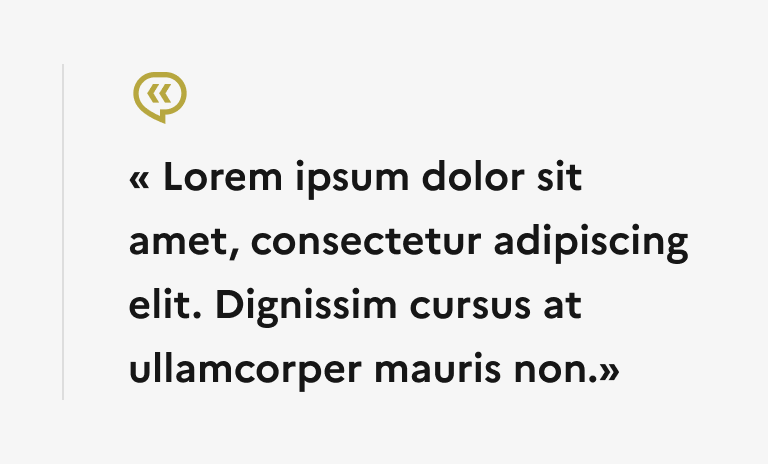

## Citation

La citation est un élément éditorial permettant de mettre en forme du contenu dans une page.

:::dsfr-doc-tab-navigation

- [Présentation](../index.md)
- [Démo](../demo/index.md)
- Design
- [Code](../code/index.md)
- [Accessibilité](../accessibility/index.md)

:::

:::dsfr-doc-anatomy{col=12}

::dsfr-doc-pin[Une icône]{add="permettant d’informer l’usager qu’il s’agit de la mise en avant d’une citation" required=true}

::dsfr-doc-pin[Le texte de la citation]{required=true}

::dsfr-doc-pin[Une image d’illustration]{add="pour incarner la citation"}

::dsfr-doc-pin[Un séparateur]{required=true}

::dsfr-doc-pin[Une signature]{add="pour préciser l’auteur de la citation"}

::dsfr-doc-pin[Une zone de détails]{add="pour préciser l’origine du texte cité"}

:::

### Variations

**Citation sans illustration**

::dsfr-doc-storybook{storyId=quote--imageless}

- Utiliser la citation sans illustration lorsqu’il n’est pas nécessaire ou possible d’incarner l’auteur de la citation.

En version mobile, le séparateur passe en dessous de la zone de détails.

**Citation avec illustration**

::dsfr-doc-storybook{storyId=quote--default}

- Utiliser la citation avec illustration pour incarner l’auteur.

En version mobile, le comportement du séparateur est le même que pour la variation sans illustration. En complément, l’illustration est affichée en dessous du texte de la citation.

### Tailles

La largeur de la citation s’adapte à la taille de son conteneur.

Toutefois, il est recommandé de ne pas excéder une largeur de 8 colonnes, s’agissant d’un composant de mise en forme de contenu.

Le texte de la citation est quant à lui disponible en 3 tailles :

- MD pour medium - taille par défaut.

::dsfr-doc-storybook{storyId=quote--default}

- LG pour large.

::dsfr-doc-storybook{storyId=quote--default args="{ size: lg }"}

- XL pour extra large.

::dsfr-doc-storybook{storyId=quote--default args="{ size: xl }"}

### États

La citation n’est sujette à aucun changement d’état.

### Personnalisation

Seule la couleur de l’icône de la citation est personnalisable. Elle peut utiliser l’ensemble des couleurs illustratives en indice $main uniquement.

::::dsfr-doc-guidelines

:::dsfr-doc-guideline[✅ À faire]{col=6 valid=true}

Personnaliser la couleur de l’icône de la citation parmi les couleurs illustratives, en indice $main.

:::

:::dsfr-doc-guideline[❌ À ne pas faire]{col=6 valid=false}

Ne pas utiliser une couleur illustrative d’un indice autre que $main.

:::

::::

:::fr-table[Titre du tableau]{valign=top multiline=true caption=false}
|  Éléments | Indice thème clair | Indice thème sombre |
|:-----|:-----|:-----|
| **Icône `$artwork-minor-blue-france`** | Indice **main**  exemple : `$pink-tuile-main-556` | Indice **main**  exemple : `$pink-tuile-main-556` |
:::

Par ailleurs, certains éléments sont optionnels - voir [la structure du composant](#citation).
