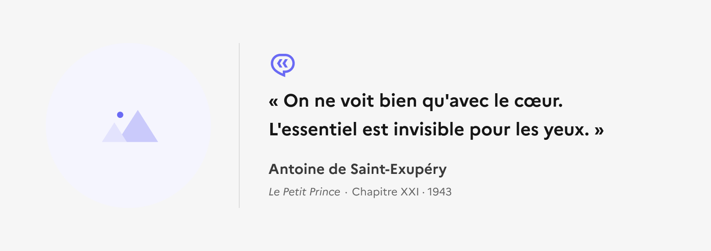
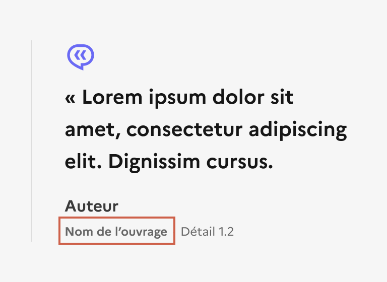

## Citation

La citation est un élément éditorial permettant de mettre en forme du contenu dans une page.

:::dsfr-doc-tab-navigation

- Présentation
- [Démo](./demo/index.md)
- [Design](./design/index.md)
- [Code](./code/index.md)
- [Accessibilité](./accessibility/index.md)

:::

::dsfr-doc-storybook{storyId=quote--quote}

### Quand utiliser ce composant ?

Insérer la citation dans une page éditoriale pour citer un texte. La citation peut provenir d'un extrait d’un discours oral ou d’un texte écrit.

> [!WARNING]
> Bien différencier la citation de la mise en avant ou mise en exergue.

[La mise en avant](../../../callout/_part/doc/index.md) est utilisée pour mettre l’accent sur une information importante, venant compléter le contenu principal.

La [mise en exergue](../../../highlight/_part/doc/index.md) quant à elle permet d’identifier plus facilement une information au sein d’un contenu existant.

### Comment utiliser ce composant ?

- **Utiliser les champs de détails pour préciser des informations complémentaires**, telles que l’édition, la collection, la fonction ou le titre de l’auteur par exemple. Il est également possible d’indiquer une URL au sein de ces champs en ajoutant un soulignement pour en faire un lien.

::::dsfr-doc-guidelines

:::dsfr-doc-guideline[✅ À faire]{col=12 valid=true}

Préciser les informations complémentaires à la citation au sein des champs de détails.

:::

- **Veiller à ce que deux citations ne se suivent pas directement** au sein d’un contenu éditorial.

:::dsfr-doc-guideline[✅ À faire]{col=6 valid=true}

Veiller à ce que deux citations ne se suivent pas directement au sein d’un contenu éditorial.

:::

:::dsfr-doc-guideline[❌ À ne pas faire]{col=6 valid=false}

Ne pas positionner deux citations à la suite au sein d’un même contenu éditorial.

:::

::::

### Règles éditoriales

- **Intégrer des guillemets avec espaces insécables** au début et à la fin du texte de la citation.
- **Appliquer systématiquement de l’italique** au nom d’un ouvrage lorsqu’il est mentionné dans la source.

::::dsfr-doc-guidelines

:::dsfr-doc-guideline[✅ À faire]{col=6 valid=true}

Indiquer le nom d’un ouvrage en italique lorsqu’il est mentionné dans la source.

:::

:::dsfr-doc-guideline[❌ À ne pas faire]{col=6 valid=false}

Ne pas indiquer un nom d’un ouvrage sans italique lorsqu’il est mentionné dans la source.

:::

- **Eviter les citations trop longues** pour qu’elles ne prennent pas trop de place, notamment en mobile. La citation n’est pas nativement limité en nombre de caractères mais il convient de ne pas excéder une taille trop importante.

:::dsfr-doc-guideline[✅ À faire]{col=12 valid=true}

Limiter les citations à une longueur raisonnable.

:::

:::dsfr-doc-guideline[❌ À ne pas faire]{col=12 valid=false}

Ne pas proposer des citations trop longues, pour qu’elles ne prennent pas trop de place, notamment en mobile.

:::

::::

> [!IMPORTANT]
> Les citations courtes d’une oeuvre publiée sont autorisées et encadrées en France par le Code de la Propriété Intellectuelle et plus précisément l'[article L122-5](https://www.legifrance.gouv.fr/affichCodeArticle.do?cidTexte=LEGITEXT000006069414&idArticle=LEGIARTI000037388886&dateTexte=20191211).
